# SA-MP Injector C++


[](https://github.com/spc-samp/samp-injector)


O **SA-MP Injector C++** transcende a definição de uma simples ferramenta de **injeção de DLL**. Ele é uma **biblioteca C++** cuidadosamente arquitetada, projetada para fornecer uma solução robusta e abrangente para a inicialização programática do jogo **Grand Theft Auto: San Andreas** (**GTA:SA**) em conjunto com seus clientes multiplayer, especificamente **SA-MP (San Andreas Multiplayer)** e **OMP (Open Multiplayer)**. Seu objetivo primordial é simplificar o processo de lançamento do jogo, eliminando a complexidade inerente à manipulação direta de processos do sistema operacional e à passagem de argumentos de linha de comando.

Desenvolvida com o propósito de oferecer máxima flexibilidade e integração facilitada, esta biblioteca `header-only` elimina a necessidade de compilações prévias complexas, permitindo que os desenvolvedores a incorporem diretamente em seus **projetos C++**. Ela não apenas orquestra a **injeção fundamental das DLLs** do cliente multiplayer (`samp.dll` ou `omp-client.dll`), mas também gerencia inteligentemente todos os parâmetros essenciais de conexão (**nickname**, **endereço IP**, **porta** e **senha**), simulando uma inicialização nativa através dos recursos intrínsecos do **Windows API**.

## Idiomas

- Deutsch: [README](translations/Deutsch/README.md)
- English: [README](translations/English/README.md)
- Español: [README](translations/Espanol/README.md)
- Français: [README](translations/Francais/README.md)
- Italiano: [README](translations/Italiano/README.md)
- Polski: [README](translations/Polski/README.md)
- Русский: [README](translations/Русский/README.md)
- Svenska: [README](translations/Svenska/README.md)
- Türkçe: [README](translations/Turkce/README.md)

## Índice

- [SA-MP Injector C++](#sa-mp-injector-c)
  - [Idiomas](#idiomas)
  - [Índice](#índice)
  - [Conceitos Fundamentais e Motivação](#conceitos-fundamentais-e-motivação)
    - [Por que Injetar DLLs?](#por-que-injetar-dlls)
    - [SA-MP e OMP: Distinções e Similaridades](#sa-mp-e-omp-distinções-e-similaridades)
  - [Arquitetura Interna da Biblioteca: Um Mergulho Aprofundado](#arquitetura-interna-da-biblioteca-um-mergulho-aprofundado)
    - [`constants.hpp`](#constantshpp)
    - [`types.hpp`](#typeshpp)
    - [`string_utils.hpp`](#string_utilshpp)
    - [`error_utils.hpp`](#error_utilshpp)
    - [`resource_handle.hpp`](#resource_handlehpp)
    - [`validation.hpp`](#validationhpp)
    - [`process.hpp`](#processhpp)
    - [`injector_core.hpp`](#injector_corehpp)
    - [`injector.hpp`](#injectorhpp)
  - [Exemplos Abrangentes de Utilização](#exemplos-abrangentes-de-utilização)
    - [1. Preparação do Ambiente de Desenvolvimento](#1-preparação-do-ambiente-de-desenvolvimento)
    - [2. Cenário Básico: Conectando a um Servidor SA-MP](#2-cenário-básico-conectando-a-um-servidor-sa-mp)
    - [3. Cenário Avançado: Conectando a um Servidor OMP](#3-cenário-avançado-conectando-a-um-servidor-omp)
  - [Tratamento de Erros Comuns e Mensagens](#tratamento-de-erros-comuns-e-mensagens)
    - [1. Tipo de Injeção Inválido](#1-tipo-de-injeção-inválido)
    - [2. Porta do Servidor Inválida (Formato ou Intervalo)](#2-porta-do-servidor-inválida-formato-ou-intervalo)
      - [2.1. Formato de Porta Não Numérico](#21-formato-de-porta-não-numérico)
      - [2.2. Porta Fora do Intervalo Válido](#22-porta-fora-do-intervalo-válido)
    - [3. Nickname Inválido (Vazio ou Muito Longo)](#3-nickname-inválido-vazio-ou-muito-longo)
      - [3.1. Nickname Vazio](#31-nickname-vazio)
      - [3.2. Nickname Muito Longo](#32-nickname-muito-longo)
    - [4. Arquivos do Jogo ou DLL Não Encontrados](#4-arquivos-do-jogo-ou-dll-não-encontrados)
      - [4.1. Executável do Jogo (`gta_sa.exe`) Não Encontrado](#41-executável-do-jogo-gta_saexe-não-encontrado)
      - [4.2. Biblioteca SA-MP (`samp.dll`) Não Encontrada](#42-biblioteca-sa-mp-sampdll-não-encontrada)
      - [4.3. Biblioteca OMP (`omp-client.dll`) Não Encontrada (apenas para injeção OMP)](#43-biblioteca-omp-omp-clientdll-não-encontrada-apenas-para-injeção-omp)
    - [5. Falha na Criação do Processo do Jogo](#5-falha-na-criação-do-processo-do-jogo)
    - [6. Falha na Alocação de Memória no Processo Alvo](#6-falha-na-alocação-de-memória-no-processo-alvo)
    - [7. Falha na Escrita do Caminho da DLL na Memória do Processo](#7-falha-na-escrita-do-caminho-da-dll-na-memória-do-processo)
    - [8. Falha ao Encontrar Funções Essenciais do Sistema](#8-falha-ao-encontrar-funções-essenciais-do-sistema)
      - [8.1. `kernel32.dll` Não Encontrado](#81-kernel32dll-não-encontrado)
      - [8.2. `LoadLibraryA` Não Encontrado](#82-loadlibrarya-não-encontrado)
    - [9. Falha ao Criar Thread Remota para Injeção](#9-falha-ao-criar-thread-remota-para-injeção)
    - [10. Timeout ou Falha na Conclusão da Injeção](#10-timeout-ou-falha-na-conclusão-da-injeção)
    - [11. Falha ao Resumir o Thread do Processo do Jogo](#11-falha-ao-resumir-o-thread-do-processo-do-jogo)
  - [Licença](#licença)
    - [Termos e Condições de Uso](#termos-e-condições-de-uso)
      - [1. Permissões Concedidas](#1-permissões-concedidas)
      - [2. Condições Obrigatórias](#2-condições-obrigatórias)
      - [3. Direitos Autorais](#3-direitos-autorais)
      - [4. Isenção de Garantias e Limitação de Responsabilidade](#4-isenção-de-garantias-e-limitação-de-responsabilidade)

## Conceitos Fundamentais e Motivação

### Por que Injetar DLLs?

> [!NOTE] Injeção de DLLs: O cerne do carregamento dinâmico.
> A **injeção de DLL (Dynamic Link Library)** é um método utilizado em sistemas operacionais **Microsoft Windows** que permite a execução de código dentro do espaço de memória de outro processo em execução. É uma técnica poderosa com diversas aplicações legítimas, desde a depuração e monitoramento de programas até a modificação de comportamento de aplicativos para estender suas funcionalidades.

No contexto de jogos como o **GTA San Andreas**, que não foram originalmente desenvolvidos com funcionalidade multiplayer integrada, a **injeção de DLLs** é a base para a existência de clientes multiplayer como **SA-MP** e **OMP**. Esses clientes são implementados como **DLLs** que, uma vez injetadas no processo do `gta_sa.exe`, assumem o controle, interceptam funções do jogo, e estabelecem comunicação com servidores multiplayer.

Ao invés de depender de um lançador externo ou da modificação direta do executável do jogo, a **injeção de DLL** permite uma inicialização mais flexível e programável, especialmente útil em ambientes onde se deseja automatizar o processo de conexão a servidores específicos com configurações pré-definidas.

### SA-MP e OMP: Distinções e Similaridades

O **SA-MP** e o **OMP** são as duas principais plataformas de multiplayer para **GTA San Andreas**. Ambos funcionam como modificações do jogo base, transformando-o em um ambiente online massivamente multiplayer.

- **SA-MP (San Andreas Multiplayer)**: O cliente original e mais consolidado, amplamente utilizado por muitos anos. Sua arquitetura exige a `samp.dll` para operar.
- **OMP (Open Multiplayer)**: Um projeto de código aberto, geralmente visto como um sucessor ou alternativa mais moderna ao **SA-MP**, oferecendo melhorias de performance, estabilidade e funcionalidades adicionais. Ele requer a `omp-client.dll`.

Embora operem de forma similar (**injetando uma DLL** no processo do **GTA:SA**), a biblioteca **SA-MP Injector C++** foi cuidadosamente desenvolvida para suportar **ambas as DLLs**, reconhecendo suas distinções de nomes de arquivo e permitindo que o desenvolvedor escolha o cliente multiplayer desejado através de um parâmetro de configuração. Isso assegura que a biblioteca possa ser utilizada com a vasta gama de servidores e projetos baseados em qualquer uma das plataformas.

## Arquitetura Interna da Biblioteca: Um Mergulho Aprofundado

O **SA-MP Injector C++** adota uma abordagem modular e orientada a objetos (onde aplicável) para gerenciar a complexidade do processo de injeção. Cada arquivo de cabeçalho é um módulo especializado, responsável por uma fatia específica da funcionalidade geral, promovendo a clareza do código, a manutenibilidade e a expansibilidade.

### `constants.hpp`

Este arquivo é a base de todas as configurações fixas da biblioteca. Ele define um namespace `Constants` para encapsular todas as literais, garantindo que não haja poluição do escopo global. O uso de `inline constexpr` é crucial aqui: `constexpr` indica que os valores são avaliados em tempo de compilação, otimizando o desempenho e garantindo a imutabilidade, enquanto `inline` evita problemas de redefinição ao incluir o arquivo em múltiplas unidades de compilação.

```cpp
#pragma once

namespace Constants {
    // Game related constants
    inline constexpr int MIN_PORT = 1;
    inline constexpr int MAX_PORT = 65535;
    inline constexpr int MAX_NICKNAME_LENGTH = 20;
    
    // File names
    inline constexpr const wchar_t* SAMP_DLL_NAME = L"samp.dll";
    inline constexpr const wchar_t* OMP_DLL_NAME = L"omp-client.dll";
    inline constexpr const wchar_t* GAME_EXE_NAME = L"gta_sa.exe";
    
    // System libraries and functions
    inline constexpr const char* KERNEL32_DLL = "kernel32.dll";
    inline constexpr const char* LOAD_LIBRARY_FUNC = "LoadLibraryA"; // 'A' para versão ANSI/8-bit
    
    // Command line arguments used by SA-MP/OMP clients
    inline constexpr const char* CMD_ARG_CONFIG = "-c";
    inline constexpr const char* CMD_ARG_NICKNAME = "-n";
    inline constexpr const char* CMD_ARG_HOST = "-h";
    inline constexpr const char* CMD_ARG_PORT = "-p";
    inline constexpr const char* CMD_ARG_PASSWORD = "-z";
    
    // Injection types as strings (wide-character)
    inline constexpr const wchar_t* INJECT_TYPE_SAMP = L"samp";
    inline constexpr const wchar_t* INJECT_TYPE_OMP = L"omp";
    
    // Error message titles for MessageBoxW
    inline constexpr const wchar_t* ERROR_TITLE_SAMP = L"SA-MP Injector Error - SPC";
    inline constexpr const wchar_t* ERROR_TITLE_OMP = L"OMP Injector Error - SPC";
    
    // Process creation flags for CreateProcessA
    inline constexpr DWORD PROCESS_CREATION_FLAGS = CREATE_SUSPENDED | DETACHED_PROCESS;
    
    // Timeouts for WaitForSingleObject (e.g., waiting for DLL injection)
    inline constexpr DWORD DLL_INJECTION_TIMEOUT_MS = 10000; // 10 seconds
    
    // Memory allocation flags for VirtualAllocEx
    inline constexpr DWORD MEMORY_ALLOCATION_TYPE = MEM_COMMIT | MEM_RESERVE;
    inline constexpr DWORD MEMORY_PROTECTION = PAGE_READWRITE; // Needed for writing DLL path
}
```

> [!TIP]
> O uso de `wchar_t` para nomes de arquivos e títulos de mensagens de erro é uma prática recomendada em **desenvolvimento Windows**. Isso garante a compatibilidade com todos os idiomas e conjuntos de caracteres, especialmente útil para caminhos de arquivo que podem conter **caracteres Unicode**. Para **APIs** que esperam `char` (como `LoadLibraryA`), a conversão é realizada explicitamente em `string_utils.hpp`.

### `types.hpp`

Um módulo conciso, porém essencial, para definir a enumeração que categoriza os tipos de injeção suportados. Isso melhora a legibilidade e a segurança de tipo do código, prevenindo erros de string ou inteiros mágicos.

```cpp
#pragma once

namespace Types {
    // Enumerações para tipos de injeção suportados
    enum class Inject_Type {
        SAMP, // San Andreas Multiplayer
        OMP // Open Multiplayer
    };
}
```

### `string_utils.hpp`

Operar com a **API do Windows** frequentemente exige a conversão entre diferentes codificações de strings. Este arquivo fornece uma função utilitária vital para converter strings de **wide-character** (`std::wstring_view`, usadas nas entradas da biblioteca) para strings **ANSI/8-bit** (`std::string`), que são necessárias para funções **WinAPI** que operam com `char*` (como `CreateProcessA` ou `GetProcAddress`).

```cpp
#pragma once

#include <string>
#include <string_view>
#include <windows.h> // Necessário para WideCharToMultiByte

namespace Utils {
    inline std::string Wide_To_Local_8Bit(std::wstring_view wstr) {
        if (wstr.empty())
            return "";
        
        // Determina o tamanho necessário para o buffer da string resultante em char
        int size = WideCharToMultiByte(CP_ACP, // Code Page ANSI (dependente do sistema local)
            0, // Sem flags adicionais
            wstr.data(), 
            static_cast<int>(wstr.size()), 
            nullptr, // Calcula o tamanho, não preenche o buffer
            0, // Tamanho 0, apenas para cálculo
            nullptr, // Default character para caracteres não representáveis
            nullptr); // Ponteiro para bool que indica se houve um caractere padrão

        if (size <= 0) // Retorna uma string vazia em caso de erro ou tamanho inválido
            return "";

        std::string result(size, 0); // Aloca a string com o tamanho determinado
        // Realiza a conversão real, preenchendo o buffer 'result'
        WideCharToMultiByte(CP_ACP, 
            0, 
            wstr.data(), 
            static_cast<int>(wstr.size()), 
            result.data(), // Buffer de destino
            size, // Tamanho do buffer de destino
            nullptr, 
            nullptr);

        return result;
    }
}
```

> [!IMPORTANT] Encoding Matters!
> O `CP_ACP` **(ANSI Code Page)** usado em `WideCharToMultiByte` é a página de código padrão do sistema **Windows**. Isso significa que a conversão pode variar dependendo da configuração de idioma do sistema do usuário. Para a maioria dos casos de uso de nomes de arquivos e argumentos de linha de comando no **SA-MP**/**OMP** (que historicamente lidam bem com strings **ANSI**), essa abordagem é geralmente suficiente. No entanto, em cenários que exigem compatibilidade **Unicode** total com sistemas externos ou entradas globais, seriam necessárias conversões para **UTF-8** (`CP_UTF8`) ou outras páginas de código. Para o escopo deste projeto, o `CP_ACP` é o padrão funcional.

### `error_utils.hpp`

Um componente fundamental para a usabilidade da biblioteca, responsável por fornecer **feedback** claro ao usuário em caso de falha. Ele centraliza a lógica de obtenção de mensagens de erro do sistema e a exibição de caixas de diálogo.

```cpp
#pragma once

#include <string>
#include <string_view>
#include <windows.h> // Para FormatMessageW e MessageBoxW
//
#include "types.hpp"
#include "constants.hpp"

namespace Utils {
    // Retorna a mensagem de erro do sistema Windows para um código de erro específico
    inline std::wstring Get_System_Error_Message(DWORD error_code) {
        wchar_t buffer[512] = {0}; // Buffer para a mensagem
        // FormatMessageW preenche o buffer com a descrição do erro do sistema
        DWORD result = FormatMessageW(FORMAT_MESSAGE_FROM_SYSTEM | FORMAT_MESSAGE_IGNORE_INSERTS, 
            nullptr, // Fonte da mensagem (do sistema)
            error_code, 
            0, // Idioma (usar padrão)
            buffer, 
            512, // Tamanho do buffer
            nullptr);
        
        // Se a função foi bem-sucedida, retorna a string do buffer; caso contrário, uma mensagem genérica
        return result ? std::wstring(buffer) : L"Unknown error (Code: " + std::to_wstring(error_code) + L")";
    }

    // Exibe uma caixa de mensagem de erro ao usuário
    inline void Show_Error(std::wstring_view message, Types::Inject_Type injectType) {
        // Escolhe o título da caixa de diálogo com base no tipo de injeção
        std::wstring title = (injectType == Types::Inject_Type::SAMP) ? Constants::ERROR_TITLE_SAMP : Constants::ERROR_TITLE_OMP;
        MessageBoxW(nullptr, // Handle da janela pai (nullptr para desktop)
            message.data(), 
            title.c_str(), 
            MB_OK | MB_ICONERROR); // Botão OK e ícone de erro
    }
}
```

> [!NOTE] Formatação de Mensagens de Erro
> A função `FormatMessageW` é uma **API Windows** poderosa que recupera a descrição textual de um código de erro do sistema. Ela lida com a localização e fornece mensagens claras que são essenciais para um **diagnóstico** eficaz, transformando um `DWORD` como `ERROR_FILE_NOT_FOUND` (2) em `L"O sistema não pode encontrar o arquivo especificado."`.

### `resource_handle.hpp`

A gestão segura de recursos (como `HANDLE`s do **Windows**) é crítica para evitar vazamentos de recursos e comportamentos indefinidos. Este arquivo define um `UniqueResource` utilizando `std::unique_ptr` e uma função customizada para `CloseHandle`. Isso segue o princípio **RAII (Resource Acquisition Is Initialization)**, garantindo que os `HANDLE`s sejam automaticamente fechados quando seus **wrappers** saem do escopo, mesmo em caso de exceções.

```cpp
#pragma once

#include <memory> // Para std::unique_ptr
#include <functional> // Para std::function
#include <windows.h> // Para HANDLE e CloseHandle

namespace Utils {
    // Alias de tipo para um std::unique_ptr que gerencia um HANDLE (ou ponteiro) com um deleter customizado
    // T: O tipo de recurso a ser gerenciado (ex: HANDLE, LPVOID)
    // Deleter: Uma classe ou lambda que sabe como como liberar o recurso
    template<typename T, typename Deleter>
    using UniqueResource = std::unique_ptr<std::remove_pointer_t<T>, Deleter>;

    // Função auxiliar para criar uma instância de UniqueResource para HANDLEs
    // Ele assume que T é um tipo de handle e usa CloseHandle como deleter.
    template<typename T>
    inline auto Make_Unique_Handle(T handle) {
        return UniqueResource<T, std::function<void(T)>>(handle, [](T h) {
            // Condição para garantir que o handle é válido antes de tentar fechá-lo
            // 0 e INVALID_HANDLE_VALUE são considerados inválidos para a maioria dos handles
            if (h && h != INVALID_HANDLE_VALUE)
                CloseHandle(h); // Libera o HANDLE do sistema operacional
        });
    }
}
```

> [!IMPORTANT]
> O uso de `UniqueResource` é uma demonstração de boas práticas de **C++ moderno** e desenvolvimento seguro em **Windows**. Ele simplifica drasticamente a gestão de ciclos de vida de **handles**, que, se não fechados corretamente, podem levar a vazamentos de memória ou recursos do **kernel**, impactando a estabilidade do sistema ao longo do tempo.

### `validation.hpp`

A robustez da injeção começa com a validação das entradas do usuário e a verificação das dependências de arquivos. Este módulo contém funções que garantem que todos os pré-requisitos e parâmetros estejam corretos antes de tentar iniciar o processo de injeção, prevenindo erros mais complexos adiante.

```cpp
#pragma once

#include <string>
#include <string_view>
#include <filesystem> // Para std::filesystem::exists
//
#include "constants.hpp"
#include "types.hpp"
#include "string_utils.hpp" // Para Wide_To_Local_8Bit
#include "error_utils.hpp" // Para Show_Error

namespace Utils {
    // Valida se uma string de porta é um número válido e está dentro do intervalo permitido
    inline bool Validate_Port(std::wstring_view port_str, std::wstring& error_message) {
        try {
            // Tenta converter a string de wide-character para std::string e depois para int
            int port_num = std::stoi(Wide_To_Local_8Bit(port_str));

            // Verifica se a porta está dentro do intervalo válido (1-65535)
            if (port_num < Constants::MIN_PORT || port_num > Constants::MAX_PORT)
                return (error_message = L"The specified port number (" + std::wstring(port_str) + 
                L") is outside the valid range of " +  std::to_wst(Constants::MIN_PORT) + 
                L" to " + std::to_wstring(Constants::MAX_PORT) + 
                L". Please provide a valid port.", false);

            return true;
        }
        catch (...) { // Captura qualquer exceção (como std::invalid_argument para não numérico)
            return (error_message = L"Invalid port format. The port must be a numeric value. Please provide a valid integer for the port.", false);
        }
    }

    // Valida o nickname, verificando se não está vazio e se o comprimento é aceitável
    inline bool Validate_Nickname(std::wstring_view nickname_str, std::wstring& error_message) {
        if (nickname_str.empty())
            return (error_message = L"Nickname cannot be empty. Please provide a valid nickname.", false);
        
        if (nickname_str.size() > Constants::MAX_NICKNAME_LENGTH)
            return (error_message = L"Nickname length exceeds the maximum allowed of " + 
                std::to_wstring(Constants::MAX_NICKNAME_LENGTH) + 
                L" characters. Please use a shorter nickname.", false);

        return true;
    }

    // Valida a existência dos arquivos críticos (gta_sa.exe, samp.dll, omp-client.dll)
    inline bool Validate_Files(const std::filesystem::path& game_path, 
        const std::filesystem::path& samp_DLL_path, 
        const std::filesystem::path& omp_DLL_path, 
        Types::Inject_Type inject_type) {
        std::wstring error_message_local; // Usamos uma variável local aqui antes de passar para Show_Error
        
        // Verifica a existência do executável do jogo
        if (!std::filesystem::exists(game_path)) {
            error_message_local = L"Game executable not found. Please ensure 'gta_sa.exe' exists at the specified path: " + game_path.wstring();
            Show_Error(error_message_local, inject_type);
            return false;
        }

        // Verifica a existência da samp.dll (essencial para ambos os tipos de injeção)
        if (!std::filesystem::exists(samp_DLL_path)) {
            error_message_local = L"SA-MP library not found. Please ensure 'samp.dll' exists at the specified path: " + samp_DLL_path.wstring();
            Show_Error(error_message_local, inject_type);

            return false;
        }

        // Se o tipo de injeção for OMP, verifica a existência da omp-client.dll
        if (inject_type == Types::Inject_Type::OMP && !std::filesystem::exists(omp_DLL_path)) {
            error_message_local = L"OMP library not found. Please ensure 'omp-client.dll' exists at the specified path for OMP injection: " + omp_DLL_path.wstring();
            Show_Error(error_message_local, inject_type);

            return false;
        }

        return true; // Todos os arquivos necessários foram encontrados
    }
}
```

> [!NOTE] C++17 `std::filesystem`
> A utilização de `std::filesystem` é uma adição moderna ao **C++17** que oferece uma maneira poderosa e plataforma-independente de interagir com o sistema de arquivos. Para este projeto no **Windows**, ela simplifica o tratamento de caminhos e a verificação da existência de arquivos em comparação com **APIs** mais antigas do **WinAPI**.
>
> Certifique-se de que seu compilador suporte **C++17** para usar `std::filesystem`. Você precisará configurar seu projeto para usar um padrão **C++17** (`/std:c++17` no **Visual Studio**).

### `process.hpp`

Este é o módulo principal responsável pela interação direta com as **APIs** de baixo nível do **Windows** para manipular processos. Ele encapsula as operações cruciais de criação de processo e **injeção de DLL**, lidando com **handles**, **memória** e **threads**.

```cpp
#pragma once

#include <string_view>
#include <optional> // Para std::optional
#include <functional> // Para std::function (usado em UniqueResource)
#include <windows.h> // APIs do Windows
#include <memory> // Para std::unique_ptr
#include <vector> // Para std::vector (buffer de args)
//
#include "resource_handle.hpp" // Nosso wrapper para HANDLEs
#include "error_utils.hpp" // Para Get_System_Error_Message e Show_Error
#include "constants.hpp" // Constantes globais
#include "types.hpp" // Tipos de injeção

class Process {
    public:
        // Construtores/Destrutores e operadores de atribuição
        // Explicitamente default e delete para garantir semântica de valor e mover-only.
        Process() = default;
        Process(const Process&) = delete; // Sem cópia
        Process& operator=(const Process&) = delete; // Sem atribuição de cópia
        Process(Process&&) = default; // Semântica de movimento
        Process& operator=(Process&&) = default; // Atribuição de movimento
        ~Process() = default;

        // Estrutura para armazenar os handles do processo e thread, gerenciados por UniqueResource
        struct Process_Info {
            Utils::UniqueResource<HANDLE, std::function<void(HANDLE)>> process_handle;
            Utils::UniqueResource<HANDLE, std::function<void(HANDLE)>> thread_handle;
        };

        // Cria o processo do jogo GTA:SA em estado suspenso
        std::optional<Process_Info> Create_Game_Process(std::string_view game_path, std::string_view command_args, std::string_view working_dir) {
            STARTUPINFOA startup_info{}; // Estrutura para informações de inicialização do processo
            startup_info.cb = sizeof(STARTUPINFOA); // Define o tamanho da estrutura

            PROCESS_INFORMATION process_info{}; // Estrutura que receberá informações sobre o novo processo

            // Cria um buffer mutável para os argumentos da linha de comando.
            // CreateProcessA modifica o buffer de linha de comando, então std::string_view direto não funciona.
            std::vector<char> args_buffer(command_args.size() + 1); // +1 para o terminador nulo

            if (!command_args.empty()) {
                std::memcpy(args_buffer.data(), command_args.data(), command_args.size());
                args_buffer[command_args.size()] = '\0'; // Garante terminador nulo
            }

            // Cria o processo
            bool success = CreateProcessA(game_path.data(), // Nome do módulo executável
                args_buffer.empty() ? nullptr : args_buffer.data(), // Argumentos da linha de comando
                nullptr, // Atributos de segurança do processo
                nullptr, // Atributos de segurança da thread
                FALSE, // Não herdar handles
                Constants::PROCESS_CREATION_FLAGS, // CREATE_SUSPENDED | DETACHED_PROCESS
                nullptr, // Ambiente do novo processo
                working_dir.empty() ? nullptr : working_dir.data(), // Diretório de trabalho
                &startup_info, // Informações de inicialização
                &process_info); // Informações do processo criado

            if (!success) {
                // Se falhou, obtém e exibe a mensagem de erro do sistema
                std::wstring error_msg = Utils::Get_System_Error_Message(GetLastError());
                Utils::Show_Error(L"Failed to create game process. Ensure 'gta_sa.exe' is not running and you have " L"sufficient permissions to execute the file. System Error: " + error_msg, Types::Inject_Type::SAMP); // Usa SAMP como fallback para o título
                
                return std::nullopt; // Retorna um optional vazio
            }

            Process_Info result;
            // Armazena os handles do processo e thread em UniqueResource para gerenciamento automático
            result.process_handle = Utils::Make_Unique_Handle(process_info.hProcess);
            result.thread_handle = Utils::Make_Unique_Handle(process_info.hThread);

            return result; // Retorna a estrutura com os handles gerenciados
        }

        // Injeta uma DLL no processo remoto
        bool Inject_DLL(HANDLE process, std::string_view DLL_path, std::wstring& error_message) {
            // Aloca memória no processo remoto para o caminho da DLL
            LPVOID remote_memory = VirtualAllocEx(process, // Handle do processo alvo
            nullptr, // Endereço preferencial (nullptr para deixar o sistema escolher)
            DLL_path.size() + 1, // Tamanho do caminho + terminador nulo
            Constants::MEMORY_ALLOCATION_TYPE, // MEM_COMMIT | MEM_RESERVE
            Constants::MEMORY_PROTECTION); // PAGE_READWRITE

            if (!remote_memory)
                return (error_message = L"Failed to allocate memory in the target process. This might be due to " L"insufficient permissions or process protection mechanisms.", false);

            // Gerenciamento de recurso para a memória alocada remotamente.
            // Será automaticamente liberado ao sair do escopo.
            auto memory_guard = Utils::UniqueResource<LPVOID, std::function<void(LPVOID)>>(remote_memory, 
                [process](LPVOID ptr) { // Lambda como deleter
                    if (ptr)
                        VirtualFreeEx(process, ptr, 0, MEM_RELEASE); // Libera a memória alocada
                }
            );

            // Escreve o caminho da DLL na memória alocada remotamente
            if (!WriteProcessMemory(process, remote_memory, DLL_path.data(), DLL_path.size() + 1, nullptr))
                return (error_message = L"Failed to write DLL path to the target process memory. Verify process " L"permissions and ensure the DLL path is accessible.", false);

            // Obtém o handle para kernel32.dll (que está carregado no próprio processo do injetor)
            HMODULE kernel32 = GetModuleHandleA(Constants::KERNEL32_DLL);
            
            if (!kernel32)
                return (error_message = L"Failed to obtain a handle to kernel32.dll. This is an essential system " L"library and this error indicates a severe system issue.", false);

            // Obtém o endereço da função LoadLibraryA em kernel32.dll.
            // Este endereço é consistente entre processos no mesmo SO e é a chave da injeção.
            LPVOID load_library_addr = reinterpret_cast<LPVOID>(GetProcAddress(kernel32, Constants::LOAD_LIBRARY_FUNC));

            if (!load_library_addr)
                return (error_message = L"Failed to find the address of the LoadLibraryA function in kernel32.dll. " L"This is critical for injecting the DLL.", false);

            // Cria uma thread remota no processo alvo para executar LoadLibraryA
            // O argumento para LoadLibraryA será o endereço remoto do caminho da DLL
            HANDLE remote_thread = CreateRemoteThread(process, // Handle do processo alvo
                nullptr, // Atributos de segurança da thread
                0, // Tamanho da pilha (0 para default)
                reinterpret_cast<LPTHREAD_START_ROUTINE>(load_library_addr), // Endereço de LoadLibraryA
                remote_memory, // Argumento para LoadLibraryA (caminho da DLL)
                0, // Flags de criação (0 para iniciar imediatamente)
                nullptr); // ID da thread (nullptr para não retornar)

            if (!remote_thread)
                return (error_message = L"Failed to create a remote thread in the target process to execute the " L"DLL injection. This could be due to security restrictions or process "
                    L"state. System Error: " + Utils::Get_System_Error_Message(GetLastError()), false);

            // Gerenciamento de recurso para o handle da thread remota
            auto thread_guard = Utils::Make_Unique_Handle(remote_thread);

            // Espera a thread remota (injeção de DLL) ser concluída ou atingir um timeout
            DWORD wait_result = WaitForSingleObject(remote_thread, Constants::DLL_INJECTION_TIMEOUT_MS);

            if (wait_result != WAIT_OBJECT_0) {
                return (error_message = L"Timeout or error waiting for DLL injection to complete. " L"System Error: " + Utils::Get_System_Error_Message(GetLastError()), false);

            // Obtém o código de saída da thread remota.
            // Para LoadLibraryA, um código de saída 0 significa falha (não conseguiu carregar a DLL).
            DWORD exit_code = 0;

            if (!GetExitCodeThread(remote_thread, &exit_code) || exit_code == 0)
                return (error_message = L"DLL injection failed or returned an error. The LoadLibrary call " L"may have failed in the target process.", false);

            return true; // Injeção bem-sucedida
        }
};
```

> [!NOTE] Design Robusto com `std::optional` e RAII
> O módulo `process.hpp` demonstra um design robusto e seguro. A função `Create_Game_Process` retorna um `std::optional<Process_Info>`. Isso permite que a função sinalize falhas na criação do processo de forma explícita e elegante (retornando um `std::nullopt`) sem recorrer a exceções ou códigos de erro ambíguos em seu retorno principal.
>
> Mais crucialmente, a estrutura `Process_Info` utiliza `Utils::UniqueResource<HANDLE, std::function<void(HANDLE)>>` para encapsular os **handles** do processo e da **thread**. Este é um exemplo do padrão **RAII (Resource Acquisition Is Initialization)**, que garante que os `HANDLE`s do sistema operacional (como `hProcess` e `hThread`) sejam automaticamente fechados via `CloseHandle` quando o objeto `Process_Info` sai de escopo. Isso elimina vazamentos de **handles**, que são uma fonte comum de instabilidade e consumo excessivo de recursos em **aplicativos Windows** de longa duração.
>
> De maneira similar, dentro da função `Inject_DLL`, `UniqueResource` é usado para gerenciar a memória alocada remotamente (`VirtualAllocEx`), garantindo que ela seja liberada (`VirtualFreeEx`) assim que não for mais necessária ou em caso de falha. Este rigoroso gerenciamento de recursos contribui significativamente para a confiabilidade e estabilidade do **SA-MP Injector C++**.

### `injector_core.hpp`

Esta é a classe orquestradora que une todas as funcionalidades dos módulos anteriores. Ela coordena a validação, a construção de argumentos de linha de comando, a criação do processo e as chamadas de **injeção de DLL**.

```cpp
#pragma once

#include <string_view>
#include <sstream> // Para construir strings com stringstream
#include <filesystem> // Para manipulação de caminhos
//
#include "process.hpp" // Funções de criação/injeção de processo
#include "validation.hpp" // Funções de validação de entradas
#include "string_utils.hpp" // Funções de conversão de string
#include "error_utils.hpp" // Funções de tratamento de erros
#include "constants.hpp" // Constantes da biblioteca
#include "types.hpp" // Tipos de injeção

namespace Injector {
    class Injector_Core {
        public:
            // Construtores/Destrutores para semântica de movimento
            Injector_Core() = default;
            Injector_Core(const Injector_Core&) = delete; // Desabilita cópia
            Injector_Core& operator=(const Injector_Core&) = delete; // Desabilita atribuição de cópia
            Injector_Core(Injector_Core&&) = default; // Habilita movimento
            Injector_Core& operator=(Injector_Core&&) = default; // Habilita atribuição de movimento
            ~Injector_Core() = default;

            // Função principal que orquestra a inicialização e injeção do jogo
            bool Initialize_Game(Types::Inject_Type inject_type, std::wstring_view folder, 
                std::wstring_view nickname, 
                std::wstring_view ip, 
                std::wstring_view port, 
                std::wstring_view password) {
                namespace fs = std::filesystem; // Alias para std::filesystem

                // Constrói os caminhos completos para os arquivos essenciais
                fs::path game_path = fs::path(folder) / Constants::GAME_EXE_NAME; // Ex: C:\GTA\gta_sa.exe
                fs::path samp_DLL_path = fs::path(folder) / Constants::SAMP_DLL_NAME; // Ex: C:\GTA\samp.dll
                fs::path omp_DLL_path = fs::path(folder) / Constants::OMP_DLL_NAME; // Ex: C:\GTA\omp-client.dll

                // 1. Validação de Arquivos
                if (!Utils::Validate_Files(game_path, samp_DLL_path, omp_DLL_path, inject_type))
                    return false; // Erro já foi exibido pela função de validação
                
                std::wstring error_message_local; // Para receber mensagens de erro das validações

                // 2. Validação de Porta
                if (!Utils::Validate_Port(port, error_message_local))
                    return (Utils::Show_Error(error_message_local, inject_type), false);

                // 3. Validação de Nickname
                if (!Utils::Validate_Nickname(nickname, error_message_local))
                    return (Utils::Show_Error(error_message_local, inject_type), false);

                // 4. Conversão de Wide-char para Local 8-bit (necessário para APIs ANSI)
                std::string nickname_str = Utils::Wide_To_Local_8Bit(nickname);
                std::string ip_str = Utils::Wide_To_Local_8Bit(ip);
                std::string port_str = Utils::Wide_To_Local_8Bit(port);
                std::string password_str = Utils::Wide_To_Local_8Bit(password);
                // Converte também os caminhos para std::string (requeridos por CreateProcessA como char*)
                std::string game_path_str = Utils::Wide_To_Local_8Bit(game_path.wstring());
                std::string folder_str = Utils::Wide_To_Local_8Bit(folder);
                std::string samp_DLL_path_str = Utils::Wide_To_Local_8Bit(samp_DLL_path.wstring());
                std::string omp_DLL_path_str = Utils::Wide_To_Local_8Bit(omp_DLL_path.wstring());

                // 5. Construção dos Argumentos da Linha de Comando
                std::string args = Build_Command_Args(nickname_str, ip_str, port_str, password_str);

                // Instancia a classe Process para gerenciar as operações de processo
                Process process_core;
                
                // 6. Criação do Processo do Jogo (Suspenso)
                auto process_info_opt = process_core.Create_Game_Process(game_path_str, args, folder_str);

                if (!process_info_opt)
                    return false; // Erro já foi exibido pela função de criação de processo

                // Desreferencia o optional para obter a estrutura Process_Info
                auto& process_info = *process_info_opt; 
                std::wstring inject_error_message; // Para receber mensagens de erro da injeção

                // 7. Injeção da samp.dll
                if (!process_core.Inject_DLL(process_info.process_handle.get(), samp_DLL_path_str, inject_error_message))
                    return (Utils::Show_Error(L"Failed to inject samp.dll: " + inject_error_message, inject_type), false);

                // 8. Injeção condicional da omp-client.dll (apenas se for OMP)
                if (inject_type == Types::Inject_Type::OMP) {
                    if (!process_core.Inject_DLL(process_info.process_handle.get(), omp_DLL_path_str, inject_error_message))
                        return (Utils::Show_Error(L"Failed to inject omp-client.dll: " + inject_error_message, inject_type), false);
                }

                // 9. Resumir o Processo do Jogo
                // O processo foi criado em estado suspenso para permitir a injeção.
                // Agora que as DLLs foram injetadas, ele pode ser retomado.
                if (ResumeThread(process_info.thread_handle.get()) == static_cast<DWORD>(-1))
                    return (Utils::Show_Error(L"Failed to resume the game process thread: " + Utils::Get_System_Error_Message(GetLastError()), inject_type), false);

                return true; // Sucesso em todas as etapas!
            }
        private:
            // Constrói a string de argumentos da linha de comando para o executável do jogo
            std::string Build_Command_Args(const std::string& nickname, const std::string& ip, const std::string& port, const std::string& password) {
                std::stringstream command_args_stream; // Usa stringstream para construção eficiente

                // SA-MP e OMP esperam os argumentos "-c -n [nickname] -h [ip] -p [port]"
                command_args_stream << Constants::CMD_ARG_CONFIG << " " 
                    << Constants::CMD_ARG_NICKNAME << " " << nickname << " " 
                    << Constants::CMD_ARG_HOST << " " << ip << " " 
                    << Constants::CMD_ARG_PORT << " " << port;

                // Adiciona a senha apenas se ela não for vazia
                if (!password.empty())
                    command_args_stream << " " << Constants::CMD_ARG_PASSWORD << " " << password;

                return command_args_stream.str();
            }
    };
}
```

> [!CAUTION] Injeção Dupla (SA-MP e OMP)
> Embora o processo para **OMP** envolva injetar a `omp-client.dll` *além* da `samp.dll`, isso está de acordo com a maneira como o **OMP** geralmente funciona. O cliente **OMP** muitas vezes usa a `samp.dll` como **base** ou **proxy** para certas funcionalidades, enquanto `omp-client.dll` estende ou sobrescreve comportamentos.
>
> É crucial que **ambas as DLLs** estejam presentes e funcionais no diretório do jogo para que a **injeção OMP** seja bem-sucedida. Se uma falhar, o jogo pode não inicializar corretamente ou o cliente multiplayer pode não carregar.

### `injector.hpp`

Este é o arquivo de interface da biblioteca. É o único arquivo que o usuário final precisará incluir para usar o **SA-MP Injector C++**. Ele atua como um invólvulo para a classe `Injector::Injector_Core`, simplificando a interface para uma única função global, `Initialize_Game`.

```cpp
#pragma once

#include <string_view>
//
#include "injector_core.hpp" // A classe principal com a lógica
#include "error_utils.hpp" // Para exibição de erros (no caso de tipo de injeção inválido)
#include "types.hpp" // Enumeração de tipos
#include "constants.hpp" // Constantes (para nomes de tipo de injeção)

// A interface de alto nível para a biblioteca.
// Simplifica o uso expondo apenas esta função global.
inline bool Initialize_Game(std::wstring_view inject_type_str, std::wstring_view folder, 
    std::wstring_view nickname, 
    std::wstring_view ip, 
    std::wstring_view port, 
    std::wstring_view password) {
    Types::Inject_Type type; // Variável para armazenar o tipo de injeção

    // Converte a string de tipo de injeção para o enum Inject_Type
    if (inject_type_str == Constants::INJECT_TYPE_SAMP)
        type = Types::Inject_Type::SAMP;
    
    else if (inject_type_str == Constants::INJECT_TYPE_OMP)
        type = Types::Inject_Type::OMP;
    
    else
        // Se a string de tipo de injeção for inválida, exibe um erro e retorna falso
        return (Utils::Show_Error(L"Invalid injection mode specified. Please use 'samp' or 'omp'.", Types::Inject_Type::SAMP), false); // Usa SAMP como fallback para o título

    Injector::Injector_Core injector; // Instancia o objeto que contém a lógica central
    
    // Delega a chamada para a função Initialize_Game da classe Injector_Core
    return injector.Initialize_Game(type, folder, nickname, ip, port, password);
}
```

> [!NOTE] Design `inline` para `header-only`
> O uso da palavra-chave `inline` para todas as funções neste arquivo e em outros utilitários permite que a biblioteca seja `header-only`. `inline` sugere ao compilador que o corpo da função deve ser inserido diretamente nos pontos de chamada, mas seu principal efeito aqui é relaxar a **One Definition Rule (ODR)** para que a função possa ser definida em múltiplos arquivos `.obj` (o que aconteceria se vários `.cpp` incluíssem `injector.hpp`). A etapa de **linkage** garantirá que apenas uma versão final exista no executável.

## Exemplos Abrangentes de Utilização

Para integrar o **SA-MP Injector C++** em seu projeto, siga as instruções e analise os cenários abaixo.

### 1. Preparação do Ambiente de Desenvolvimento

- **Compilador C++**: Recomenda-se um compilador que **suporte C++17**. **Visual Studio** com `vcpkg` (para `std::filesystem`) ou **GCC/Clang (versão 17+)** são opções.
- **Configuração do Projeto**:
  - Crie um novo projeto **C++** (por exemplo, um projeto de console).
  - Copie **todos** os arquivos `.hpp` do **SA-MP Injector C++** para uma pasta acessível ao seu projeto (ex: na pasta de **headers**).
  - Certifique-se de que o **padrão C++** esteja configurado para **C++17**. É fundamental manter esta versão para compatibilidade máxima com as bibliotecas do **SA-MP** e **OMP**. No **Visual Studio**: `Project Properties > Configuration Properties > C/C++ > Language > C++ Language Standard -> "ISO C++17 Standard (/std:c++17)"`
- **Permissões**: Seu executável provavelmente precisará ser executado como **Administrador (não necessariamente)** para criar processos e **injetar DLLs** no ambiente do sistema. No **Visual Studio**, isso pode ser feito em: `Project Properties > Configuration Properties > Linker > Manifest File > UAC Execution Level -> "requireAdministrator (/LEVEL='requireAdministrator')"`

### 2. Cenário Básico: Conectando a um Servidor SA-MP

Este é o caso de uso mais comum, iniciando o **GTA:SA** e conectando a um servidor **SA-MP** com um **nickname** e **IP**/**porta** específicos.

```cpp
// main.cpp
#include <iostream>
#include <string>
#include <codecvt> // Para std::wstring_convert (legado, mas funcional para este caso)
#include <locale> // Para std::codecvt_utf8_to_utf16
//
#include "injector.hpp" // A única inclusão necessária da biblioteca!

int Main(int argc, char* argv[]) {
    // Definir as variáveis de configuração
    // Mude estes caminhos e detalhes de servidor para corresponder à sua configuração local
    std::wstring folder = L"C:\\Jogos\\GTA San Andreas"; // Onde gta_sa.exe, samp.dll estão
    std::wstring nickname = L"Nome";
    std::wstring ip = L"127.0.0.1"; // Exemplo: seu servidor local
    std::wstring port = L"7777";
    std::wstring password = L""; // Deixe vazio se não houver senha

    // Opcional: Permitir que o usuário forneça configurações via linha de comando (simplificado)
    // Para um tratamento de args mais robusto, use uma biblioteca de parsing de argumentos.
    if (argc > 1) {
        // Exemplo: se o primeiro arg for um caminho
        if (argc > 1)
            folder = std::wstring_convert<std::codecvt_utf8_to_utf16>().from_bytes(argv[1]);
        
        if (argc > 2)
            nickname = std::wstring_convert<std::codecvt_utf8_to_utf16>().from_bytes(argv[2]);

        if (argc > 3)
            ip = std::wstring_convert<std::codecvt_utf8_to_utf16>().from_bytes(argv[3]);

        if (argc > 4)
            port = std::wstring_convert<std::codecvt_utf8_to_utf16>().from_bytes(argv[4]);
        
        if (argc > 5)
            password = std::wstring_convert<std::codecvt_utf8_to_utf16>().from_bytes(argv[5]);
    }

    std::wcout << L"Iniciando SA-MP..." << std::endl;
    std::wcout << L"Pasta do jogo: " << folder << std::endl;
    std::wcout << L"Nickname: " << nickname << std::endl;
    std::wcout << L"Servidor: " << ip << L":" << port << std::endl;

    // Chamada à função da biblioteca para iniciar o jogo
    if (Initialize_Game(L"samp", // Tipo de injeção: SA-MP
        folder, // Caminho da folder do jogo
        nickname, // Nickname desejado
        ip, // IP do servidor
        port, // Porta do servidor (string)
        password)) { // Senha do servidor (string, pode ser vazia)
        std::wcout << L"\n--- SA-MP inicializado com sucesso! ---" << std::endl;
        std::wcout << L"O jogo foi iniciado em um processo separado." << std::endl;
    }
    else {
        std::wcout << L"\n--- FALHA ao iniciar SA-MP! ---" << std::endl;
        std::wcout << L"Verifique as mensagens de erro exibidas." << std::endl;
    }

    // Mantém o console aberto para visualizar as mensagens de saída
    std::wcout << L"\nPressione Enter para fechar o programa." << std::endl;
    std::wcin.ignore();

    return 0;
}
```

**Para compilar e rodar:**

```bash
# Exemplo com g++ (Linux/MinGW/MSYS2) - Requer a libstdc++fs para filesystem
# É importante garantir que o toolchain não esteja usando uma versão de C++
# que introduza incompatibilidades no processo de injeção.
# Verifique a documentação específica do seu compilador para flags de compatibilidade binária (ABI).
g++ main.cpp -o my_launcher -std=c++17 -Wall -lstdc++fs -municode -lkernel32

# Exemplo com MSVC (Visual Studio Developer Command Prompt)
# A flag '/std:c++17' garante a conformidade com C++17.
cl /EHsc /std:c++17 /permissive- /FS /utf-8 main.cpp /link /OUT:my_launcher.exe
```

> [!NOTE] Compatibilidade do Compilador e C++
> O **SA-MP** e **OMP**, como projetos legados, são compilados com ferramentas específicas que definem sua **Application Binary Interface (ABI)**. Embora esta biblioteca use **C++17**, **é crucial que as DLLs de SA-MP e OMP com as quais ela interage também sejam compatíveis com a ABI do seu compilador e da versão de tempo de execução do C++ (CRT) que você usa**.
>
> Usar um compilador ou versão de **C++** muito diferente do que foi usado para **construir as DLLs** do jogo pode levar a problemas sutis (por exemplo, com a alocação de memória ou passagem de parâmetros) que não são facilmente **diagnosticáveis** e não resultarão em um erro explícito do injetor. Por esta razão, **o C++17 é a versão máxima recomendada**, pois versões mais recentes podem introduzir mudanças na **ABI** ou na **CRT** que não são toleradas pelos módulos de jogo mais antigos.

### 3. Cenário Avançado: Conectando a um Servidor OMP

Para o **OMP**, a lógica é idêntica à do **SA-MP**, mas você especifica `L"omp"` como o `inject_type` e assegura que a `omp-client.dll` esteja presente no diretório do jogo.

```cpp
// main.cpp
#include <iostream>
#include <string>
#include <codecvt> // Para std::wstring_convert (legado, mas funcional para este caso)
#include <locale> // Para std::codecvt_utf8_to_utf16
//
#include "injector.hpp" // A única inclusão necessária da biblioteca!

int Main() {
    // Definir as variáveis de configuração
    // Mude estes caminhos e detalhes de servidor para corresponder à sua configuração local
    std::wstring folder = L"C:\\Jogos\\GTA San Andreas"; // Onde gta_sa.exe, samp.dll e omp-client.dll estão
    std::wstring nickname = L"Nome";
    std::wstring ip = L"127.0.0.1"; // Exemplo: seu servidor local
    std::wstring port = L"7777";
    std::wstring password = L""; // Deixe vazio se não houver senha

    // Opcional: Permitir que o usuário forneça configurações via linha de comando (simplificado)
    // Para um tratamento de args mais robusto, use uma biblioteca de parsing de argumentos.
    if (argc > 1) {
        // Exemplo: se o primeiro arg for um caminho
        if (argc > 1)
            folder = std::wstring_convert<std::codecvt_utf8_to_utf16>().from_bytes(argv[1]);
        
        if (argc > 2)
            nickname = std::wstring_convert<std::codecvt_utf8_to_utf16>().from_bytes(argv[2]);

        if (argc > 3)
            ip = std::wstring_convert<std::codecvt_utf8_to_utf16>().from_bytes(argv[3]);

        if (argc > 4)
            port = std::wstring_convert<std::codecvt_utf8_to_utf16>().from_bytes(argv[4]);
        
        if (argc > 5)
            password = std::wstring_convert<std::codecvt_utf8_to_utf16>().from_bytes(argv[5]);
    }

    std::wcout << L"Iniciando OMP..." << std::endl;
    std::wcout << L"Pasta do jogo: " << folder << std::endl;
    std::wcout << L"Nickname: " << nickname << std::endl;
    std::wcout << L"Servidor: " << ip << L":" << port << std::endl;

    // Chamada à função da biblioteca para iniciar o jogo
    if (Initialize_Game(L"omp", // Tipo de injeção: OMP
        folder, // Caminho da folder do jogo
        nickname, // Nickname desejado
        ip, // IP do servidor
        port, // Porta do servidor (string)
        password)) { // Senha do servidor (string, pode ser vazia)
        std::wcout << L"\n--- OMP inicializado com sucesso! ---" << std::endl;
        std::wcout << L"O jogo foi iniciado em um processo separado." << std::endl;
    }
    else {
        std::wcout << L"\n--- FALHA ao iniciar OMP! ---" << std::endl;
        std::wcout << L"Verifique as mensagens de erro exibidas." << std::endl;
    }

    // Mantém o console aberto para visualizar as mensagens de saída
    std::wcout << L"\nPressione Enter para fechar o programa." << std::endl;
    std::wcin.ignore();

    return 0;
}
```

## Tratamento de Erros Comuns e Mensagens

O **SA-MP Injector C++** prioriza a usabilidade, e uma parte fundamental disso é fornecer **feedback** claro ao usuário em caso de falha. As mensagens de erro são apresentadas através de caixas de **diálogo do Windows** (`MessageBoxW`) e são categorizadas pelo tipo de **injeção (SA-MP ou OMP)** para maior contexto. Isso garante que você saiba exatamente o que deu errado e como abordar a resolução.

Aqui estão alguns dos erros comuns que você pode encontrar e suas prováveis causas/soluções, acompanhadas de exemplos visuais de como essas caixas de diálogo aparecem para o usuário final:

### 1. Tipo de Injeção Inválido

Se o `inject_type` fornecido na função `Initialize_Game` não for `L"samp"` ou `L"omp"`, a biblioteca não saberá qual cliente multiplayer você pretende inicializar.

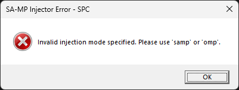

- **Mensagem de Erro Exibida**: `"Invalid injection mode specified. Please use 'samp' or 'omp'."`
- **Causa**: O primeiro argumento da função `Initialize_Game` (`std::wstring_view inject_type`) não corresponde aos valores esperados de `L"samp"` ou `L"omp"`. Pode ser um erro de digitação, uma string vazia ou um valor não reconhecido.
- **Solução**: Verifique se o `std::wstring_view inject_type_str` está definido corretamente como `L"samp"` ou `L"omp"`. É fundamental usar o prefixo `L` para literais de **wide-character (caracteres largos)** ao definir strings para compatibilidade com as constantes da biblioteca.
    ```cpp
    // Correto:
    Initialize_Game(L"samp", /* outros parâmetros */);
    Initialize_Game(L"omp", /* outros parâmetros */);

    // Incorreto (causará erro):
    // Initialize_Game(L"invalid", /* outros parâmetros */);
    // Initialize_Game(L"", /* outros parâmetros */);
    ```

### 2. Porta do Servidor Inválida (Formato ou Intervalo)

A porta é um parâmetro numérico essencial para a conexão com o servidor. Este erro ocorre se o valor não puder ser interpretado como um número válido ou estiver fora do intervalo aceitável **(1 a 65535)**.

#### 2.1. Formato de Porta Não Numérico

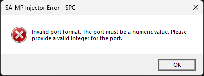

- **Mensagem de Erro Exibida**: `"Invalid port format. The port must be a numeric value. Please provide a valid integer for the port."`
- **Causa**: O argumento `port` (`std::wstring_view`) contém caracteres que não são dígitos numéricos ou não pode ser convertido para um número inteiro.
- **Solução**: Forneça uma string que contenha apenas dígitos e represente um número inteiro válido.
    ```cpp
    // Correto:
    Initialize_Game(/* outros parâmetros */, L"7777", /* outros parâmetros */);

    // Incorreto (formato inválido):
    // Initialize_Game(/* outros parâmetros */, L"port7777", /* outros parâmetros */);

    // Incorreto (invalid):
    // Initialize_Game(/* outros parâmetros */, L"invalid", /* outros parâmetros */);
    ```

#### 2.2. Porta Fora do Intervalo Válido


- **Mensagem de Erro Exibida**: `"The specified port number (XXXX) is outside the valid range of 1 to 65535. Please provide a valid port."` (O **XXXX** será o valor que você tentou usar).
- **Causa**: A porta fornecida é um número válido, mas está abaixo de `1` (reservado ou não utilizável) ou acima de `65535` (limite máximo para **portas TCP/UDP**).
- **Solução**: Forneça uma porta que esteja dentro do intervalo de `1` a `65535`. Portas comuns para **SA-MP**/**OMP** são `7777` ou `7778`.
    ```cpp
    // Correto:
    Initialize_Game(/* outros parâmetros */, L"7777", /* outros parâmetros */);

    // Incorreto (fora do range):
    // Initialize_Game(/* outros parâmetros */, L"0", /* outros parâmetros */); // Muito baixo
    // Initialize_Game(/* outros parâmetros */, L"65536", /* outros parâmetros */); // Muito alto
    // Initialize_Game(/* outros parâmetros */, L"-1", /* outros parâmetros */); // Valor negativo
    ```

### 3. Nickname Inválido (Vazio ou Muito Longo)

O **nickname** do jogador é validado para garantir que o cliente do jogo o aceite.

#### 3.1. Nickname Vazio

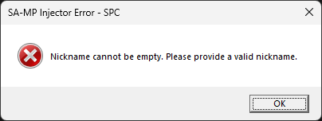

- **Mensagem de Erro Exibida**: `"Nickname cannot be empty. Please provide a valid nickname."`
- **Causa**: O argumento `nickname` (`std::wstring_view`) foi fornecido como uma string vazia.
- **Solução**: Certifique-se de que o nickname não esteja vazio.
    ```cpp
    // Correto:
    Initialize_Game(/* outros parâmetros */, L"Nome", /* outros parâmetros */);

    // Incorreto (vazio):
    // Initialize_Game(/* outros parâmetros */, L"", /* outros parâmetros */);
    ```

#### 3.2. Nickname Muito Longo


- **Mensagem de Erro Exibida**: `"Nickname length exceeds the maximum allowed of 20 characters. Please use a shorter nickname."`
- **Causa**: O comprimento do **nickname** fornecido excede `Constants::MAX_NICKNAME_LENGTH`, que é `20` caracteres.
- **Solução**: Use um **nickname** que tenha no máximo `20` caracteres.
    ```cpp
    // Correto:
    Initialize_Game(/* outros parâmetros */, L"Nome", /* outros parâmetros */);

    // Incorreto (muito longo):
    // Initialize_Game(/* outros parâmetros */, L"EsteApelidoÉMuitoLongoEDepassaVinteCaracteres", /* outros parâmetros */);
    ```

### 4. Arquivos do Jogo ou DLL Não Encontrados

Esta é uma das causas mais comuns de falha. A biblioteca precisa que `gta_sa.exe`, `samp.dll` e, para **OMP**, `omp-client.dll` estejam presentes nos locais esperados.

#### 4.1. Executável do Jogo (`gta_sa.exe`) Não Encontrado

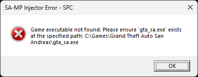

- **Mensagem de Erro Exibida**: `"Game executable not found. Please ensure 'gta_sa.exe' exists at the specified path: [caminho completo]"`. O `[caminho completo]` incluirá a pasta e o nome do arquivo.
- **Causa**: O arquivo `gta_sa.exe` não foi encontrado na pasta fornecida no argumento `folder`.
- **Solução**:
  1. Verifique se o `folder` (`std::wstring_view`) aponta para o diretório correto de instalação do **GTA San Andreas**.
  2. Confirme se `gta_sa.exe` existe dentro dessa pasta e que seu nome não foi alterado.

#### 4.2. Biblioteca SA-MP (`samp.dll`) Não Encontrada


- **Mensagem de Erro Exibida**: `"SA-MP library not found. Please ensure 'samp.dll' exists at the specified path: [caminho completo]"`.
- **Causa**: O arquivo `samp.dll` não foi encontrado na pasta fornecida no argumento `folder`. **Esta DLL** é um requisito para **ambos** os tipos de injeção (`samp` e `omp`).
- **Solução**: Assegure-se de que o `samp.dll` está presente na pasta de instalação do **GTA San Andreas**.

#### 4.3. Biblioteca OMP (`omp-client.dll`) Não Encontrada (apenas para injeção OMP)

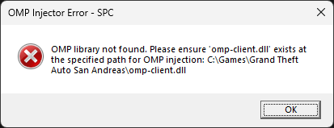

- **Mensagem de Erro Exibida**: `"OMP library not found. Please ensure 'omp-client.dll' exists at the specified path for OMP injection: [caminho completo]"`.
- **Causa**: Se você especificou `L"omp"` como tipo de injeção, mas o arquivo `omp-client.dll` não foi encontrado na pasta fornecida.
- **Solução**: Baixe o cliente **OMP** mais recente e certifique-se de que `omp-client.dll` (e `samp.dll`) estejam presentes na pasta de instalação do **GTA San Andreas**.

### 5. Falha na Criação do Processo do Jogo

Este é um erro mais complexo, pois envolve **permissões do sistema operacional** e o estado atual do `gta_sa.exe`.

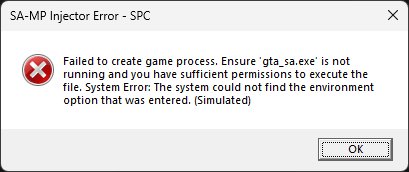

- **Mensagem de Erro Exibida**: `"Failed to create game process. Ensure 'gta_sa.exe' is not running and you have sufficient permissions to execute the file. System Error: [Mensagem de erro do sistema operacional]"`. A mensagem do sistema será adicionada pelo `GetLastError()` (ex: `Access is denied.` ou `The requested operation requires elevation.`).
- **Causa**: A chamada `CreateProcessA` para iniciar o `gta_sa.exe` falhou. As causas comuns incluem:
  - **Processo já em execução**: Uma instância do `gta_sa.exe` já está ativa e bloqueando uma nova execução.
  - **Permissões insuficientes**: O seu aplicativo não tem os privilégios necessários (e.g., administrador) para criar um processo em determinadas configurações de sistema (**UAC** ativado, pastas protegidas, etc.).
  - **Problemas com o executável**: O `gta_sa.exe` pode estar corrompido ou bloqueado por outro programa (ex: um antivírus mal-configurado).
- **Solução**:
  1. Verifique o Gerenciador de Tarefas e certifique-se de que não há nenhuma instância de `gta_sa.exe` em execução. Encerre qualquer uma se houver.
  2. Execute o seu aplicativo que utiliza a biblioteca com privilégios de **Administrador**. Clique com o botão direito no executável e selecione **"Executar como administrador"**.
  3. Se um **antivírus** ou **software** de segurança estiver interferindo, adicione seu aplicativo e/ou a pasta do **GTA:SA** às exceções do antivírus (faça isso com cuidado e apenas se tiver certeza da integridade de seus arquivos).

### 6. Falha na Alocação de Memória no Processo Alvo

A biblioteca tenta alocar um pequeno espaço de memória no `gta_sa.exe` para copiar o **caminho da DLL**.

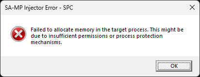

- **Mensagem de Erro Exibida**: `"Failed to allocate memory in the target process. This might be due to insufficient permissions or process protection mechanisms."`
- **Causa**: A função `VirtualAllocEx` (usada para alocar memória dentro de outro processo) falhou. Isso é mais provável se:
  - O processo do **GTA:SA** (mesmo estando em estado suspenso) possui defesas de segurança ou **patches anti-injeção** que impedem a alocação de memória por processos externos.
  - Seu aplicativo não tem as permissões elevadas necessárias para manipular a memória de outro processo.
  - (Menos comum) Há uma escassez extrema de memória virtual no sistema.
- **Solução**:
  1. Execute seu aplicativo com privilégios de **Administrador**.
  2. Certifique-se de que o jogo não possui nenhuma modificação ou **patch de segurança** que possa estar bloqueando tentativas de injeção ou manipulação de memória (isso é mais comum em ambientes modificados ou com certas ferramentas anti-cheat de terceiros).

### 7. Falha na Escrita do Caminho da DLL na Memória do Processo

Após alocar a memória, a biblioteca tenta copiar o **caminho da DLL** para ela.


- **Mensagem de Erro Exibida**: `"Failed to write DLL path to the target process memory. Verify process permissions and ensure the DLL path is accessible."`
- **Causa**: A função `WriteProcessMemory` falhou ao tentar copiar os **bytes do caminho da DLL** para a memória remota alocada no `gta_sa.exe`. Isso geralmente aponta para:
  - **Permissões de gravação**: Seu aplicativo não tem permissão para escrever nessa região de memória ou no processo do **GTA:SA**.
  - **Handle inválido**: O **handle** do processo (`process_handle`) de alguma forma se tornou inválido entre a alocação e a escrita, o que é muito raro devido ao uso de `UniqueResource` mas pode ocorrer sob condições extremas do sistema.
  - **Problemas de Proteção de Memória**: Alguma proteção de memória (seja do **SO** ou de modificações do jogo) impediu a gravação.
- **Solução**: Execute como **Administrador**. Verifique se o `gta_sa.exe` e seu ambiente estão "limpos" de ferramentas que poderiam bloquear operações de memória.

### 8. Falha ao Encontrar Funções Essenciais do Sistema

Estas são **APIs** cruciais do **Windows**; erros aqui indicam um problema fundamental com o sistema operacional ou o ambiente de execução.

#### 8.1. `kernel32.dll` Não Encontrado

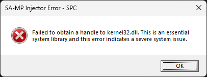

- **Mensagem de Erro Exibida**: `"Failed to obtain a handle to kernel32.dll. This is an essential system library and this error indicates a severe system issue."`
- **Causa**: O `kernel32.dll` é uma das **DLLs** mais básicas do **Windows**, contendo funções essenciais como `CreateProcess`, `VirtualAllocEx`, etc. Se `GetModuleHandleA` não conseguir um **handle** para ela, o sistema operacional está com problemas muito sérios.
- **Solução**: Este é um erro **crítico** que raramente é causado pela biblioteca ou seu aplicativo. Sugere corrupção de arquivos do sistema, problemas graves com o **Windows**, ou uma instalação altamente incomum do **SO**. Recomenda-se executar verificações de integridade do sistema (como `sfc /scannow` no **Prompt de Comando** como **Administrador**) ou, em último caso, reinstalar o **Windows**.

#### 8.2. `LoadLibraryA` Não Encontrado

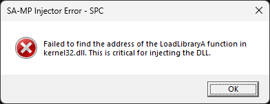

- **Mensagem de Erro Exibida**: `"Failed to find the address of the LoadLibraryA function in kernel32.dll. This is critical for injecting the DLL."`
- **Causa**: Embora `kernel32.dll` tenha sido encontrado, a função `LoadLibraryA` não pôde ser resolvida via `GetProcAddress`. Embora extremamente incomum, pode ser resultado de corrupção do **arquivo DLL** do `kernel32.dll` ou um ambiente de execução altamente não-padrão.
- **Solução**: Assim como o erro de `kernel32.dll` acima, isso indica um problema sério no sistema operacional.

### 9. Falha ao Criar Thread Remota para Injeção

Após preparar o ambiente remoto e copiar o **caminho da DLL**, uma nova **thread** é criada no processo do jogo para "chamar" a `LoadLibraryA`.

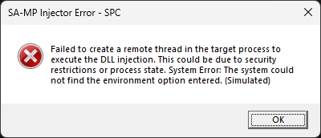

- **Mensagem de Erro Exibida**: `"Failed to create a remote thread in the target process to execute the DLL injection. This could be due to security restrictions or process state. System Error: [Mensagem de erro do sistema operacional]"`.
- **Causa**: A chamada `CreateRemoteThread` falhou. Este erro é comum em sistemas com defesas **anti-injeção** robustas ou quando um programa está monitorando intensamente o comportamento do processo:
  - **Mecanismos de Segurança**: Ferramentas **anti-cheat**, **softwares** de segurança ou certas políticas do **Windows** podem detectar e bloquear tentativas de criar **threads** em processos de terceiros.
  - **Processo Alvo Inconsistente**: Se o processo do **GTA:SA** estiver em um estado inesperado ou instável (embora iniciado em `CREATE_SUSPENDED`), isso pode afetar a capacidade de criar **threads** nele.
- **Solução**:
  1. Execute seu aplicativo com privilégios de **Administrador**.
  2. Verifique se não há ferramentas **anti-cheat**, **antivírus agressivos** ou **firewalls** configurados para inspecionar e bloquear manipulação de processos que possam estar em conflito. Adicione seu aplicativo e o `gta_sa.exe` às exceções, se aplicável (com precaução).
  3. A mensagem de erro do sistema (`GetLastError()`) pode fornecer detalhes adicionais para investigar a causa específica (ex: **"A process has been denied access to create threads for other processes."**).

### 10. Timeout ou Falha na Conclusão da Injeção

Após criar a **thread** remota, o injetor espera que ela conclua a **carga da DLL**.

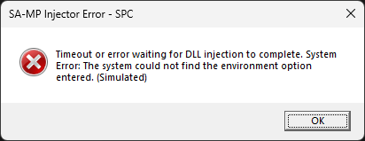

- **Mensagem de Erro Exibida**: `"Timeout or error waiting for DLL injection to complete. System Error: [Mensagem de erro do sistema operacional]"`.
- **Causa**: A **thread** remota que está executando `LoadLibraryA` demorou mais de `Constants::DLL_INJECTION_TIMEOUT_MS` (10 segundos) para retornar, ou ela falhou e `GetExitCodeThread` retornou 0. As causas potenciais incluem:
  - **Problemas na DLL Injetada**: A `DllMain` da `samp.dll` ou `omp-client.dll` está demorando muito para executar, contém um **loop infinito**, um **crash**, ou um erro que **impede a DLL** de carregar corretamente (ex: **dependências de DLLs** ausentes).
  - **Bloqueio Silencioso**: Um mecanismo de segurança pode ter bloqueado o `LoadLibraryA` mas não notificou com um erro óbvio de criação de **thread**.
- **Solução**:
  1. Verifique a integridade dos arquivos `samp.dll` e `omp-client.dll`. Eles podem estar corrompidos ou serem de uma versão incompatível com seu `gta_sa.exe`.
  2. Garanta **que a DLL injetada** não depende de **outras DLLs** que possam estar faltando ou inacessíveis no sistema.

### 11. Falha ao Resumir o Thread do Processo do Jogo

Este é o passo final para iniciar o jogo depois **que as DLLs** são injetadas.


- **Mensagem de Erro Exibida**: `"Failed to resume the game process thread: [Mensagem de erro do sistema operacional]"`.
- **Causa**: A chamada `ResumeThread` falhou, o que significa que o **thread** principal do `gta_sa.exe` não pôde ser ativado para iniciar a execução do jogo. Isso é um erro raro, mas pode acontecer se:
  - O **handle** do **thread** do processo tornou-se inválido.
  - O sistema operacional impediu a retomada por algum motivo, possivelmente relacionado a uma interrupção de segurança ou estado inconsistente do processo.
  - O processo pode ter sido encerrado externamente entre a **injeção da DLL** e a tentativa de retomada do **thread** principal.
- **Solução**: Se todas as etapas anteriores foram bem-sucedidas e apenas `ResumeThread` falhou, pode ser um problema com o sistema operacional, com a própria instalação do **GTA:SA**, ou com outro **software** de segurança muito rigoroso. Reexamine o estado do `gta_sa.exe` via **Gerenciador de Tarefas** logo antes e após o erro. Tentar reiniciar o computador pode resolver problemas de estado temporário do sistema.

> [!TIP] Ferramentas de Diagnóstico
> Em cenários de depuração complexos, ferramentas como **Process Monitor (Sysinternals Suite)** ou um depurador (como **Visual Studio Debugger**, **WinDbg**, **OllyDbg**) podem ser inestimáveis. Elas podem ajudar a observar as chamadas de **API**, verificar erros de acesso, rastrear o estado dos **handles** e até mesmo inspecionar a memória do processo, fornecendo uma visão aprofundada do que está acontecendo por baixo dos panos.

## Licença

Copyright © **SA-MP Programming Community**

Este software é licenciado sob os termos da Licença MIT ("Licença"); você pode utilizar este software de acordo com as condições da Licença. Uma cópia da Licença pode ser obtida em: [MIT License](https://opensource.org/licenses/MIT)

### Termos e Condições de Uso

#### 1. Permissões Concedidas

A presente licença concede, gratuitamente, a qualquer pessoa que obtenha uma cópia deste software e arquivos de documentação associados, os seguintes direitos:
* Utilizar, copiar, modificar, mesclar, publicar, distribuir, sublicenciar e/ou vender cópias do software sem restrições
* Permitir que pessoas para as quais o software é fornecido façam o mesmo, desde que sujeitas às condições a seguir

#### 2. Condições Obrigatórias

Todas as cópias ou partes substanciais do software devem incluir:
* O aviso de direitos autorais acima
* Este aviso de permissão
* O aviso de isenção de responsabilidade abaixo

#### 3. Direitos Autorais

O software e toda a documentação associada são protegidos por leis de direitos autorais. A **SA-MP Programming Community** mantém a titularidade dos direitos autorais originais do software.

#### 4. Isenção de Garantias e Limitação de Responsabilidade

O SOFTWARE É FORNECIDO "COMO ESTÁ", SEM GARANTIA DE QUALQUER TIPO, EXPRESSA OU IMPLÍCITA, INCLUINDO, MAS NÃO SE LIMITANDO ÀS GARANTIAS DE COMERCIALIZAÇÃO, ADEQUAÇÃO A UM DETERMINADO FIM E NÃO VIOLAÇÃO. 

EM NENHUMA CIRCUNSTÂNCIA OS AUTORES OU TITULARES DOS DIREITOS AUTORAIS SERÃO RESPONSÁVEIS POR QUALQUER REIVINDICAÇÃO, DANOS OU OUTRA RESPONSABILIDADE, SEJA EM AÇÃO DE CONTRATO, DELITO OU DE OUTRA FORMA, DECORRENTE DE, FORA DE OU EM CONEXÃO COM O SOFTWARE OU O USO OU OUTRAS NEGOCIAÇÕES NO SOFTWARE.

---

Para informações detalhadas sobre a Licença MIT, consulte: https://opensource.org/licenses/MIT