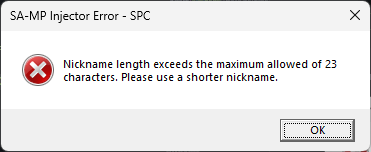
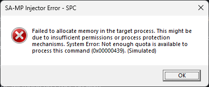
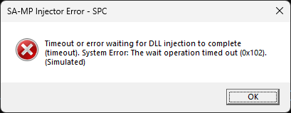

# SA-MP Injector PowerShell


[](https://github.com/spc-samp/samp-injector)


O **SA-MP Injector PowerShell** é mais do que um script de **injeção de DLL**. Ele representa uma **biblioteca de funções e classes PowerShell** desenvolvida para oferecer uma solução robusta e completa para a inicialização programática do jogo **Grand Theft Auto: San Andreas** (**GTA:SA**) em conjunto com seus clientes multiplayer, especificamente **SA-MP (San Andreas Multiplayer)** e **OMP (Open Multiplayer)**. Seu propósito primordial é simplificar o processo de lançamento do jogo, eliminando a complexidade inerente à manipulação direta de processos do sistema operacional e à passagem de argumentos de linha de comando.

Desenvolvido para oferecer máxima flexibilidade e fácil integração, esta biblioteca permite que os desenvolvedores a incorporem diretamente em seus **projetos e scripts PowerShell**. Ela não apenas orquestra a **injeção fundamental das DLLs** do cliente multiplayer (`samp.dll` ou `omp-client.dll`), mas também gerencia de forma inteligente todos os parâmetros essenciais de conexão (**nickname**, **endereço IP**, **porta** e **senha**), simulando uma inicialização nativa por meio dos recursos intrínsecos da **Windows API**, que são acessados diretamente via **PowerShell**.

## Idiomas

- Deutsch: [README](translations/Deutsch/README.md)
- English: [README](translations/English/README.md)
- Español: [README](translations/Espanol/README.md)
- Français: [README](translations/Francais/README.md)
- Italiano: [README](translations/Italiano/README.md)
- Polski: [README](translations/Polski/README.md)
- Русский: [README](translations/Русский/README.md)
- Svenska: [README](translations/Svenska/README.md)
- Türkçe: [README](translations/Turkce/README.md)

## Índice

- [SA-MP Injector PowerShell](#sa-mp-injector-powershell)
  - [Idiomas](#idiomas)
  - [Índice](#índice)
  - [Conceitos Fundamentais e Motivação](#conceitos-fundamentais-e-motivação)
    - [Por que Injetar DLLs?](#por-que-injetar-dlls)
    - [SA-MP e OMP: Distinções e Similaridades](#sa-mp-e-omp-distinções-e-similaridades)
    - [Injeção de DLLs em PowerShell: Uma Abordagem Direta com WinAPI](#injeção-de-dlls-em-powershell-uma-abordagem-direta-com-winapi)
  - [Arquitetura Interna da Biblioteca: Um Mergulho Aprofundado](#arquitetura-interna-da-biblioteca-um-mergulho-aprofundado)
    - [`Constants.ps1`](#constantsps1)
    - [`CustomTypes.ps1`](#customtypesps1)
    - [`StringUtils.ps1`](#stringutilsps1)
    - [`ErrorUtils.ps1`](#errorutilsps1)
    - [`Process.ps1`](#processps1)
    - [`InjectorCore.ps1`](#injectorcoreps1)
    - [`Injector.ps1`](#injectorps1)
    - [`Cleanup.ps1`](#cleanupps1)
  - [Exemplos Abrangentes de Utilização](#exemplos-abrangentes-de-utilização)
    - [1. Preparação do Ambiente de Desenvolvimento](#1-preparação-do-ambiente-de-desenvolvimento)
    - [2. Cenário Básico: Conectando a um Servidor SA-MP](#2-cenário-básico-conectando-a-um-servidor-sa-mp)
    - [3. Cenário Avançado: Conectando a um Servidor OMP](#3-cenário-avançado-conectando-a-um-servidor-omp)
    - [4. Execução a partir de um Script Pai](#4-execução-a-partir-de-um-script-pai)
  - [Tratamento de Erros Comuns e Mensagens](#tratamento-de-erros-comuns-e-mensagens)
    - [1. Tipo de Injeção Inválido](#1-tipo-de-injeção-inválido)
    - [2. Porta do Servidor Inválida (Formato ou Intervalo)](#2-porta-do-servidor-inválida-formato-ou-intervalo)
      - [2.1. Formato de Porta Não Numérico](#21-formato-de-porta-não-numérico)
      - [2.2. Porta Fora do Intervalo Válido](#22-porta-fora-do-intervalo-válido)
    - [3. Nickname Inválido (Vazio ou Muito Longo)](#3-nickname-inválido-vazio-ou-muito-longo)
      - [3.1. Nickname Vazio](#31-nickname-vazio)
      - [3.2. Nickname Muito Longo](#32-nickname-muito-longo)
    - [4. Arquivos do Jogo ou DLL Não Encontrados](#4-arquivos-do-jogo-ou-dll-não-encontrados)
      - [4.1. Executável do Jogo (`gta_sa.exe`) Não Encontrado](#41-executável-do-jogo-gta_saexe-não-encontrado)
      - [4.2. Biblioteca SA-MP (`samp.dll`) Não Encontrada](#42-biblioteca-sa-mp-sampdll-não-encontrada)
      - [4.3. Biblioteca OMP (`omp-client.dll`) Não Encontrada (apenas para injeção OMP)](#43-biblioteca-omp-omp-clientdll-não-encontrada-apenas-para-injeção-omp)
    - [5. Falha na Criação do Processo do Jogo](#5-falha-na-criação-do-processo-do-jogo)
    - [6. Falha na Alocação de Memória no Processo Alvo](#6-falha-na-alocação-de-memória-no-processo-alvo)
    - [7. Falha na Escrita do Caminho da DLL na Memória do Processo](#7-falha-na-escrita-do-caminho-da-dll-na-memória-do-processo)
    - [8. Falha ao Encontrar Funções Essenciais do Sistema](#8-falha-ao-encontrar-funções-essenciais-do-sistema)
      - [8.1. `kernel32.dll` Não Encontrado](#81-kernel32dll-não-encontrado)
      - [8.2. `LoadLibraryA` Não Encontrado](#82-loadlibrarya-não-encontrado)
    - [9. Falha ao Criar Thread Remota para Injeção](#9-falha-ao-criar-thread-remota-para-injeção)
    - [10. Timeout ou Falha na Conclusão da Injeção](#10-timeout-ou-falha-na-conclusão-da-injeção)
    - [11. Falha ao Resumir o Thread do Processo do Jogo](#11-falha-ao-resumir-o-thread-do-processo-do-jogo)
  - [Licença](#licença)
    - [Termos e Condições de Uso](#termos-e-condições-de-uso)
      - [1. Permissões Concedidas](#1-permissões-concedidas)
      - [2. Condições Obrigatórias](#2-condições-obrigatórias)
      - [3. Direitos Autorais](#3-direitos-autorais)
      - [4. Isenção de Garantias e Limitação de Responsabilidade](#4-isenção-de-garantias-e-limitação-de-responsabilidade)

## Conceitos Fundamentais e Motivação

### Por que Injetar DLLs?

> [!NOTE]
> A **injeção de DLL (Dynamic Link Library)** é um método utilizado em sistemas operacionais **Microsoft Windows** que permite a execução de código dentro do espaço de memória de outro processo em execução. É uma técnica poderosa com diversas aplicações legítimas, desde a depuração e monitoramento de programas até a modificação de comportamento de aplicativos para estender suas funcionalidades.

No contexto de jogos como o **GTA San Andreas**, que não foram originalmente desenvolvidos com funcionalidade multiplayer integrada, a **injeção de DLLs** é a base para a existência de clientes multiplayer como **SA-MP** e **OMP**. Esses clientes são implementados como **DLLs** que, uma vez injetadas no processo do `gta_sa.exe`, assumem o controle, interceptam funções do jogo, e estabelecem comunicação com servidores multiplayer.

Ao invés de depender de um lançador externo ou da modificação direta do executável do jogo, a **injeção de DLL** permite uma inicialização mais flexível e programável, especialmente útil em ambientes onde se deseja automatizar o processo de conexão a servidores específicos com configurações pré-definidas.

### SA-MP e OMP: Distinções e Similaridades

O **SA-MP** e o **OMP** são as duas principais plataformas de multiplayer para **GTA San Andreas**. Ambos funcionam como modificações do jogo base, transformando-o em um ambiente online massivamente multiplayer.

- **SA-MP (San Andreas Multiplayer)**: O cliente original e mais consolidado, amplamente utilizado por muitos anos. Sua arquitetura exige a `samp.dll` para operar.
- **OMP (Open Multiplayer)**: Um projeto de código aberto, geralmente visto como um sucessor ou alternativa mais moderna ao **SA-MP**, oferecendo melhorias de performance, estabilidade e funcionalidades adicionais. Ele requer a `omp-client.dll`.

Embora operem de forma similar (**injetando uma DLL** no processo do **GTA:SA**), a biblioteca **SA-MP Injector PowerShell** foi cuidadosamente desenvolvida para suportar **ambas as DLLs**, reconhecendo suas distinções de nomes de arquivo e permitindo que o desenvolvedor escolha o cliente multiplayer desejado através de um parâmetro de configuração. Isso assegura que a biblioteca possa ser utilizada com a vasta gama de servidores e projetos baseados em qualquer uma das plataformas.

### Injeção de DLLs em PowerShell: Uma Abordagem Direta com WinAPI

PowerShell é uma linguagem de script poderosa para automação no Windows, mas a manipulação de processos e a injeção de DLLs em um nível tão baixo de sistema não é sua função primária. Para alcançar esse objetivo, a biblioteca **SA-MP Injector PowerShell** faz uso extensivo do comando `Add-Type` para invocar diretamente as funções da **Windows API (WinAPI)**.

O `Add-Type` permite definir e compilar código C# (ou outros idiomas .NET) em tempo de execução no ambiente PowerShell. Este código C# atua como uma "ponte" para as funções nativas da WinAPI (`DllImport`), possibilitando operações como:

- **`CreateProcessA`**: Para iniciar o processo do GTA:SA.
- **`VirtualAllocEx`**: Para alocar memória dentro do processo remoto.
- **`WriteProcessMemory`**: Para copiar o caminho da DLL para a memória alocada.
- **`GetModuleHandleA` e `GetProcAddress`**: Para obter o endereço da função `LoadLibraryA` na `kernel32.dll`.
- **`CreateRemoteThread`**: Para criar uma thread no processo remoto que executa `LoadLibraryA`, efetivamente carregando a DLL.
- **`WaitForSingleObject` e `GetExitCodeThread`**: Para monitorar o sucesso da injeção.
- **`ResumeThread`**: Para reativar o processo do jogo após a injeção.
- **`CloseHandle`**: Para fechar handles de recursos do sistema e evitar vazamentos.
- **`MessageBoxW`**: Para exibir mensagens de erro informativas ao usuário.

Essa abordagem direta com a WinAPI permite que o PowerShell realize as mesmas operações de baixo nível que uma aplicação compilada em **C++** faria, com a conveniência de um ambiente de script.

## Arquitetura Interna da Biblioteca: Um Mergulho Aprofundado

A biblioteca **SA-MP Injector PowerShell** adota uma abordagem modular para gerenciar a complexidade do processo de injeção. Cada script é um módulo especializado, responsável por uma fatia específica da funcionalidade geral, promovendo a clareza do código, a manutenibilidade e a expansibilidade.

### `Constants.ps1`

Este script é a base de todas as configurações fixas da biblioteca. Ele define um hash table global (`$global:CONSTANTS`) que armazena todas as literais e valores numéricos utilizados, como limites de porta, nomes de arquivos DLL, referências a APIs do sistema e flags para operações como criação de processo e alocação de memória.

```powershell
$global:CONSTANTS = @{
    # Port validation limits
    MIN_PORT = 1
    MAX_PORT = 65535
    
    # Nickname constraints
    MAX_NICKNAME_LENGTH = 20
    
    # Required file names
    SAMP_DLL_NAME = "samp.dll"
    OMP_DLL_NAME = "omp-client.dll"
    GAME_EXE_NAME = "gta_sa.exe"
    
    # System API references
    KERNEL32_DLL = "kernel32.dll"
    USER32_DLL = "user32.dll" # Utilizado para MessageBoxW
    LOAD_LIBRARY_FUNC = "LoadLibraryA"
    
    # Command line argument prefixes
    CMD_ARG_CONFIG = "-c"
    CMD_ARG_NICKNAME = "-n"
    CMD_ARG_HOST = "-h"
    CMD_ARG_PORT = "-p"
    CMD_ARG_PASSWORD = "-z"
    
    # Injection type identifiers
    INJECT_TYPE_SAMP = "samp"
    INJECT_TYPE_OMP = "omp"
    
    # Error dialog titles
    ERROR_TITLE_SAMP = "SA-MP Injector Error - SPC"
    ERROR_TITLE_OMP = "OMP Injector Error - SPC"
    
    # Process creation flags (CREATE_SUSPENDED | DETACHED_PROCESS)
    # 0x00000104 = CREATE_SUSPENDED (0x4) + DETACHED_PROCESS (0x100)
    PROCESS_CREATION_FLAGS = 0x00000104
    
    # Operation timeouts
    DLL_INJECTION_TIMEOUT_MS = 10000 # 10 segundos
    
    # Memory allocation constants
    # 0x00003000 = MEM_COMMIT (0x1000) + MEM_RESERVE (0x2000)
    MEMORY_ALLOCATION_TYPE = 0x00003000
    # 0x00000004 = PAGE_READWRITE
    MEMORY_PROTECTION = 0x00000004
    # 0x00008000 = MEM_RELEASE
    MEMORY_FREE_TYPE = 0x00008000
    
    # Wait object results (Windows API)
    WAIT_OBJECT_0 = 0x00000000
    WAIT_TIMEOUT = 0x00000102
    WAIT_FAILED = 0xFFFFFFFF
    
    # Thread resume error indicator (Windows API)
    THREAD_RESUME_ERROR = 0xFFFFFFFF # ResumeThread returns -1 on failure
    
    # MessageBox constants (Windows API)
    MB_OK = 0x00000000
    MB_ICONERROR = 0x00000010
    MB_TOPMOST = 0x00040000
}
```

> [!TIP]
> O uso de um hash table global para constantes é uma prática comum em scripts PowerShell. Ele centraliza as configurações e evita o "magic number" e strings repetidas, tornando o código mais legível e fácil de manter. Os valores das flags (`0x...`) correspondem aos valores decimais das constantes definidas na Windows API.

### `CustomTypes.ps1`

Este script é fundamental para a interação com a Windows API. Ele define tipos C# em tempo de execução usando `Add-Type`, incluindo:

- **`Inject_Type` enum**: Para categorizar o tipo de injeção (SAMP ou OMP), melhorando a segurança de tipo.
- **`WinAPI` class**: Uma classe estática que importa e expõe as funções da Windows API necessárias para a injeção. Cada método nesta classe corresponde a uma função da API (`DllImport`), com a assinatura e o conjunto de caracteres (`CharSet`) corretos.
- **`Startup_Info` struct e `Process_Information` struct**: Estruturas de dados C# que replicam as estruturas `STARTUPINFO` e `PROCESS_INFORMATION` usadas pela função `CreateProcessA` da Windows API.
- **`Process_Info` class**: Uma classe simples em C# que age como um contêiner para os handles do processo e da thread retornados após a criação bem-sucedida de um processo, facilitando o transporte e gerenciamento desses handles dentro do ambiente PowerShell.

```powershell
if (-not ([System.Management.Automation.PSTypeName]'Inject_Type').Type) {
    Add-Type -TypeDefinition @'
        public enum Inject_Type {
            SAMP = 0,
            OMP = 1
        }
'@
}

if (-not ([System.Management.Automation.PSTypeName]'WinAPI').Type) {
    Add-Type -TypeDefinition @'
        using System;
        using System.Runtime.InteropServices;
        using System.Text; // Necessário para Marshal.GetLastWin32Error
        
        public class WinAPI {
            [DllImport("kernel32.dll", SetLastError = true, CharSet = CharSet.Ansi)]
            public static extern bool CreateProcessA(string lpApplicationName, [In, Out] byte[] lpCommandLine, IntPtr lpProcessAttributes, IntPtr lpThreadAttributes, bool bInheritHandles, 
                uint dwCreationFlags, IntPtr lpEnvironment, string lpCurrentDirectory, [In, Out] ref Startup_Info lpStartupInfo, out Process_Information lpProcessInformation);
            
            [DllImport("kernel32.dll", SetLastError = true)]
            public static extern IntPtr VirtualAllocEx(IntPtr hProcess, IntPtr lpAddress, uint dwSize, uint flAllocationType, uint flProtect);
            
            [DllImport("kernel32.dll", SetLastError = true)]
            public static extern bool VirtualFreeEx(IntPtr hProcess, IntPtr lpAddress, uint dwSize, uint dwFreeType);
            
            [DllImport("kernel32.dll", SetLastError = true)]
            public static extern bool WriteProcessMemory(IntPtr hProcess, IntPtr lpBaseAddress, byte[] lpBuffer, uint nSize, out IntPtr lpNumberOfBytesWritten);
            
            [DllImport("kernel32.dll", SetLastError = true, CharSet = CharSet.Ansi)]
            public static extern IntPtr GetModuleHandleA(string lpModuleName);
            
            [DllImport("kernel32.dll", SetLastError = true, CharSet = CharSet.Ansi)]
            public static extern IntPtr GetProcAddress(IntPtr hModule, string lpProcName);
            
            [DllImport("kernel32.dll", SetLastError = true)]
            public static extern IntPtr CreateRemoteThread(IntPtr hProcess, IntPtr lpThreadAttributes, uint dwStackSize, IntPtr lpStartAddress, IntPtr lpParameter, uint dwCreationFlags, 
                out IntPtr lpThreadId);
            
            [DllImport("kernel32.dll", SetLastError = true)]
            public static extern uint WaitForSingleObject(IntPtr hHandle, uint dwMilliseconds);
            
            [DllImport("kernel32.dll", SetLastError = true)]
            public static extern bool GetExitCodeThread(IntPtr hThread, out uint lpExitCode);
            
            [DllImport("kernel32.dll", SetLastError = true)]
            public static extern uint ResumeThread(IntPtr hThread);
            
            [DllImport("kernel32.dll", SetLastError = true)]
            public static extern bool CloseHandle(IntPtr hObject);
            
            [DllImport("user32.dll", SetLastError = true, CharSet = CharSet.Unicode)]
            public static extern int MessageBoxW(IntPtr hWnd, string lpText, string lpCaption, uint uType);
            
            // Estrutura C# para STARTUPINFO
            [StructLayout(LayoutKind.Sequential, CharSet = CharSet.Ansi)]
            public struct Startup_Info {
                public uint cb;
                public string lpReserved;
                public string lpDesktop;
                public string lpTitle;
                public uint dwX;
                public uint dwY;
                public uint dwXSize;
                public uint dwYSize;
                public uint dwXCountChars;
                public uint dwYCountChars;
                public uint dwFillAttribute;
                public uint dwFlags;
                public short wShowWindow;
                public short cbReserved2;
                public IntPtr lpReserved2;
                public IntPtr hStdInput;
                public IntPtr hStdOutput;
                public IntPtr hStdError;
            }
            
            // Estrutura C# para PROCESS_INFORMATION
            [StructLayout(LayoutKind.Sequential)]
            public struct Process_Information {
                public IntPtr hProcess;
                public IntPtr hThread;
                public uint dwProcessId;
                public uint dwThreadId;
            }
        }
'@
}

if (-not ([System.Management.Automation.PSTypeName]'Process_Info').Type) {
    Add-Type -TypeDefinition @'
        using System;
        
        // Classe auxiliar para transportar handles de processo e thread
        public class Process_Info {
            public IntPtr ProcessHandle { get; set; }
            public IntPtr ThreadHandle { get; set; }
            
            public Process_Info() {
                ProcessHandle = IntPtr.Zero;
                ThreadHandle = IntPtr.Zero;
            }
        }
'@
}
```

> [!IMPORTANT]
> A injeção de DLLs de 32 bits (como `samp.dll` e `omp-client.dll`) em um processo de 32 bits (`gta_sa.exe`) **exige que o ambiente PowerShell também seja de 32 bits**. O **SA-MP Injector PowerShell** lida com isso automaticamente reiniciando-se em um shell PowerShell x86 se detectar que está sendo executado em um ambiente x64. Isso é crucial para garantir a compatibilidade do tamanho dos ponteiros e o correto funcionamento da injeção.
>
> A diretiva `if (-not ([System.Management.Automation.PSTypeName]'TypeName').Type)` garante que os tipos C# sejam adicionados ao ambiente PowerShell apenas uma vez, evitando erros de redefinição se o script for executado múltiplas vezes na mesma sessão.

### `StringUtils.ps1`

Este módulo fornece uma função utilitária essencial para manipulação de strings, especificamente para lidar com codificações de caracteres necessárias ao interagir com a Windows API legada (funções "A" de char*).

```powershell
function Convert_Wide_To_Local_8Bit {
    param([Parameter(Mandatory = $false)] [AllowEmptyString()] [string]$wide_string)
    
    if ([string]::IsNullOrEmpty($wide_string)) {
        return [string]::Empty
    }

    try {
        # Obtém a página de código ANSI local do sistema
        $ansi_code_page = [System.Globalization.CultureInfo]::CurrentCulture.TextInfo.ANSICodePage
        $encoding = [System.Text.Encoding]::GetEncoding($ansi_code_page)
        
        # Converte a string Unicode (wide) para bytes na codificação ANSI local
        $bytes = $encoding.GetBytes($wide_string)

        # Converte os bytes de volta para uma string usando a mesma codificação ANSI
        # Isso garante que a string seja compatível com APIs que esperam codificação 8-bit (ANSI)
        return $encoding.GetString($bytes)
    }
    catch {
        # Em caso de erro na conversão (e.g., caracteres que não podem ser mapeados),
        # retorna a string original como um fallback, embora possa causar problemas
        # se contiver caracteres não suportados por APIs ANSI.
        return $wide_string
    }
}
```

> [!IMPORTANT]
> A função `Convert_Wide_To_Local_8Bit` é crucial porque muitas funções da Windows API com sufixo "A" (`CreateProcessA`, `LoadLibraryA`, `GetModuleHandleA`, `GetProcAddress`) esperam strings codificadas em ANSI (8-bit), que dependem da página de código do sistema local. Por padrão, as strings em PowerShell são Unicode. Esta função realiza a conversão necessária. Se o nome de arquivo ou um argumento de linha de comando contiver caracteres fora da página de código ANSI do sistema, a conversão pode resultar em caracteres incorretos ou perda de dados. Para este projeto, que visa interagir com programas antigos, esta abordagem ANSI é tipicamente suficiente e necessária.

### `ErrorUtils.ps1`

Este módulo é responsável por fornecer feedback claro ao usuário em caso de falha. Ele centraliza a lógica de obtenção de mensagens de erro do sistema e a exibição de caixas de diálogo padrão do Windows.

```powershell
function Get_System_Error_Message {
    param([Parameter(Mandatory = $true)][int]$error_code)
    
    try {
        # Usa Win32Exception para obter a mensagem de erro formatada pelo sistema
        $exception = New-Object System.ComponentModel.Win32Exception($error_code)
        
        return $exception.Message
    }
    catch {
        # Fallback para mensagem de erro desconhecida
        return "Unknown error (Code: $error_code)"
    }
}

function Show_Error {
    param([Parameter(Mandatory = $true)][string]$message, [Parameter(Mandatory = $true)][Inject_Type]$inject_type)
    
    # Determina o título da caixa de diálogo com base no tipo de injeção
    $title = if ($inject_type -eq [Inject_Type]::SAMP) {
        $global:CONSTANTS.ERROR_TITLE_SAMP
    }
    else {
        $global:CONSTANTS.ERROR_TITLE_OMP
    }
    
    try {
        # Combina flags para MessageBoxW (OK, Ícone de Erro, AlwaysOnTop)
        $message_box_flags = $global:CONSTANTS.MB_OK -bor $global:CONSTANTS.MB_ICONERROR -bor $global:CONSTANTS.MB_TOPMOST
        
        # Chama a função MessageBoxW importada via Add-Type
        [void][WinAPI]::MessageBoxW([System.IntPtr]::Zero, $message, $title, $message_box_flags)
    }
    catch {
        # Em caso de falha ao exibir a MessageBox (e.g., em ambientes sem UI), escreve no console
        Write-Host "[$title] $message" -ForegroundColor Red
    }
}
```

> [!NOTE]
> `Get_System_Error_Message` utiliza `System.ComponentModel.Win32Exception` do .NET para converter um código de erro numérico da Windows API (`GetLastError()`) em uma descrição de texto legível pelo usuário, que pode estar localizada no idioma do sistema operacional.
>
> `Show_Error` usa a função `MessageBoxW` importada da `user32.dll` via `Add-Type` (`CustomTypes.ps1`) para exibir uma caixa de diálogo informativa. As flags como `MB_OK` e `MB_ICONERROR` são importadas das constantes da WinAPI.

### `Process.ps1`

Este é o módulo principal responsável pela interação direta com as APIs de baixo nível do Windows para manipular processos. Ele encapsula as operações cruciais de criação de processo e injeção de DLL, lidando com handles, memória e threads.

```powershell
class Process {
    # Libera os handles de processo e thread, prevenindo vazamentos de recursos
    [void] Close_Process_Info([Process_Info]$process_info) {
        if ($null -ne $process_info) {
            # Fecha o handle do processo se for válido
            if ($process_info.ProcessHandle -ne [System.IntPtr]::Zero -and $process_info.ProcessHandle -ne [System.IntPtr]::new(-1)) {
                [void][WinAPI]::CloseHandle($process_info.ProcessHandle)
                $process_info.ProcessHandle = [System.IntPtr]::Zero # Marca como fechado
            }

            # Fecha o handle da thread se for válido
            if ($process_info.ThreadHandle -ne [System.IntPtr]::Zero -and $process_info.ThreadHandle -ne [System.IntPtr]::new(-1)) {
                [void][WinAPI]::CloseHandle($process_info.ThreadHandle)
                $process_info.ThreadHandle = [System.IntPtr]::Zero # Marca como fechado
            }
        }
    }

    # Cria o processo do jogo GTA:SA em estado suspenso
    [Process_Info] Create_Game_Process([string]$game_path, [string]$command_args, [string]$working_dir) {
        $startup_info = New-Object WinAPI+Startup_Info
        # Define o tamanho da estrutura, crucial para APIs do Windows
        $startup_info.cb = [System.Runtime.InteropServices.Marshal]::SizeOf($startup_info)
        
        $process_information = New-Object WinAPI+Process_Information
        
        $command_line_bytes = $null

        if (-not [string]::IsNullOrEmpty($command_args)) {
            # Converte os argumentos da linha de comando para um array de bytes ANSI com terminador nulo
            $command_line_bytes = [System.Text.Encoding]::Default.GetBytes($command_args + "`0")
        }
        
        # Define o diretório de trabalho, null se vazio
        $current_directory = if ([string]::IsNullOrEmpty($working_dir)) {
            $null
        }
        else {
            $working_dir
        }
        
        # Chama a função CreateProcessA da Windows API
        $success = [WinAPI]::CreateProcessA($game_path, $command_line_bytes, [System.IntPtr]::Zero, [System.IntPtr]::Zero, $false, $global:CONSTANTS.PROCESS_CREATION_FLAGS, 
            [System.IntPtr]::Zero, $current_directory, [ref]$startup_info, [ref]$process_information)
        
        if (-not $success) {
            # Em caso de falha, obtém o último erro do sistema e exibe
            $error_code = [System.Runtime.InteropServices.Marshal]::GetLastWin32Error()
            $error_message = Get_System_Error_Message $error_code
            Show_Error "Failed to create game process. Ensure 'gta_sa.exe' is not running and you have sufficient permissions to execute the file. System Error: $error_message" ([Inject_Type]::SAMP)

            return $null # Retorna null em caso de falha
        }
        
        # Retorna um objeto Process_Info contendo os handles do processo e da thread
        $result = New-Object Process_Info
        $result.ProcessHandle = $process_information.hProcess
        $result.ThreadHandle = $process_information.hThread
        
        return $result
    }
    
    # Injeta uma DLL no processo remoto
    [bool] Inject_DLL([IntPtr]$process_handle, [string]$dll_path, [ref]$error_message) {
        if ($process_handle -eq [System.IntPtr]::Zero) {
            $error_message.Value = "Invalid process handle provided for DLL injection."

            return $false
        }
        
        if ([string]::IsNullOrEmpty($dll_path)) {
            $error_message.Value = "DLL path cannot be empty."

            return $false
        }
        
        # Converte o caminho da DLL para bytes ASCII (ANSI 8-bit) com terminador nulo
        $dll_path_bytes = [System.Text.Encoding]::ASCII.GetBytes($dll_path + "`0")
        $dll_path_size = $dll_path_bytes.Length
        
        # Aloca memória no processo remoto para o caminho da DLL
        $remote_memory = [WinAPI]::VirtualAllocEx($process_handle, [System.IntPtr]::Zero, $dll_path_size, $global:CONSTANTS.MEMORY_ALLOCATION_TYPE, $global:CONSTANTS.MEMORY_PROTECTION)
        
        if ($remote_memory -eq [System.IntPtr]::Zero) {
            $error_code = [System.Runtime.InteropServices.Marshal]::GetLastWin32Error()
            $error_message.Value = "Failed to allocate memory in the target process. This might be due to insufficient permissions or process protection mechanisms. System Error: $(Get_System_Error_Message $error_code)"

            return $false
        }
        
        # Usa um bloco try/finally para garantir que a memória remota seja liberada
        try {
            $bytes_written = [System.IntPtr]::Zero
            # Escreve o caminho da DLL na memória remota
            $write_success = [WinAPI]::WriteProcessMemory($process_handle, $remote_memory, $dll_path_bytes, $dll_path_size, [ref]$bytes_written)
            
            if (-not $write_success) {
                $error_code = [System.Runtime.InteropServices.Marshal]::GetLastWin32Error()
                $error_message.Value = "Failed to write DLL path to the target process memory. Verify process permissions and ensure the DLL path is accessible. System Error: $(Get_System_Error_Message $error_code)"
                
                return $false
            }
            
            # Obtém o handle para kernel32.dll (que está carregado em todos os processos)
            $kernel32_handle = [WinAPI]::GetModuleHandleA($global:CONSTANTS.KERNEL32_DLL)

            if ($kernel32_handle -eq [System.IntPtr]::Zero) {
                $error_code = [System.Runtime.InteropServices.Marshal]::GetLastWin32Error()
                $error_message.Value = "Failed to obtain a handle to kernel32.dll. This is an essential system library and this error indicates a severe system issue. System Error: $(Get_System_Error_Message $error_code)"
                
                return $false
            }
            
            # Obtém o endereço da função LoadLibraryA em kernel32.dll.
            # Este endereço é consistente entre processos no mesmo SO.
            $load_library_address = [WinAPI]::GetProcAddress($kernel32_handle, $global:CONSTANTS.LOAD_LIBRARY_FUNC)

            if ($load_library_address -eq [System.IntPtr]::Zero) {
                $error_code = [System.Runtime.InteropServices.Marshal]::GetLastWin32Error()
                $error_message.Value = "Failed to find the address of the LoadLibraryA function in kernel32.dll. This is critical for injecting the DLL. System Error: $(Get_System_Error_Message $error_code)"
                
                return $false
            }
            
            $thread_id = [System.IntPtr]::Zero
            # Cria uma thread remota no processo alvo para executar LoadLibraryA
            $remote_thread_handle = [WinAPI]::CreateRemoteThread($process_handle, [System.IntPtr]::Zero, 0, $load_library_address, $remote_memory, 0, [ref]$thread_id)
            
            if ($remote_thread_handle -eq [System.IntPtr]::Zero) {
                $error_code = [System.Runtime.InteropServices.Marshal]::GetLastWin32Error()
                $error_message.Value = "Failed to create a remote thread in the target process to execute the DLL injection. This could be due to security restrictions or process state. System Error: $(Get_System_Error_Message $error_code)"
                
                return $false
            }
            
            # Usa um bloco try/finally para garantir que o handle da thread remota seja fechado
            try {
                # Espera a thread remota (injeção de DLL) ser concluída ou atingir um timeout
                $wait_result = [WinAPI]::WaitForSingleObject($remote_thread_handle, $global:CONSTANTS.DLL_INJECTION_TIMEOUT_MS)
                
                if ($wait_result -ne $global:CONSTANTS.WAIT_OBJECT_0) {
                    $error_code = [System.Runtime.InteropServices.Marshal]::GetLastWin32Error()

                    $wait_result_message = switch ($wait_result) {
                        $global:CONSTANTS.WAIT_TIMEOUT { "timeout" }
                        $global:CONSTANTS.WAIT_FAILED { "wait failed" }
                        default { "unknown wait result ($wait_result)" }
                    }

                    $error_message.Value = "Timeout or error waiting for DLL injection to complete ($wait_result_message). System Error: $(Get_System_Error_Message $error_code)"

                    return $false
                }
                
                $exit_code = 0
                # Obtém o código de saída da thread remota. Para LoadLibraryA, 0 significa falha.
                $get_exit_code_success = [WinAPI]::GetExitCodeThread($remote_thread_handle, [ref]$exit_code)
                
                if (-not $get_exit_code_success -or $exit_code -eq 0) {
                    $error_code = [System.Runtime.InteropServices.Marshal]::GetLastWin32Error()
                    $error_message.Value = "DLL injection failed or returned an error. The LoadLibrary call may have failed in the target process. Exit Code: $exit_code. System Error: $(Get_System_Error_Message $error_code)"

                    return $false
                }
                
                return $true # Injeção bem-sucedida
            }
            finally {
                # Garante que o handle da thread remota seja fechado
                [void][WinAPI]::CloseHandle($remote_thread_handle)
            }
        }
        finally {
            # Garante que a memória alocada remotamente seja liberada
            # 0 para dwSize em MEM_RELEASE libera toda a região alocada por VirtualAllocEx
            [void][WinAPI]::VirtualFreeEx($process_handle, $remote_memory, 0, $global:CONSTANTS.MEMORY_FREE_TYPE)
        }
    }
}
```

> [!NOTE]
> A classe `Process` usa `[System.IntPtr]` para representar handles do Windows. É importante notar o uso extensivo de `try/finally` para garantir que os handles (`ProcessHandle`, `ThreadHandle`, `remote_memory`, `remote_thread_handle`) sejam fechados e a memória liberada corretamente, mesmo em caso de erros. Esta é a forma PowerShell de implementar o princípio **RAII** (Resource Acquisition Is Initialization), embora menos integrado na sintaxe da linguagem.

### `InjectorCore.ps1`

Esta é a classe orquestradora que une todas as funcionalidades dos módulos anteriores. Ela coordena a validação, a construção de argumentos de linha de comando, a criação do processo e as chamadas de injeção de DLL.

```powershell
class Injector_Core {
    # Função principal que orquestra a inicialização e injeção do jogo
    [bool] Initialize_Game([Inject_Type]$inject_type, [string]$folder, [string]$nickname, [string]$ip, [string]$port, [string]$password) {
        # Constrói os caminhos completos para os arquivos essenciais
        $game_path = Join-Path -Path $folder -ChildPath $global:CONSTANTS.GAME_EXE_NAME
        $samp_dll_path = Join-Path -Path $folder -ChildPath $global:CONSTANTS.SAMP_DLL_NAME
        $omp_dll_path = Join-Path -Path $folder -ChildPath $global:CONSTANTS.OMP_DLL_NAME
        
        $validation_error = [string]::Empty # Variável para capturar mensagens de erro de validação
        
        # 1. Validação de Arquivos
        if (-not (Validate_Files $game_path $samp_dll_path $omp_dll_path $inject_type)) {
            # Erro já foi exibido pela função de validação
            return $false
        }

        # 2. Validação de Porta
        if (-not (Validate_Port $port ([ref]$validation_error))) {
            Show_Error $validation_error $inject_type
            return $false
        }
        
        # 3. Validação de Nickname
        if (-not (Validate_Nickname $nickname ([ref]$validation_error))) {
            Show_Error $validation_error $inject_type
            return $false
        }
        
        # 4. Conversão de Strings para Codificação ANSI/8-bit (necessário para APIs legadas)
        $converted_nickname = Convert_Wide_To_Local_8Bit $nickname
        $converted_ip = Convert_Wide_To_Local_8Bit $ip
        $converted_port = Convert_Wide_To_Local_8Bit $port
        $converted_password = Convert_Wide_To_Local_8Bit $password
        $converted_game_path = Convert_Wide_To_Local_8Bit $game_path
        $converted_folder = Convert_Wide_To_Local_8Bit $folder
        $converted_samp_dll_path = Convert_Wide_To_Local_8Bit $samp_dll_path
        $converted_omp_dll_path = Convert_Wide_To_Local_8Bit $omp_dll_path
        
        # 5. Construção dos Argumentos da Linha de Comando
        $command_arguments = $this.Build_Command_Args($converted_nickname, $converted_ip, $converted_port, $converted_password)
        
        $process_manager = New-Object Process # Instancia a classe Process
        $process_info = $null # Variável para armazenar informações do processo criado
        
        # Usa um bloco try/finally para garantir que os handles do processo sejam fechados
        try {
            # 6. Criação do Processo do Jogo (Suspenso)
            $process_info = $process_manager.Create_Game_Process($converted_game_path, $command_arguments, $converted_folder)
            
            if ($null -eq $process_info) {
                # Erro já foi exibido pela função de criação de processo
                return $false
            }

            $injection_error = [string]::Empty # Variável para capturar mensagens de erro de injeção
            
            # 7. Injeção da samp.dll
            if (-not $process_manager.Inject_DLL($process_info.ProcessHandle, $converted_samp_dll_path, ([ref]$injection_error))) {
                Show_Error "Failed to inject samp.dll: $injection_error" $inject_type
                return $false
            }
            
            # 8. Injeção condicional da omp-client.dll (apenas se o tipo de injeção for OMP)
            if ($inject_type -eq [Inject_Type]::OMP) {
                if (-not $process_manager.Inject_DLL($process_info.ProcessHandle, $converted_omp_dll_path, ([ref]$injection_error))) {
                    Show_Error "Failed to inject omp-client.dll: $injection_error" $inject_type
                    return $false
                }
            }
            
            # 9. Resumir o Processo do Jogo
            # O processo foi criado em estado suspenso para permitir a injeção.
            # Agora que as DLLs foram injetadas, ele pode ser retomado.
            $resume_result = [WinAPI]::ResumeThread($process_info.ThreadHandle)

            if ($resume_result -eq $global:CONSTANTS.THREAD_RESUME_ERROR) {
                $error_code = [System.Runtime.InteropServices.Marshal]::GetLastWin32Error()
                $error_message = Get_System_Error_Message $error_code
                Show_Error "Failed to resume the game process thread: $error_message" $inject_type

                return $false
            }
            
            return $true # Sucesso em todas as etapas!
        }
        finally {
            # Garante que os handles do processo sejam fechados no final,
            # independentemente de sucesso ou falha.
            if ($null -ne $process_info) {
                $process_manager.Close_Process_Info($process_info)
            }
        }
    }
    
    # Constrói a string de argumentos da linha de comando para o executável do jogo
    [string] Build_Command_Args([string]$nickname, [string]$ip, [string]$port, [string]$password) {
        $arguments = @(
            $global:CONSTANTS.CMD_ARG_CONFIG,
            $global:CONSTANTS.CMD_ARG_NICKNAME, $nickname,
            $global:CONSTANTS.CMD_ARG_HOST, $ip, 
            $global:CONSTANTS.CMD_ARG_PORT, $port
        )
        
        if (-not [string]::IsNullOrEmpty($password)) {
            $arguments += @($global:CONSTANTS.CMD_ARG_PASSWORD, $password)
        }

        return $arguments -join ' '
    }
}
```

> [!CAUTION]
> Para o **OMP**, a injeção envolve a `omp-client.dll` *além* da `samp.dll`. Isso está de acordo com a maneira como o **OMP** geralmente funciona, pois ele pode usar a `samp.dll` como base e estender funcionalidades com `omp-client.dll`. É crucial que **ambas as DLLs** estejam presentes e funcionais no diretório do jogo para que a injeção OMP seja bem-sucedida. Se uma falhar, o jogo pode não inicializar corretamente ou o cliente multiplayer pode não carregar.
>
> Note que, como o PowerShell não possui um `std::optional` ou garantia de **RAII** nativa da mesma forma que C++, o código usa um bloco `try/finally` explícito na função `Initialize_Game` para garantir que `Close_Process_Info` seja chamado e os handles sejam liberados, mesmo que um erro ocorra. Isso é uma boa prática de limpeza de recursos em PowerShell.

### `Injector.ps1`

Este é o script de entrada principal da biblioteca. Ele lida com o carregamento dos outros módulos, a validação do ambiente PowerShell (verificando se é x86 para compatibilidade de injeção) e a inicialização da classe `Injector_Core`. É o script que o usuário final executará.

```powershell
param([Parameter(Mandatory = $true, Position = 0)][ValidateNotNullOrEmpty()][string]$inject_type,
    [Parameter(Mandatory = $true, Position = 1)][ValidateNotNullOrEmpty()][string]$folder,
    [Parameter(Mandatory = $true, Position = 2)][ValidateNotNullOrEmpty()][string]$nickname,
    [Parameter(Mandatory = $true, Position = 3)][ValidateNotNullOrEmpty()][string]$ip,
    [Parameter(Mandatory = $true, Position = 4)][ValidateNotNullOrEmpty()][string]$port,
    [Parameter(Position = 5)][AllowEmptyString()][string]$password = "",
    [switch]$restarted_x86) # Flag interna para indicar que o script já foi reiniciado em x86

$ErrorActionPreference = 'Stop' # Garante que erros de não-término se comportem como erros de término
# Isso faz com que blocos catch captures mais erros e previne que o script continue inesperadamente.

# Obtém o caminho completo do script atual, essencial para carregar os módulos auxiliares
$script_path = $MyInvocation.MyCommand.Path

if ([string]::IsNullOrEmpty($script_path)) {
    # Em casos onde o script é invocado de forma especial (e.g. from pipeline), $MyInvocation.MyCommand.Path pode ser vazio
    $script_path = Join-Path -Path (Get-Location) -ChildPath $MyInvocation.MyCommand.Name
}

$script_directory = Split-Path -Parent $script_path # Diretório base da biblioteca
$exit_code = 1 # Código de saída padrão (falha)

try {
    # Carrega todos os módulos da biblioteca (constantes, tipos personalizados, utilitários, etc.)
    . (Join-Path -Path $script_directory -ChildPath "Constants.ps1")
    . (Join-Path -Path $script_directory -ChildPath "CustomTypes.ps1")
    . (Join-Path -Path $script_directory -ChildPath "StringUtils.ps1")
    . (Join-Path -Path $script_directory -ChildPath "ErrorUtils.ps1")
    . (Join-Path -Path $script_directory -ChildPath "Validation.ps1")
    . (Join-Path -Path $script_directory -ChildPath "Process.ps1")
    . (Join-Path -Path $script_directory -ChildPath "InjectorCore.ps1")

    # Define a função de interface principal para o usuário.
    # É uma wrapper para a classe Injector_Core.
    function Initialize_Game {
        param([string]$inject_type, [string]$folder, [string]$nickname, [string]$ip, [string]$port, [string]$password = "")

        # Verifica se o ambiente PowerShell é x64 e se ainda não foi reiniciado em x86
        if ([IntPtr]::Size -eq 8 -and -not $restarted_x86) {
            Write-Host "Detected PowerShell x64 environment. Restarting on PowerShell x86 for DLL injection compatibility (32-bit)..." -ForegroundColor Yellow

            # Localiza o executável do PowerShell de 32 bits
            $powershell_x86_path = Join-Path -Path $env:windir -ChildPath "SysWOW64\WindowsPowerShell\v1.0\powershell.exe"

            if (-not (Test-Path -Path $powershell_x86_path)) {
                Write-Host "Could not find powershell.exe (x86) at '$powershell_x86_path'. 32-bit DLL injection may fail." -ForegroundColor Red
                return $false
            }

            # Prepara a lista de argumentos para o novo processo PowerShell x86
            $argument_list = @("-NoProfile", "-NonInteractive", "-ExecutionPolicy", "Bypass", "-File", $script_path, $inject_type, $folder, $nickname, $ip, $port)
            
            if (-not [string]::IsNullOrEmpty($password)) {
                $argument_list += $password
            }
            # Adiciona a flag para indicar que já foi reiniciado
            $argument_list += "-restarted_x86"
            
            try {
                $process_start_info = New-Object System.Diagnostics.ProcessStartInfo
                $process_start_info.FileName = $powershell_x86_path
                # Junta os argumentos em uma string para StartInfo.Arguments
                $process_start_info.Arguments = ($argument_list | ForEach-Object { "`"$_`"" }) -join " " # Envolve args em aspas para tratar espaços
                $process_start_info.RedirectStandardOutput = $true # Redireciona a saída do processo filho
                $process_start_info.RedirectStandardError = $true   # Redireciona os erros do processo filho
                $process_start_info.UseShellExecute = $false     # Não usa ShellExecute (executa diretamente o PowerShell.exe)
                $process_start_info.CreateNoWindow = $true       # Não cria uma nova janela para o processo filho

                $child_process = New-Object System.Diagnostics.Process
                $child_process.StartInfo = $process_start_info
                
                # Inicia o processo filho e espera a conclusão
                [void]$child_process.Start()
                $child_process.WaitForExit()
                
                # Captura e exibe a saída/erros do processo filho
                $standard_output = $child_process.StandardOutput.ReadToEnd()
                $standard_error = $child_process.StandardError.ReadToEnd()

                if (-not [string]::IsNullOrEmpty($standard_output)) { Write-Host $standard_output }
                if (-not [string]::IsNullOrEmpty($standard_error)) { Write-Host $standard_error -ForegroundColor Red }

                $child_exit_code = $child_process.ExitCode
                
                if ($child_exit_code -eq 0) {
                    Write-Host "PowerShell x86 process completed with code 0 (Success)." -ForegroundColor Green
                    return $true
                }
                else {
                    Write-Host "PowerShell x86 process completed with error code: '$child_exit_code'." -ForegroundColor Red
                    return $false
                }
            }
            catch {
                Write-Host "Failed to start PowerShell x86: '$($_.Exception.Message)'" -ForegroundColor Red
                return $false
            }
        }
        
        # Lógica de inicialização real, só é alcançada se o ambiente for x86 ou já foi reiniciado
        $injection_type = $null

        switch ($inject_type.ToLower()) {
            $global:CONSTANTS.INJECT_TYPE_SAMP {
                $injection_type = [Inject_Type]::SAMP
            }
            $global:CONSTANTS.INJECT_TYPE_OMP {
                $injection_type = [Inject_Type]::OMP
            }
            default {
                Show_Error "Invalid injection mode specified. Please use 'samp' or 'omp'." ([Inject_Type]::SAMP)
                return $false
            }
        }

        $injector_core = New-Object Injector_Core # Instancia a classe principal de injeção

        # Delega a chamada para a função Initialize_Game da classe Injector_Core
        return $injector_core.Initialize_Game($injection_type, $folder, $nickname, $ip, $port, $password)
    }

    # Parâmetros passados para a função principal
    $initialization_parameters = @{
        inject_type = $inject_type
        folder = $folder
        nickname = $nickname
        ip = $ip
        port = $port
        password = $password
    }

    # Chamada para iniciar o processo de injeção
    $game_initialization_result = Initialize_Game @initialization_parameters

    if ($game_initialization_result) {
        $exit_code = 0 # Sucesso
    }
    else {
        $exit_code = 1 # Falha
    }
}
catch {
    Write-Host "Critical error during execution: '$($_.Exception.Message)'" -ForegroundColor Red
    $exit_code = 1
}
finally {
    # Garante que o script de limpeza seja executado ao final, independente de sucesso ou falha
    try {
        . (Join-Path -Path $script_directory -ChildPath "Cleanup.ps1")
    }
    catch {
        Write-Host "Warning: Cleanup script execution failed: '$($_.Exception.Message)'" -ForegroundColor Yellow
    }
    
    exit $exit_code # Sai com o código de status apropriado
}
```

> [!NOTE]
> Este script é o ponto de entrada principal para a injeção. Ele é responsável por:
> - Definir os **parâmetros de linha de comando** que o usuário final usará.
> - Definir `$ErrorActionPreference = 'Stop'` para um controle mais rígido de erros.
> - **Carregar** todos os scripts auxiliares usando o "dot-sourcing" (`. `), garantindo que suas funções e classes estejam disponíveis na sessão atual.
> - Implementar a lógica de **restart para ambiente x86**: Se o PowerShell estiver rodando em 64 bits, ele se relança automaticamente em uma instância de 32 bits (SysWOW64) e passa os mesmos argumentos, pois a injeção de DLLs de 32 bits é mais confiável (e, em muitos casos, obrigatória) de um processo de 32 bits. Isso é uma distinção chave do PowerShell em comparação com uma aplicação C++ compilada diretamente para x86.
> - Chamar a função `Initialize_Game` para iniciar o processo de injeção.
> - Gerenciar o código de saída do script (0 para sucesso, 1 para falha).
> - Chamar o script `Cleanup.ps1` no bloco `finally`.

### `Cleanup.ps1`

Este script é responsável por remover as funções e variáveis globais carregadas pela biblioteca da sessão atual do PowerShell. Isso é uma boa prática para evitar poluição do ambiente e garantir que execuções subsequentes do script com diferentes configurações não encontrem estados inesperados de sessões anteriores.

```powershell
$functions_to_remove = @(
    '*Initialize_Game*', # Usa wildcard para remover funções (pode ter aliases)
    '*Get_System_Error_Message*',
    '*Show_Error*',
    '*Convert_Wide_To_Local_8Bit*',
    '*Validate_*', # Remove todas as funções que começam com 'Validate_'
    '*Build_Command_Args*'
)

# Itera sobre os padrões e remove as funções
foreach ($pattern in $functions_to_remove) {
    Get-Command -CommandType Function -Name $pattern -ErrorAction SilentlyContinue | ForEach-Object {
        try {
            Remove-Item -Path "Function:$($_.Name)" -Force -ErrorAction SilentlyContinue
        }
        catch {} # Ignora erros se a função não puder ser removida por algum motivo
    }
}

$global_variables_to_remove = @(
    'CONSTANTS',
    'CAN_SHOW_MESSAGE_BOX' # Adicione aqui se mais variáveis globais forem introduzidas
)

# Itera sobre as variáveis globais e as remove
foreach ($variable_name in $global_variables_to_remove) {
    try {
        Remove-Variable -Name $variable_name -Scope Global -Force -ErrorAction SilentlyContinue
    }
    catch {} # Ignora erros
}

$variable_patterns_to_remove = @(
    '*_Core*', # Remove variáveis que terminam com '_Core' (e.g., $injector_core)
    '*Process*' # Remove variáveis que terminam com 'Process' (e.g., $process_manager)
)

# Remove variáveis em diferentes escopos usando padrões
foreach ($scope in @('Script', 'Local')) {
    foreach ($pattern in $variable_patterns_to_remove) {
        Get-Variable -Scope $scope -Name $pattern -ErrorAction SilentlyContinue | ForEach-Object {
            try {
                Remove-Variable -Name $_.Name -Scope $scope -Force -ErrorAction SilentlyContinue
            }
            catch {} # Ignora erros
        }
    }
}
```

> [!TIP]
> A limpeza é crucial em scripts PowerShell que importam muitos elementos para a sessão. `Remove-Item -Path "Function:..."` e `Remove-Variable` são usados para desalocar esses elementos. O uso de `ErrorAction SilentlyContinue` e `try/catch` vazios nos loops de remoção garante que o script de limpeza não falhe caso algum item já tenha sido removido ou não exista.

## Exemplos Abrangentes de Utilização

Para integrar o **SA-MP Injector PowerShell** em seu projeto ou usá-lo diretamente, siga as instruções e analise os cenários abaixo.

### 1. Preparação do Ambiente de Desenvolvimento

- **PowerShell Version**: Recomenda-se **PowerShell 5.1** ou superior (compatível com `Add-Type` para classes).
- **Permissões de Execução**: O PowerShell possui políticas de execução. Você precisará permitir a execução de scripts locais. Abra o PowerShell como **Administrador** e execute:
   ```powershell
   Set-ExecutionPolicy -ExecutionPolicy RemoteSigned -Scope CurrentUser
   ```
   Isso permitirá que scripts assinados rodem, e scripts que você criou (não baixados da internet) rodem localmente sem assinatura.
- **Copiar Arquivos**: Coloque todos os arquivos `.ps1` da biblioteca (`Injector.ps1`, `Constants.ps1`, `CustomTypes.ps1`, `StringUtils.ps1`, `ErrorUtils.ps1`, `Validation.ps1`, `Process.ps1`, `InjectorCore.ps1`, `Cleanup.ps1`) em um único diretório.
- **Permissões de Processo**: Seu script precisará de privilégios de **Administrador** para criar processos e injetar DLLs em outro processo. Sempre execute o **PowerShell como Administrador** ao usar esta biblioteca.

### 2. Cenário Básico: Conectando a um Servidor SA-MP

Este é o caso de uso mais comum, iniciando o GTA:SA e conectando a um servidor SA-MP com um nickname e IP/porta específicos.

```powershell
# Crie um novo script, por exemplo, "StartSAMP.ps1"

# Importa a função principal da biblioteca SA-MP Injector PowerShell
# Certifique-se de que o caminho abaixo reflita onde o Injector.ps1 está localizado.
# Por exemplo, se Injector.ps1 estiver na mesma pasta que este script:
$injector_path = Join-Path -Path $PSScriptRoot -ChildPath "Injector.ps1"

# Ou, se estiver em um subdiretório:
# $injector_path = Join-Path -Path $PSScriptRoot -ChildPath "SA-MP-Injector-PowerShell\Injector.ps1"

# Importa a função Injector.ps1 usando dot-sourcing para que suas funções
# fiquem disponíveis no escopo atual.
. $injector_path

# Definir as variáveis de configuração
# Mude estes caminhos e detalhes de servidor para corresponder à sua configuração local.
$game_folder = "C:\Games\GTA San Andreas" # Onde gta_sa.exe, samp.dll estão
$player_nickname = "Nome"
$server_ip = "127.0.0.1" # Exemplo: seu servidor local
$server_port = "7777"
$server_password = "" # Deixe vazio se não houver senha

Write-Host "Iniciando SA-MP..." -ForegroundColor Cyan
Write-Host "Pasta do jogo: $game_folder" -ForegroundColor Gray
Write-Host "Nickname: $player_nickname" -ForegroundColor Gray
Write-Host "Servidor: $server_ip:$server_port" -ForegroundColor Gray

# Chamada à função da biblioteca para iniciar o jogo
$result = Initialize_Game `
    -inject_type "samp" ` # Tipo de injeção: "samp" ou "omp"
    -folder $game_folder ` # Caminho da pasta do jogo
    -nickname $player_nickname ` # Nickname desejado
    -ip $server_ip ` # IP do servidor
    -port $server_port ` # Porta do servidor (string)
    -password $server_password # Senha do servidor (string, pode ser vazia)

if ($result) {
    Write-Host "`n--- SA-MP inicializado com sucesso! ---" -ForegroundColor Green
    Write-Host "O jogo foi iniciado em um processo separado." -ForegroundColor Green
}
else {
    Write-Host "`n--- FALHA ao iniciar SA-MP! ---" -ForegroundColor Red
    Write-Host "Verifique as mensagens de erro exibidas (pop-ups ou console)." -ForegroundColor Red
}

# Mantém o console aberto para visualizar as mensagens de saída
Read-Host "`nPressione Enter para fechar o programa."
```

**Para executar o script:**
1. **Salve** o código acima como `StartSAMP.ps1` (ou qualquer nome, desde que termine com `.ps1`).
2. **Salve** todos os arquivos da biblioteca do **SA-MP Injector PowerShell** na mesma pasta ou em uma estrutura de subpastas que você gerenciar com `$injector_path`.
3. **Abra o PowerShell como Administrador**.
4. Navegue até o diretório onde você salvou `StartSAMP.ps1`.
5. Execute o script:
   ```powershell
   .\StartSAMP.ps1
   ```
   (Lembre-se que `.` antes do nome do script é necessário para scripts no diretório atual, a menos que você o adicione ao PATH).

### 3. Cenário Avançado: Conectando a um Servidor OMP

Para o OMP, a lógica é idêntica à do SA-MP, mas você especifica `"omp"` como o `inject_type` e assegura que a `omp-client.dll` esteja presente no diretório do jogo.

```powershell
# Crie um novo script, por exemplo, "StartOMP.ps1"

# Importa a função principal da biblioteca SA-MP Injector PowerShell
$injector_path = Join-Path -Path $PSScriptRoot -ChildPath "Injector.ps1"
. $injector_path

# Definir as variáveis de configuração para OMP
$game_folder = "C:\Games\GTA San Andreas" # Onde gta_sa.exe, samp.dll e omp-client.dll estão
$player_nickname = "Nome"
$server_ip = "127.0.0.1" # Exemplo: seu servidor local
$server_port = "7777"
$server_password = "" # Deixe vazio se não houver senha

Write-Host "Iniciando OMP..." -ForegroundColor Cyan
Write-Host "Pasta do jogo: $game_folder" -ForegroundColor Gray
Write-Host "Nickname: $player_nickname" -ForegroundColor Gray
Write-Host "Servidor: $server_ip:$server_port" -ForegroundColor Gray

# Chamada à função da biblioteca para iniciar o jogo
$result = Initialize_Game `
    -inject_type "omp" `   # Tipo de injeção: "omp"
    -folder $game_folder `
    -nickname $player_nickname `
    -ip $server_ip `
    -port $server_port `
    -password $server_password

if ($result) {
    Write-Host "`n--- OMP inicializado com sucesso! ---" -ForegroundColor Green
    Write-Host "O jogo foi iniciado em um processo separado." -ForegroundColor Green
}
else {
    Write-Host "`n--- FALHA ao iniciar OMP! ---" -ForegroundColor Red
    Write-Host "Verifique as mensagens de erro exibidas (pop-ups ou console)." -ForegroundColor Red
}

Read-Host "`nPressione Enter para fechar o programa."
```

**Para executar o script:**

Siga os mesmos passos da seção anterior, substituindo `StartSAMP.ps1` por `StartOMP.ps1`.

### 4. Execução a partir de um Script Pai

É possível criar um script mais complexo que invoca a biblioteca e lida com parâmetros ou condições de forma mais avançada. O conceito central permanece o mesmo: o `Injector.ps1` deve ser "dot-sourced" no script pai.

```powershell
# Launcher.ps1
param(
    [string]$type = "samp",
    [string]$game_dir = "C:\Games\GTA San Andreas",
    [string]$player_nickname = "Nome",
    [string]$server_ip = "127.0.0.1",
    [string]$server_port = "7777",
    [string]$server_password = ""
)

# Carrega o Injector.ps1
$injector_script = Join-Path -Path $PSScriptRoot -ChildPath "Injector.ps1"

# Verifica se o script principal do injetor existe antes de carregar
if (-not (Test-Path $injector_script -PathType Leaf)) {
    Write-Error "Injector.ps1 não encontrado em $injector_script. Por favor, verifique o caminho."
    
    exit 1
}

. $injector_script # Usa dot-sourcing para carregar as funções

Write-Host "Tentando iniciar o jogo com os parâmetros fornecidos..." -ForegroundColor Yellow

$success = Initialize_Game -inject_type $type `
    -folder $game_dir `
    -nickname $player_nickname `
    -ip $server_ip `
    -port $server_port `
    -password $server_password

if ($success) {
    Write-Host "`nRelatório do launcher: Jogo iniciado com sucesso!" -ForegroundColor Green
}
else {
    Write-Host "`nRelatório do launcher: Falha ao iniciar o jogo!" -ForegroundColor Red
}

Read-Host "`nPressione Enter para sair."
```

**Execução do `Launcher.ps1`:**

```powershell
# Executa com valores padrão
.\Launcher.ps1

# Executa para OMP com IP e porta específicos
.\Launcher.ps1 -type "omp" -server_ip "omp.server.com" -server_port "7777" -player_nickname "Nome" -server_password "secure123"
```

## Tratamento de Erros Comuns e Mensagens

O **SA-MP Injector PowerShell** prioriza a usabilidade, e uma parte fundamental disso é fornecer feedback claro ao usuário em caso de falha. As mensagens de erro são apresentadas através de caixas de **diálogo do Windows** (`MessageBoxW`) ou diretamente no console do PowerShell, e são categorizadas pelo tipo de **injeção (SA-MP ou OMP)** para maior contexto. Isso garante que você saiba exatamente o que deu errado e como abordar a resolução.

Aqui estão alguns dos erros comuns que você pode encontrar e suas prováveis causas/soluções, acompanhadas de exemplos visuais de como essas caixas de diálogo aparecem para o usuário final:

### 1. Tipo de Injeção Inválido

Se o `inject_type` fornecido não for `"samp"` ou `"omp"`, a biblioteca não saberá qual cliente multiplayer você pretende inicializar.


- **Mensagem de Erro Exibida**: `"Invalid injection mode specified. Please use 'samp' or 'omp'."`
- **Causa**: O argumento `inject_type` não corresponde aos valores esperados de `"samp"` ou `"omp"`. Pode ser um erro de digitação, uma string vazia ou um valor não reconhecido.
- **Solução**: Verifique se o `$inject_type` está definido corretamente como `"samp"` ou `"omp"`. É importante que a string corresponda exatamente (embora o código use `ToLower()` para a comparação).
   ```powershell
   # Correto:
   Initialize_Game -inject_type "samp" ...
   Initialize_Game -inject_type "omp" ...

   # Incorreto (causará erro):
   # Initialize_Game -inject_type "invalid" ...
   # Initialize_Game -inject_type "" ...
   ```

### 2. Porta do Servidor Inválida (Formato ou Intervalo)

A porta é um parâmetro numérico essencial para a conexão com o servidor. Este erro ocorre se o valor não puder ser interpretado como um número válido ou estiver fora do intervalo aceitável (**1 a 65535**).

#### 2.1. Formato de Porta Não Numérico


- **Mensagem de Erro Exibida**: `"Invalid port format. The port must be a numeric value. Please provide a valid integer for the port."`
- **Causa**: O argumento `port` contém caracteres que não são dígitos numéricos ou não pode ser convertido para um número inteiro válido (e.g., `"abc"`, `"7777a"`).
- **Solução**: Forneça uma string que contenha apenas dígitos e represente um número inteiro válido.
   ```powershell
   # Correto:
   Initialize_Game ... -port "7777" ...
   
   # Incorreto (formato inválido):
   # Initialize_Game ... -port "port7777" ...
   # Initialize_Game ... -port "invalid" ...
   ```

#### 2.2. Porta Fora do Intervalo Válido


- **Mensagem de Erro Exibida**: `"The specified port number (XXXX) is outside the valid range of 1 to 65535. Please provide a valid port."` (O **XXXX** será o valor que você tentou usar).
- **Causa**: A porta fornecida é um número válido, mas está abaixo de `1` (reservado ou não utilizável) ou acima de `65535` (limite máximo para **portas TCP/UDP**).
- **Solução**: Forneça uma porta que esteja dentro do intervalo de `1` a `65535`. Portas comuns para **SA-MP**/**OMP** são `7777`.
   ```powershell
   # Correto:
   Initialize_Game ... -port "7777" ...

   # Incorreto (fora do range):
   # Initialize_Game ... -port "0" ...      # Muito baixo
   # Initialize_Game ... -port "65536" ...  # Muito alto
   # Initialize_Game ... -port "-1" ...     # Valor negativo
   ```

### 3. Nickname Inválido (Vazio ou Muito Longo)

O **nickname** do jogador é validado para garantir que o cliente do jogo o aceite.

#### 3.1. Nickname Vazio


- **Mensagem de Erro Exibida**: `"Nickname cannot be empty. Please provide a valid nickname."`
- **Causa**: O argumento `nickname` foi fornecido como uma string vazia.
- **Solução**: Certifique-se de que o nickname não esteja vazio.
   ```powershell
   # Correto:
   Initialize_Game ... -nickname "MeuNome" ...

   # Incorreto (vazio):
   # Initialize_Game ... -nickname "" ...
   ```

#### 3.2. Nickname Muito Longo



- **Mensagem de Erro Exibida**: `"Nickname length exceeds the maximum allowed of 20 characters. Please use a shorter nickname."`
- **Causa**: O comprimento do **nickname** fornecido excede `$global:CONSTANTS.MAX_NICKNAME_LENGTH`, que é `20` caracteres.
- **Solução**: Use um **nickname** que tenha no máximo `20` caracteres.
   ```powershell
   # Correto:
   Initialize_Game ... -nickname "Curto" ...

   # Incorreto (muito longo):
   # Initialize_Game ... -nickname "EsteNomeDeJogadorEhMuitoGrandeParaUsarAqui" ...
   ```

### 4. Arquivos do Jogo ou DLL Não Encontrados

Esta é uma das causas mais comuns de falha. A biblioteca precisa que `gta_sa.exe`, `samp.dll` e, para **OMP**, `omp-client.dll` estejam presentes nos locais esperados.

#### 4.1. Executável do Jogo (`gta_sa.exe`) Não Encontrado


- **Mensagem de Erro Exibida**: `"Game executable not found. Please ensure 'gta_sa.exe' exists at the specified path: [caminho completo]"`. O `[caminho completo]` incluirá a pasta e o nome do arquivo.
- **Causa**: O arquivo `gta_sa.exe` não foi encontrado na pasta fornecida no argumento `folder`.
- **Solução**:
   1. Verifique se o `$folder` aponta para o diretório correto de instalação do **GTA San Andreas**.
   2. Confirme se `gta_sa.exe` existe dentro dessa pasta e que seu nome não foi alterado.

#### 4.2. Biblioteca SA-MP (`samp.dll`) Não Encontrada


- **Mensagem de Erro Exibida**: `"SA-MP library not found. Please ensure 'samp.dll' exists at the specified path: [caminho completo]"`.
- **Causa**: O arquivo `samp.dll` não foi encontrado na pasta fornecida no argumento `folder`. **Esta DLL** é um requisito para **ambos** os tipos de injeção (`samp` e `omp`).
- **Solução**: Assegure-se de que o `samp.dll` está presente na pasta de instalação do **GTA San Andreas**.

#### 4.3. Biblioteca OMP (`omp-client.dll`) Não Encontrada (apenas para injeção OMP)


- **Mensagem de Erro Exibida**: `"OMP library not found. Please ensure 'omp-client.dll' exists at the specified path for OMP injection: [caminho completo]"`.
- **Causa**: Se você especificou `"omp"` como tipo de injeção, mas o arquivo `omp-client.dll` não foi encontrado na pasta fornecida.
- **Solução**: Baixe o cliente **OMP** mais recente e certifique-se de que `omp-client.dll` (e `samp.dll`) estejam presentes na pasta de instalação do **GTA San Andreas**.

### 5. Falha na Criação do Processo do Jogo

Este é um erro mais complexo, pois envolve **permissões do sistema operacional** e o estado atual do `gta_sa.exe`.


- **Mensagem de Erro Exibida**: `"Failed to create game process. Ensure 'gta_sa.exe' is not running and you have sufficient permissions to execute the file. System Error: [Mensagem de erro do sistema operacional]"`. A mensagem do sistema será adicionada por `Get_System_Error_Message` (ex: `Access is denied.` ou `The requested operation requires elevation.`).
- **Causa**: A chamada `CreateProcessA` para iniciar o `gta_sa.exe` falhou. As causas comuns incluem:
   - **Processo já em execução**: Uma instância do `gta_sa.exe` já está ativa e bloqueando uma nova execução.
   - **Permissões insuficientes**: O seu script não tem os privilégios necessários (e.g., administrador) para criar um processo em determinadas configurações de sistema (**UAC** ativado, pastas protegidas, etc.).
   - **Problemas com o executável**: O `gta_sa.exe` pode estar corrompido ou bloqueado por outro programa (ex: um antivírus mal-configurado).
- **Solução**:
   1. Verifique o Gerenciador de Tarefas e certifique-se de que não há nenhuma instância de `gta_sa.exe` em execução. Encerre qualquer uma se houver.
   2. Execute o script **PowerShell como Administrador**. Clique com o botão direito no ícone do PowerShell e selecione **"Executar como administrador"**, ou inicie-o a partir de um atalho configurado para isso.
   3. Se um **antivírus** ou **software** de segurança estiver interferindo, adicione seu script e/ou a pasta do **GTA:SA** às exceções do antivírus (faça isso com cuidado e apenas se tiver certeza da integridade de seus arquivos).

### 6. Falha na Alocação de Memória no Processo Alvo

A biblioteca tenta alocar um pequeno espaço de memória no `gta_sa.exe` para copiar o **caminho da DLL**.



- **Mensagem de Erro Exibida**: `"Failed to allocate memory in the target process. This might be due to insufficient permissions or process protection mechanisms. System Error: [Mensagem de erro do sistema operacional]"`.
- **Causa**: A função `VirtualAllocEx` (usada para alocar memória dentro de outro processo) falhou. Isso é mais provável se:
   - O processo do **GTA:SA** (mesmo estando em estado suspenso) possui defesas de segurança ou **patches anti-injeção** que impedem a alocação de memória por processos externos.
   - Seu script não tem as permissões elevadas necessárias para manipular a memória de outro processo.
   - (Menos comum) Há uma escassez extrema de memória virtual no sistema.
- **Solução**:
   1. Execute seu script com privilégios de **Administrador**.
   2. Certifique-se de que o jogo não possui nenhuma modificação ou **patch de segurança** que possa estar bloqueando tentativas de injeção ou manipulação de memória (isso é mais comum em ambientes modificados ou com certas ferramentas anti-cheat de terceiros).

### 7. Falha na Escrita do Caminho da DLL na Memória do Processo

Após alocar a memória, a biblioteca tenta copiar o **caminho da DLL** para ela.


- **Mensagem de Erro Exibida**: `"Failed to write DLL path to the target process memory. Verify process permissions and ensure the DLL path is accessible. System Error: [Mensagem de erro do sistema operacional]"`.
- **Causa**: A função `WriteProcessMemory` falhou ao tentar copiar os **bytes do caminho da DLL** para a memória remota alocada no `gta_sa.exe`. Isso geralmente aponta para:
   - **Permissões de gravação**: Seu script não tem permissão para escrever nessa região de memória ou no processo do **GTA:SA**.
   - **Handle inválido**: O **handle** do processo de alguma forma se tornou inválido (menos comum, mas possível sob condições extremas do sistema).
   - **Problemas de Proteção de Memória**: Alguma proteção de memória (seja do **SO** ou de modificações do jogo) impediu a gravação.
- **Solução**: Execute como **Administrador**. Verifique se o `gta_sa.exe` e seu ambiente estão "limpos" de ferramentas que poderiam bloquear operações de memória.

### 8. Falha ao Encontrar Funções Essenciais do Sistema

Estas são APIs cruciais do Windows; erros aqui indicam um problema fundamental com o sistema operacional ou o ambiente de execução.

#### 8.1. `kernel32.dll` Não Encontrado


- **Mensagem de Erro Exibida**: `"Failed to obtain a handle to kernel32.dll. This is an essential system library and this error indicates a severe system issue. System Error: [Mensagem de erro do sistema operacional]"`.
- **Causa**: O `kernel32.dll` é uma das DLLs mais básicas do Windows, contendo funções essenciais. Se `GetModuleHandleA` não conseguir um **handle** para ela, o sistema operacional está com problemas muito sérios.
- **Solução**: Este é um erro **crítico** que raramente é causado pela biblioteca ou seu script. Sugere corrupção de arquivos do sistema, problemas graves com o **Windows**, ou uma instalação altamente incomum do **SO**. Recomenda-se executar verificações de integridade do sistema (como `sfc /scannow` no **Prompt de Comando** como **Administrador**) ou, em último caso, reinstalar o **Windows**.

#### 8.2. `LoadLibraryA` Não Encontrado


- **Mensagem de Erro Exibida**: `"Failed to find the address of the LoadLibraryA function in kernel32.dll. This is critical for injecting the DLL. System Error: [Mensagem de erro do sistema operacional]"`.
- **Causa**: Embora `kernel32.dll` tenha sido encontrado, a função `LoadLibraryA` não pôde ser resolvida via `GetProcAddress`. Embora extremamente incomum, pode ser resultado de corrupção do **arquivo DLL** do `kernel32.dll` ou um ambiente de execução altamente não-padrão.
- **Solução**: Assim como o erro de `kernel32.dll` acima, isso indica um problema sério no sistema operacional.

### 9. Falha ao Criar Thread Remota para Injeção

Após preparar o ambiente remoto e copiar o **caminho da DLL**, uma nova **thread** é criada no processo do jogo para "chamar" a `LoadLibraryA`.


- **Mensagem de Erro Exibida**: `"Failed to create a remote thread in the target process to execute the DLL injection. This could be due to security restrictions or process state. System Error: [Mensagem de erro do sistema operacional]"`.
- **Causa**: A chamada `CreateRemoteThread` falhou. Este erro é comum em sistemas com defesas **anti-injeção** robustas ou quando um programa está monitorando intensamente o comportamento do processo:
   - **Mecanismos de Segurança**: Ferramentas **anti-cheat**, **softwares** de segurança ou certas políticas do **Windows** podem detectar e bloquear tentativas de criar **threads** em processos de terceiros.
   - **Processo Alvo Inconsistente**: Se o processo do **GTA:SA** estiver em um estado inesperado ou instável (embora iniciado em `CREATE_SUSPENDED`), isso pode afetar a capacidade de criar **threads** nele.
- **Solução**:
   1. Execute seu script com privilégios de **Administrador**.
   2. Verifique se não há ferramentas **anti-cheat**, **antivírus agressivos** ou **firewalls** configurados para inspecionar e bloquear manipulação de processos que possam estar em conflito. Adicione seu script e o `gta_sa.exe` às exceções, se aplicável (com precaução).
   3. A mensagem de erro do sistema pode fornecer detalhes adicionais para investigar a causa específica (ex: **"A process has been denied access to create threads for other processes."**).

### 10. Timeout ou Falha na Conclusão da Injeção

Após criar a **thread** remota, o injetor espera que ela conclua a **carga da DLL**.



- **Mensagem de Erro Exibida**: `"Timeout or error waiting for DLL injection to complete (timeout). System Error: [Mensagem de erro do sistema operacional]"`.
- **Causa**: A **thread** remota que está executando `LoadLibraryA` demorou mais de `$global:CONSTANTS.DLL_INJECTION_TIMEOUT_MS` (10 segundos) para retornar, ou ela falhou e `GetExitCodeThread` retornou 0. As causas potenciais incluem:
   - **Problemas na DLL Injetada**: A `DllMain` da `samp.dll` ou `omp-client.dll` está demorando muito para executar, contém um **loop infinito**, um **crash**, ou um erro que **impede a DLL** de carregar corretamente (ex: **dependências de DLLs** ausentes).
   - **Bloqueio Silencioso**: Um mecanismo de segurança pode ter bloqueado o `LoadLibraryA` mas não notificou com um erro óbvio de criação de **thread**.
- **Solução**:
   1. Verifique a integridade dos arquivos `samp.dll` e `omp-client.dll`. Eles podem estar corrompidos ou serem de uma versão incompatível com seu `gta_sa.exe`.
   2. Garanta **que a DLL injetada** não depende de **outras DLLs** que possam estar faltando ou inacessíveis no sistema.

### 11. Falha ao Resumir o Thread do Processo do Jogo

Este é o passo final para iniciar o jogo depois **que as DLLs** são injetadas.


- **Mensagem de Erro Exibida**: `"Failed to resume the game process thread: [Mensagem de erro do sistema operacional]"`.
- **Causa**: A chamada `ResumeThread` falhou, o que significa que o **thread** principal do `gta_sa.exe` não pôde ser ativado para iniciar a execução do jogo. Isso é um erro raro, mas pode acontecer se:
   - O **handle** do **thread** do processo tornou-se inválido.
   - O sistema operacional impediu a retomada por algum motivo, possivelmente relacionado a uma interrupção de segurança ou estado inconsistente do processo.
   - O processo pode ter sido encerrado externamente entre a **injeção da DLL** e a tentativa de retomada do **thread** principal.
- **Solução**: Se todas as etapas anteriores foram bem-sucedidas e apenas `ResumeThread` falhou, pode ser um problema com o sistema operacional, com a própria instalação do **GTA:SA**, ou com outro **software** de segurança muito rigoroso. Reexamine o estado do `gta_sa.exe` via **Gerenciador de Tarefas** logo antes e após o erro. Tentar reiniciar o computador pode resolver problemas de estado temporário do sistema.

> [!TIP]
> Em cenários de depuração complexos, ferramentas como **Process Monitor (Sysinternals Suite)** ou um depurador (como **WinDbg**) podem ser inestimáveis. Elas podem ajudar a observar as chamadas de **API**, verificar erros de acesso, rastrear o estado dos **handles** e até mesmo inspecionar a memória do processo, fornecendo uma visão aprofundada do que está acontecendo por baixo dos panos.
>
> Para depurar scripts PowerShell que utilizam `Add-Type` e interagem com a WinAPI em baixo nível, ferramentas como o **PowerShell Integrated Scripting Environment (ISE)** ou **Visual Studio Code** com a extensão PowerShell são úteis, permitindo a colocação de breakpoints e inspeção de variáveis. Lembre-se sempre de executá-los **como Administrador**.

## Licença

Copyright © **SA-MP Programming Community**

Este software é licenciado sob os termos da Licença MIT ("Licença"); você pode utilizar este software de acordo com as condições da Licença. Uma cópia da Licença pode ser obtida em: [MIT License](https://opensource.org/licenses/MIT)

### Termos e Condições de Uso

#### 1. Permissões Concedidas

A presente licença concede, gratuitamente, a qualquer pessoa que obtenha uma cópia deste software e arquivos de documentação associados, os seguintes direitos:
* Utilizar, copiar, modificar, mesclar, publicar, distribuir, sublicenciar e/ou vender cópias do software sem restrições
* Permitir que pessoas para as quais o software é fornecido façam o mesmo, desde que sujeitas às condições a seguir

#### 2. Condições Obrigatórias

Todas as cópias ou partes substanciais do software devem incluir:
* O aviso de direitos autorais acima
* Este aviso de permissão
* O aviso de isenção de responsabilidade abaixo

#### 3. Direitos Autorais

O software e toda a documentação associada são protegidos por leis de direitos autorais. A **SA-MP Programming Community** mantém a titularidade dos direitos autorais originais do software.

#### 4. Isenção de Garantias e Limitação de Responsabilidade

O SOFTWARE É FORNECIDO "COMO ESTÁ", SEM GARANTIA DE QUALQUER TIPO, EXPRESSA OU IMPLÍCITA, INCLUINDO, MAS NÃO SE LIMITANDO ÀS GARANTIAS DE COMERCIALIZAÇÃO, ADEQUAÇÃO A UM DETERMINADO FIM E NÃO VIOLAÇÃO. 

EM NENHUMA CIRCUNSTÂNCIA OS AUTORES OU TITULARES DOS DIREITOS AUTORAIS SERÃO RESPONSÁVEIS POR QUALQUER REIVINDICAÇÃO, DANOS OU OUTRA RESPONSABILIDADE, SEJA EM AÇÃO DE CONTRATO, DELITO OU DE OUTRA FORMA, DECORRENTE DE, FORA DE OU EM CONEXÃO COM O SOFTWARE OU O USO OU OUTRAS NEGOCIAÇÕES NO SOFTWARE.

---

Para informações detalhadas sobre a Licença MIT, consulte: https://opensource.org/licenses/MIT