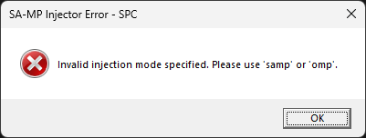
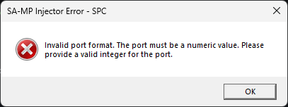
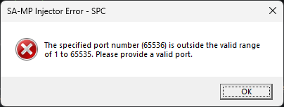
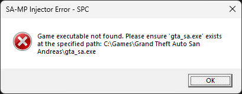
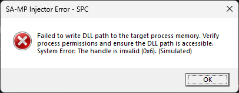

# SA-MP Injector PowerShell


[](https://github.com/spc-samp/samp-injector)


Der **SA-MP Injector PowerShell** ist mehr als nur ein **DLL-Injection**-Skript. Er stellt eine **Bibliothek von PowerShell-Funktionen und -Klassen** dar, die entwickelt wurde, um eine robuste und vollständige Lösung für den programmatischen Start des Spiels **Grand Theft Auto: San Andreas** (**GTA:SA**) in Verbindung mit seinen Multiplayer-Clients, speziell **SA-MP (San Andreas Multiplayer)** und **OMP (Open Multiplayer)**, zu bieten. Sein Hauptzweck ist es, den Startvorgang des Spiels zu vereinfachen, indem die Komplexität der direkten Handhabung von Betriebssystemprozessen und der Übergabe von Kommandozeilenargumenten beseitigt wird.

Entwickelt, um maximale Flexibilität und einfache Integration zu bieten, ermöglicht diese Bibliothek Entwicklern, sie direkt in ihre **PowerShell-Projekte und -Skripte** zu integrieren. Sie orchestriert nicht nur die **grundlegende Injektion der DLLs** des Multiplayer-Clients (`samp.dll` oder `omp-client.dll`), sondern verwaltet auch intelligent alle wesentlichen Verbindungsparameter (**Nickname**, **IP-Adresse**, **Port** und **Passwort**), indem sie einen nativen Start über die intrinsischen Funktionen der **Windows-API** simuliert, auf die direkt über **PowerShell** zugegriffen wird.

## Sprachen

- Português: [README](../../)
- English: [README](../English/README.md)
- Español: [README](../Espanol/README.md)
- Français: [README](../Francais/README.md)
- Italiano: [README](../Italiano/README.md)
- Polski: [README](../Polski/README.md)
- Русский: [README](../Русский/README.md)
- Svenska: [README](../Svenska/README.md)
- Türkçe: [README](../Turkce/README.md)

## Inhaltsverzeichnis

- [SA-MP Injector PowerShell](#sa-mp-injector-powershell)
  - [Sprachen](#sprachen)
  - [Inhaltsverzeichnis](#inhaltsverzeichnis)
  - [Grundlegende Konzepte und Motivation](#grundlegende-konzepte-und-motivation)
    - [Warum DLLs injizieren?](#warum-dlls-injizieren)
    - [SA-MP und OMP: Unterschiede und Gemeinsamkeiten](#sa-mp-und-omp-unterschiede-und-gemeinsamkeiten)
    - [DLL-Injektion in PowerShell: Ein direkter Ansatz mit WinAPI](#dll-injektion-in-powershell-ein-direkter-ansatz-mit-winapi)
  - [Interne Architektur der Bibliothek: Ein tiefer Einblick](#interne-architektur-der-bibliothek-ein-tiefer-einblick)
    - [`Constants.ps1`](#constantsps1)
    - [`CustomTypes.ps1`](#customtypesps1)
    - [`StringUtils.ps1`](#stringutilsps1)
    - [`ErrorUtils.ps1`](#errorutilsps1)
    - [`Process.ps1`](#processps1)
    - [`InjectorCore.ps1`](#injectorcoreps1)
    - [`Injector.ps1`](#injectorps1)
    - [`Cleanup.ps1`](#cleanupps1)
  - [Umfassende Anwendungsbeispiele](#umfassende-anwendungsbeispiele)
    - [1. Vorbereitung der Entwicklungsumgebung](#1-vorbereitung-der-entwicklungsumgebung)
    - [2. Grundlegendes Szenario: Verbindung zu einem SA-MP-Server](#2-grundlegendes-szenario-verbindung-zu-einem-sa-mp-server)
    - [3. Fortgeschrittenes Szenario: Verbindung zu einem OMP-Server](#3-fortgeschrittenes-szenario-verbindung-zu-einem-omp-server)
    - [4. Ausführung aus einem übergeordneten Skript](#4-ausführung-aus-einem-übergeordneten-skript)
  - [Umgang mit häufigen Fehlern und Meldungen](#umgang-mit-häufigen-fehlern-und-meldungen)
    - [1. Ungültiger Injektionstyp](#1-ungültiger-injektionstyp)
    - [2. Ungültiger Server-Port (Format oder Bereich)](#2-ungültiger-server-port-format-oder-bereich)
      - [2.1. Nicht-numerisches Portformat](#21-nicht-numerisches-portformat)
      - [2.2. Port außerhalb des gültigen Bereichs](#22-port-außerhalb-des-gültigen-bereichs)
    - [3. Ungültiger Nickname (leer oder zu lang)](#3-ungültiger-nickname-leer-oder-zu-lang)
      - [3.1. Leerer Nickname](#31-leerer-nickname)
      - [3.2. Zu langer Nickname](#32-zu-langer-nickname)
    - [4. Spieldateien oder DLL nicht gefunden](#4-spieldateien-oder-dll-nicht-gefunden)
      - [4.1. Spiel-Executable (`gta_sa.exe`) nicht gefunden](#41-spiel-executable-gta_saexe-nicht-gefunden)
      - [4.2. SA-MP-Bibliothek (`samp.dll`) nicht gefunden](#42-sa-mp-bibliothek-sampdll-nicht-gefunden)
      - [4.3. OMP-Bibliothek (`omp-client.dll`) nicht gefunden (nur für OMP-Injektion)](#43-omp-bibliothek-omp-clientdll-nicht-gefunden-nur-für-omp-injektion)
    - [5. Fehler beim Erstellen des Spielprozesses](#5-fehler-beim-erstellen-des-spielprozesses)
    - [6. Fehler bei der Speicherzuweisung im Zielprozess](#6-fehler-bei-der-speicherzuweisung-im-zielprozess)
    - [7. Fehler beim Schreiben des DLL-Pfads in den Prozessspeicher](#7-fehler-beim-schreiben-des-dll-pfads-in-den-prozessspeicher)
    - [8. Fehler beim Finden wesentlicher Systemfunktionen](#8-fehler-beim-finden-wesentlicher-systemfunktionen)
      - [8.1. `kernel32.dll` nicht gefunden](#81-kernel32dll-nicht-gefunden)
      - [8.2. `LoadLibraryA` nicht gefunden](#82-loadlibrarya-nicht-gefunden)
    - [9. Fehler beim Erstellen des Remote-Threads für die Injektion](#9-fehler-beim-erstellen-des-remote-threads-für-die-injektion)
    - [10. Timeout oder Fehler beim Abschluss der Injektion](#10-timeout-oder-fehler-beim-abschluss-der-injektion)
    - [11. Fehler beim Fortsetzen des Spielprozess-Threads](#11-fehler-beim-fortsetzen-des-spielprozess-threads)
  - [Lizenz](#lizenz)
    - [Nutzungsbedingungen](#nutzungsbedingungen)
      - [1. Gewährte Berechtigungen](#1-gewährte-berechtigungen)
      - [2. Verpflichtende Bedingungen](#2-verpflichtende-bedingungen)
      - [3. Urheberrecht](#3-urheberrecht)
      - [4. Gewährleistungsausschluss und Haftungsbeschränkung](#4-gewährleistungsausschluss-und-haftungsbeschränkung)

## Grundlegende Konzepte und Motivation

### Warum DLLs injizieren?

> [!NOTE]
> Die **DLL-Injektion (Dynamic Link Library)** ist eine Methode, die in **Microsoft Windows**-Betriebssystemen verwendet wird, um die Ausführung von Code im Speicherbereich eines anderen laufenden Prozesses zu ermöglichen. Es ist eine leistungsstarke Technik mit verschiedenen legitimen Anwendungen, von der Fehlerbehebung und Überwachung von Programmen bis hin zur Verhaltensänderung von Anwendungen zur Erweiterung ihrer Funktionalitäten.

Im Kontext von Spielen wie **GTA San Andreas**, die ursprünglich nicht mit integrierter Multiplayer-Funktionalität entwickelt wurden, ist die **DLL-Injektion** die Grundlage für die Existenz von Multiplayer-Clients wie **SA-MP** und **OMP**. Diese Clients sind als **DLLs** implementiert, die, sobald sie in den `gta_sa.exe`-Prozess injiziert werden, die Kontrolle übernehmen, Spielfunktionen abfangen und die Kommunikation mit Multiplayer-Servern herstellen.

Anstatt sich auf einen externen Launcher oder die direkte Änderung der Spiel-Executable zu verlassen, ermöglicht die **DLL-Injektion** einen flexibleren und programmierbareren Start, was besonders nützlich in Umgebungen ist, in denen der Verbindungsprozess zu bestimmten Servern mit vordefinierten Konfigurationen automatisiert werden soll.

### SA-MP und OMP: Unterschiede und Gemeinsamkeiten

**SA-MP** und **OMP** sind die beiden wichtigsten Multiplayer-Plattformen für **GTA San Andreas**. Beide funktionieren als Modifikationen des Basisspiels und verwandeln es in eine massive Online-Multiplayer-Umgebung.

- **SA-MP (San Andreas Multiplayer)**: Der ursprüngliche und etablierteste Client, der seit vielen Jahren weit verbreitet ist. Seine Architektur erfordert die `samp.dll` zum Betrieb.
- **OMP (Open Multiplayer)**: Ein Open-Source-Projekt, das oft als Nachfolger oder modernere Alternative zu **SA-MP** angesehen wird und Leistungsverbesserungen, Stabilität und zusätzliche Funktionen bietet. Es erfordert die `omp-client.dll`.

Obwohl sie ähnlich funktionieren (**indem sie eine DLL** in den **GTA:SA**-Prozess **injizieren**), wurde die Bibliothek **SA-MP Injector PowerShell** sorgfältig entwickelt, um **beide DLLs** zu unterstützen, ihre unterschiedlichen Dateinamen zu erkennen und dem Entwickler zu ermöglichen, den gewünschten Multiplayer-Client über einen Konfigurationsparameter auszuwählen. Dies stellt sicher, dass die Bibliothek mit der breiten Palette von Servern und Projekten verwendet werden kann, die auf einer der beiden Plattformen basieren.

### DLL-Injektion in PowerShell: Ein direkter Ansatz mit WinAPI

PowerShell ist eine leistungsstarke Skriptsprache für die Automatisierung unter Windows, aber die Manipulation von Prozessen und die Injektion von DLLs auf einer so niedrigen Systemebene ist nicht ihre primäre Funktion. Um dieses Ziel zu erreichen, nutzt die Bibliothek **SA-MP Injector PowerShell** ausgiebig den Befehl `Add-Type`, um direkt Funktionen der **Windows API (WinAPI)** aufzurufen.

`Add-Type` ermöglicht es, C#-Code (oder andere .NET-Sprachen) zur Laufzeit in der PowerShell-Umgebung zu definieren und zu kompilieren. Dieser C#-Code fungiert als "Brücke" zu den nativen WinAPI-Funktionen (`DllImport`) und ermöglicht Operationen wie:

- **`CreateProcessA`**: Zum Starten des GTA:SA-Prozesses.
- **`VirtualAllocEx`**: Zum Zuweisen von Speicher innerhalb des Remote-Prozesses.
- **`WriteProcessMemory`**: Zum Kopieren des DLL-Pfads in den zugewiesenen Speicher.
- **`GetModuleHandleA` und `GetProcAddress`**: Zum Abrufen der Adresse der Funktion `LoadLibraryA` in `kernel32.dll`.
- **`CreateRemoteThread`**: Zum Erstellen eines Threads im Remote-Prozess, der `LoadLibraryA` ausführt und somit die DLL lädt.
- **`WaitForSingleObject` und `GetExitCodeThread`**: Zur Überwachung des Erfolgs der Injektion.
- **`ResumeThread`**: Zum Reaktivieren des Spielprozesses nach der Injektion.
- **`CloseHandle`**: Zum Schließen von Systemressourcen-Handles und zur Vermeidung von Lecks.
- **`MessageBoxW`**: Zur Anzeige informativer Fehlermeldungen für den Benutzer.

Dieser direkte Ansatz mit der WinAPI ermöglicht es PowerShell, die gleichen Low-Level-Operationen durchzuführen wie eine in **C++** kompilierte Anwendung, jedoch mit dem Komfort einer Skriptumgebung.

## Interne Architektur der Bibliothek: Ein tiefer Einblick

Die Bibliothek **SA-MP Injector PowerShell** verfolgt einen modularen Ansatz, um die Komplexität des Injektionsprozesses zu bewältigen. Jedes Skript ist ein spezialisiertes Modul, das für einen bestimmten Teil der Gesamtfunktionalität verantwortlich ist, was die Klarheit des Codes, die Wartbarkeit und die Erweiterbarkeit fördert.

### `Constants.ps1`

Dieses Skript ist die Grundlage aller festen Konfigurationen der Bibliothek. Es definiert eine globale Hashtabelle (`$global:CONSTANTS`), die alle verwendeten Literale und numerischen Werte speichert, wie z.B. Portgrenzen, DLL-Dateinamen, Verweise auf System-APIs und Flags für Operationen wie Prozesserstellung und Speicherzuweisung.

```powershell
$global:CONSTANTS = @{
    # Grenzen für die Port-Validierung
    MIN_PORT = 1
    MAX_PORT = 65535
    
    # Nickname-Einschränkungen
    MAX_NICKNAME_LENGTH = 23
    
    # Erforderliche Dateinamen
    SAMP_DLL_NAME = "samp.dll"
    OMP_DLL_NAME = "omp-client.dll"
    GAME_EXE_NAME = "gta_sa.exe"
    
    # System-API-Referenzen
    KERNEL32_DLL = "kernel32.dll"
    USER32_DLL = "user32.dll" # Wird für MessageBoxW verwendet
    LOAD_LIBRARY_FUNC = "LoadLibraryA"
    
    # Präfixe für Kommandozeilenargumente
    CMD_ARG_CONFIG = "-c"
    CMD_ARG_NICKNAME = "-n"
    CMD_ARG_HOST = "-h"
    CMD_ARG_PORT = "-p"
    CMD_ARG_PASSWORD = "-z"
    
    # Bezeichner für Injektionstypen
    INJECT_TYPE_SAMP = "samp"
    INJECT_TYPE_OMP = "omp"
    
    # Titel für Fehlerdialoge
    ERROR_TITLE_SAMP = "SA-MP Injector Error - SPC"
    ERROR_TITLE_OMP = "OMP Injector Error - SPC"
    
    # Flags für Prozesserstellung (CREATE_SUSPENDED | DETACHED_PROCESS)
    # 0x00000104 = CREATE_SUSPENDED (0x4) + DETACHED_PROCESS (0x100)
    PROCESS_CREATION_FLAGS = 0x00000104
    
    # Timeouts für Operationen
    DLL_INJECTION_TIMEOUT_MS = 10000 # 10 Sekunden
    
    # Konstanten für Speicherzuweisung
    # 0x00003000 = MEM_COMMIT (0x1000) + MEM_RESERVE (0x2000)
    MEMORY_ALLOCATION_TYPE = 0x00003000
    # 0x00000004 = PAGE_READWRITE
    MEMORY_PROTECTION = 0x00000004
    # 0x00008000 = MEM_RELEASE
    MEMORY_FREE_TYPE = 0x00008000
    
    # Ergebnisse von Wait-Objekten (Windows API)
    WAIT_OBJECT_0 = 0x00000000
    WAIT_TIMEOUT = 0x00000102
    WAIT_FAILED = 0xFFFFFFFF
    
    # Fehlerindikator für Thread-Fortsetzung (Windows API)
    THREAD_RESUME_ERROR = 0xFFFFFFFF # ResumeThread gibt -1 bei Fehler zurück
    
    # MessageBox-Konstanten (Windows API)
    MB_OK = 0x00000000
    MB_ICONERROR = 0x00000010
    MB_TOPMOST = 0x00040000
}
```

> [!TIP]
> Die Verwendung einer globalen Hashtabelle für Konstanten ist eine gängige Praxis in PowerShell-Skripten. Sie zentralisiert die Konfigurationen und vermeidet "magische Zahlen" und wiederholte Zeichenketten, was den Code lesbarer und einfacher zu warten macht. Die Flag-Werte (`0x...`) entsprechen den Dezimalwerten der in der Windows API definierten Konstanten.

### `CustomTypes.ps1`

Dieses Skript ist für die Interaktion mit der Windows API von grundlegender Bedeutung. Es definiert C#-Typen zur Laufzeit mit `Add-Type`, einschließlich:

- **`Inject_Type` enum**: Zur Kategorisierung des Injektionstyps (SAMP oder OMP), was die Typsicherheit verbessert.
- **`WinAPI` class**: Eine statische Klasse, die die für die Injektion erforderlichen Windows API-Funktionen importiert und verfügbar macht. Jede Methode in dieser Klasse entspricht einer API-Funktion (`DllImport`), mit der korrekten Signatur und dem korrekten Zeichensatz (`CharSet`).
- **`Startup_Info` struct und `Process_Information` struct**: C#-Datenstrukturen, die die `STARTUPINFO`- und `PROCESS_INFORMATION`-Strukturen nachbilden, die von der `CreateProcessA`-Funktion der Windows API verwendet werden.
- **`Process_Info` class**: Eine einfache C#-Klasse, die als Container für die Prozess- und Thread-Handles fungiert, die nach der erfolgreichen Erstellung eines Prozesses zurückgegeben werden, was den Transport und die Verwaltung dieser Handles in der PowerShell-Umgebung erleichtert.

```powershell
if (-not ([System.Management.Automation.PSTypeName]'Inject_Type').Type) {
    Add-Type -TypeDefinition @'
        public enum Inject_Type {
            SAMP = 0,
            OMP = 1
        }
'@
}

if (-not ([System.Management.Automation.PSTypeName]'WinAPI').Type) {
    Add-Type -TypeDefinition @'
        using System;
        using System.Runtime.InteropServices;
        using System.Text; // Notwendig für Marshal.GetLastWin32Error
        
        public class WinAPI {
            [DllImport("kernel32.dll", SetLastError = true, CharSet = CharSet.Ansi)]
            public static extern bool CreateProcessA(string lpApplicationName, [In, Out] byte[] lpCommandLine, IntPtr lpProcessAttributes, IntPtr lpThreadAttributes, bool bInheritHandles, 
                uint dwCreationFlags, IntPtr lpEnvironment, string lpCurrentDirectory, [In, Out] ref Startup_Info lpStartupInfo, out Process_Information lpProcessInformation);
            
            [DllImport("kernel32.dll", SetLastError = true)]
            public static extern IntPtr VirtualAllocEx(IntPtr hProcess, IntPtr lpAddress, uint dwSize, uint flAllocationType, uint flProtect);
            
            [DllImport("kernel32.dll", SetLastError = true)]
            public static extern bool VirtualFreeEx(IntPtr hProcess, IntPtr lpAddress, uint dwSize, uint dwFreeType);
            
            [DllImport("kernel32.dll", SetLastError = true)]
            public static extern bool WriteProcessMemory(IntPtr hProcess, IntPtr lpBaseAddress, byte[] lpBuffer, uint nSize, out IntPtr lpNumberOfBytesWritten);
            
            [DllImport("kernel32.dll", SetLastError = true, CharSet = CharSet.Ansi)]
            public static extern IntPtr GetModuleHandleA(string lpModuleName);
            
            [DllImport("kernel32.dll", SetLastError = true, CharSet = CharSet.Ansi)]
            public static extern IntPtr GetProcAddress(IntPtr hModule, string lpProcName);
            
            [DllImport("kernel32.dll", SetLastError = true)]
            public static extern IntPtr CreateRemoteThread(IntPtr hProcess, IntPtr lpThreadAttributes, uint dwStackSize, IntPtr lpStartAddress, IntPtr lpParameter, uint dwCreationFlags, 
                out IntPtr lpThreadId);
            
            [DllImport("kernel32.dll", SetLastError = true)]
            public static extern uint WaitForSingleObject(IntPtr hHandle, uint dwMilliseconds);
            
            [DllImport("kernel32.dll", SetLastError = true)]
            public static extern bool GetExitCodeThread(IntPtr hThread, out uint lpExitCode);
            
            [DllImport("kernel32.dll", SetLastError = true)]
            public static extern uint ResumeThread(IntPtr hThread);
            
            [DllImport("kernel32.dll", SetLastError = true)]
            public static extern bool CloseHandle(IntPtr hObject);
            
            [DllImport("user32.dll", SetLastError = true, CharSet = CharSet.Unicode)]
            public static extern int MessageBoxW(IntPtr hWnd, string lpText, string lpCaption, uint uType);
            
            // C#-Struktur für STARTUPINFO
            [StructLayout(LayoutKind.Sequential, CharSet = CharSet.Ansi)]
            public struct Startup_Info {
                public uint cb;
                public string lpReserved;
                public string lpDesktop;
                public string lpTitle;
                public uint dwX;
                public uint dwY;
                public uint dwXSize;
                public uint dwYSize;
                public uint dwXCountChars;
                public uint dwYCountChars;
                public uint dwFillAttribute;
                public uint dwFlags;
                public short wShowWindow;
                public short cbReserved2;
                public IntPtr lpReserved2;
                public IntPtr hStdInput;
                public IntPtr hStdOutput;
                public IntPtr hStdError;
            }
            
            // C#-Struktur für PROCESS_INFORMATION
            [StructLayout(LayoutKind.Sequential)]
            public struct Process_Information {
                public IntPtr hProcess;
                public IntPtr hThread;
                public uint dwProcessId;
                public uint dwThreadId;
            }
        }
'@
}

if (-not ([System.Management.Automation.PSTypeName]'Process_Info').Type) {
    Add-Type -TypeDefinition @'
        using System;
        
        // Hilfsklasse zum Transportieren von Prozess- und Thread-Handles
        public class Process_Info {
            public IntPtr ProcessHandle { get; set; }
            public IntPtr ThreadHandle { get; set; }
            
            public Process_Info() {
                ProcessHandle = IntPtr.Zero;
                ThreadHandle = IntPtr.Zero;
            }
        }
'@
}
```

> [!IMPORTANT]
> Die Injektion von 32-Bit-DLLs (wie `samp.dll` und `omp-client.dll`) in einen 32-Bit-Prozess (`gta_sa.exe`) **erfordert, dass die PowerShell-Umgebung ebenfalls 32-Bit ist**. Der **SA-MP Injector PowerShell** handhabt dies automatisch, indem er sich in einer x86-PowerShell-Shell neu startet, wenn er erkennt, dass er in einer x64-Umgebung ausgeführt wird. Dies ist entscheidend, um die Kompatibilität der Zeigergrößen und das korrekte Funktionieren der Injektion zu gewährleisten.
>
> Die Direktive `if (-not ([System.Management.Automation.PSTypeName]'TypeName').Type)` stellt sicher, dass die C#-Typen nur einmal zur PowerShell-Umgebung hinzugefügt werden, um Fehler durch Neudefinition zu vermeiden, wenn das Skript mehrmals in derselben Sitzung ausgeführt wird.

### `StringUtils.ps1`

Dieses Modul stellt eine wesentliche Hilfsfunktion zur String-Manipulation bereit, speziell um mit den Zeichenkodierungen umzugehen, die bei der Interaktion mit der veralteten Windows API (Funktionen "A" für char*) erforderlich sind.

```powershell
function Convert_Wide_To_Local_8Bit {
    param([Parameter(Mandatory = $false)] [AllowEmptyString()] [string]$wide_string)
    
    if ([string]::IsNullOrEmpty($wide_string)) {
        return [string]::Empty
    }

    try {
        # Ruft die lokale ANSI-Codepage des Systems ab
        $ansi_code_page = [System.Globalization.CultureInfo]::CurrentCulture.TextInfo.ANSICodePage
        $encoding = [System.Text.Encoding]::GetEncoding($ansi_code_page)
        
        # Konvertiert den Unicode-String (wide) in Bytes in der lokalen ANSI-Kodierung
        $bytes = $encoding.GetBytes($wide_string)

        # Konvertiert die Bytes zurück in einen String mit derselben ANSI-Kodierung
        # Dies stellt sicher, dass der String mit APIs kompatibel ist, die eine 8-Bit-Kodierung (ANSI) erwarten
        return $encoding.GetString($bytes)
    }
    catch {
        # Im Falle eines Konvertierungsfehlers (z.B. Zeichen, die nicht zugeordnet werden können),
        # wird der ursprüngliche String als Fallback zurückgegeben, obwohl dies Probleme verursachen kann,
        # wenn er Zeichen enthält, die von ANSI-APIs nicht unterstützt werden.
        return $wide_string
    }
}
```

> [!IMPORTANT]
> Die Funktion `Convert_Wide_To_Local_8Bit` ist entscheidend, da viele Windows-API-Funktionen mit dem Suffix "A" (`CreateProcessA`, `LoadLibraryA`, `GetModuleHandleA`, `GetProcAddress`) in ANSI (8-Bit) kodierte Zeichenketten erwarten, die von der lokalen Systemcodepage abhängen. Standardmäßig sind Zeichenketten in PowerShell Unicode. Diese Funktion führt die notwendige Konvertierung durch. Wenn ein Dateiname oder ein Kommandozeilenargument Zeichen außerhalb der ANSI-Codepage des Systems enthält, kann die Konvertierung zu falschen Zeichen oder Datenverlust führen. Für dieses Projekt, das auf die Interaktion mit alten Programmen abzielt, ist dieser ANSI-Ansatz typischerweise ausreichend und notwendig.

### `ErrorUtils.ps1`

Dieses Modul ist dafür verantwortlich, dem Benutzer im Fehlerfall klares Feedback zu geben. Es zentralisiert die Logik zum Abrufen von Systemfehlermeldungen und zur Anzeige von Standard-Windows-Dialogfeldern.

```powershell
function Get_System_Error_Message {
    param([Parameter(Mandatory = $true)][int]$error_code)
    
    try {
        # Verwendet Win32Exception, um die vom System formatierte Fehlermeldung zu erhalten
        $exception = New-Object System.ComponentModel.Win32Exception($error_code)
        
        return $exception.Message
    }
    catch {
        # Fallback für unbekannte Fehlermeldung
        return "Unknown error (Code: $error_code)"
    }
}

function Show_Error {
    param([Parameter(Mandatory = $true)][string]$message, [Parameter(Mandatory = $true)][Inject_Type]$inject_type)
    
    # Bestimmt den Titel des Dialogfelds basierend auf dem Injektionstyp
    $title = if ($inject_type -eq [Inject_Type]::SAMP) {
        $global:CONSTANTS.ERROR_TITLE_SAMP
    }
    else {
        $global:CONSTANTS.ERROR_TITLE_OMP
    }
    
    try {
        # Kombiniert Flags für MessageBoxW (OK, Fehlersymbol, AlwaysOnTop)
        $message_box_flags = $global:CONSTANTS.MB_OK -bor $global:CONSTANTS.MB_ICONERROR -bor $global:CONSTANTS.MB_TOPMOST
        
        # Ruft die über Add-Type importierte MessageBoxW-Funktion auf
        [void][WinAPI]::MessageBoxW([System.IntPtr]::Zero, $message, $title, $message_box_flags)
    }
    catch {
        # Im Falle eines Fehlers bei der Anzeige der MessageBox (z.B. in Umgebungen ohne UI), schreibt in die Konsole
        Write-Host "[$title] $message" -ForegroundColor Red
    }
}
```

> [!NOTE]
> `Get_System_Error_Message` verwendet `System.ComponentModel.Win32Exception` aus .NET, um einen numerischen Fehlercode der Windows API (`GetLastError()`) in eine für den Benutzer lesbare Textbeschreibung zu konvertieren, die in der Sprache des Betriebssystems lokalisiert sein kann.
>
> `Show_Error` verwendet die `MessageBoxW`-Funktion, die aus der `user32.dll` über `Add-Type` (`CustomTypes.ps1`) importiert wurde, um ein informatives Dialogfeld anzuzeigen. Flags wie `MB_OK` und `MB_ICONERROR` werden aus den WinAPI-Konstanten importiert.

### `Process.ps1`

Dies ist das Hauptmodul, das für die direkte Interaktion mit den Low-Level-APIs von Windows zur Prozessmanipulation verantwortlich ist. Es kapselt die entscheidenden Operationen der Prozesserstellung und DLL-Injektion und kümmert sich um Handles, Speicher und Threads.

```powershell
class Process {
    # Gibt die Prozess- und Thread-Handles frei und verhindert so Ressourcenlecks
    [void] Close_Process_Info([Process_Info]$process_info) {
        if ($null -ne $process_info) {
            # Schließt das Prozess-Handle, wenn es gültig ist
            if ($process_info.ProcessHandle -ne [System.IntPtr]::Zero -and $process_info.ProcessHandle -ne [System.IntPtr]::new(-1)) {
                [void][WinAPI]::CloseHandle($process_info.ProcessHandle)
                $process_info.ProcessHandle = [System.IntPtr]::Zero # Als geschlossen markieren
            }

            # Schließt das Thread-Handle, wenn es gültig ist
            if ($process_info.ThreadHandle -ne [System.IntPtr]::Zero -and $process_info.ThreadHandle -ne [System.IntPtr]::new(-1)) {
                [void][WinAPI]::CloseHandle($process_info.ThreadHandle)
                $process_info.ThreadHandle = [System.IntPtr]::Zero # Als geschlossen markieren
            }
        }
    }

    # Erstellt den Prozess des GTA:SA-Spiels im angehaltenen Zustand
    [Process_Info] Create_Game_Process([string]$game_path, [string]$command_args, [string]$working_dir) {
        $startup_info = New-Object WinAPI+Startup_Info
        # Setzt die Größe der Struktur, entscheidend für Windows-APIs
        $startup_info.cb = [System.Runtime.InteropServices.Marshal]::SizeOf($startup_info)
        
        $process_information = New-Object WinAPI+Process_Information
        
        $command_line_bytes = $null

        if (-not [string]::IsNullOrEmpty($command_args)) {
            # Konvertiert die Kommandozeilenargumente in ein ANSI-Byte-Array mit Null-Terminator
            $command_line_bytes = [System.Text.Encoding]::Default.GetBytes($command_args + "`0")
        }
        
        # Setzt das Arbeitsverzeichnis, null wenn leer
        $current_directory = if ([string]::IsNullOrEmpty($working_dir)) {
            $null
        }
        else {
            $working_dir
        }
        
        # Ruft die CreateProcessA-Funktion der Windows API auf
        $success = [WinAPI]::CreateProcessA($game_path, $command_line_bytes, [System.IntPtr]::Zero, [System.IntPtr]::Zero, $false, $global:CONSTANTS.PROCESS_CREATION_FLAGS, 
            [System.IntPtr]::Zero, $current_directory, [ref]$startup_info, [ref]$process_information)
        
        if (-not $success) {
            # Im Fehlerfall wird der letzte Systemfehler abgerufen und angezeigt
            $error_code = [System.Runtime.InteropServices.Marshal]::GetLastWin32Error()
            $error_message = Get_System_Error_Message $error_code
            Show_Error "Failed to create game process. Ensure 'gta_sa.exe' is not running and you have sufficient permissions to execute the file. System Error: $error_message" ([Inject_Type]::SAMP)

            return $null # Gibt null im Fehlerfall zurück
        }
        
        # Gibt ein Process_Info-Objekt zurück, das die Prozess- und Thread-Handles enthält
        $result = New-Object Process_Info
        $result.ProcessHandle = $process_information.hProcess
        $result.ThreadHandle = $process_information.hThread
        
        return $result
    }
    
    # Injiziert eine DLL in den Remote-Prozess
    [bool] Inject_DLL([IntPtr]$process_handle, [string]$dll_path, [ref]$error_message) {
        if ($process_handle -eq [System.IntPtr]::Zero) {
            $error_message.Value = "Invalid process handle provided for DLL injection."

            return $false
        }
        
        if ([string]::IsNullOrEmpty($dll_path)) {
            $error_message.Value = "DLL path cannot be empty."

            return $false
        }
        
        # Konvertiert den DLL-Pfad in ASCII-Bytes (ANSI 8-Bit) mit Null-Terminator
        $dll_path_bytes = [System.Text.Encoding]::ASCII.GetBytes($dll_path + "`0")
        $dll_path_size = $dll_path_bytes.Length
        
        # Weist Speicher im Remote-Prozess für den DLL-Pfad zu
        $remote_memory = [WinAPI]::VirtualAllocEx($process_handle, [System.IntPtr]::Zero, $dll_path_size, $global:CONSTANTS.MEMORY_ALLOCATION_TYPE, $global:CONSTANTS.MEMORY_PROTECTION)
        
        if ($remote_memory -eq [System.IntPtr]::Zero) {
            $error_code = [System.Runtime.InteropServices.Marshal]::GetLastWin32Error()
            $error_message.Value = "Failed to allocate memory in the target process. This might be due to insufficient permissions or process protection mechanisms. System Error: $(Get_System_Error_Message $error_code)"

            return $false
        }
        
        # Verwendet einen try/finally-Block, um sicherzustellen, dass der Remote-Speicher freigegeben wird
        try {
            $bytes_written = [System.IntPtr]::Zero
            # Schreibt den DLL-Pfad in den Remote-Speicher
            $write_success = [WinAPI]::WriteProcessMemory($process_handle, $remote_memory, $dll_path_bytes, $dll_path_size, [ref]$bytes_written)
            
            if (-not $write_success) {
                $error_code = [System.Runtime.InteropServices.Marshal]::GetLastWin32Error()
                $error_message.Value = "Failed to write DLL path to the target process memory. Verify process permissions and ensure the DLL path is accessible. System Error: $(Get_System_Error_Message $error_code)"
                
                return $false
            }
            
            # Ruft das Handle für kernel32.dll ab (das in allen Prozessen geladen ist)
            $kernel32_handle = [WinAPI]::GetModuleHandleA($global:CONSTANTS.KERNEL32_DLL)

            if ($kernel32_handle -eq [System.IntPtr]::Zero) {
                $error_code = [System.Runtime.InteropServices.Marshal]::GetLastWin32Error()
                $error_message.Value = "Failed to obtain a handle to kernel32.dll. This is an essential system library and this error indicates a severe system issue. System Error: $(Get_System_Error_Message $error_code)"
                
                return $false
            }
            
            # Ruft die Adresse der LoadLibraryA-Funktion in kernel32.dll ab.
            # Diese Adresse ist konsistent zwischen Prozessen im selben Betriebssystem.
            $load_library_address = [WinAPI]::GetProcAddress($kernel32_handle, $global:CONSTANTS.LOAD_LIBRARY_FUNC)

            if ($load_library_address -eq [System.IntPtr]::Zero) {
                $error_code = [System.Runtime.InteropServices.Marshal]::GetLastWin32Error()
                $error_message.Value = "Failed to find the address of the LoadLibraryA function in kernel32.dll. This is critical for injecting the DLL. System Error: $(Get_System_Error_Message $error_code)"
                
                return $false
            }
            
            $thread_id = [System.IntPtr]::Zero
            # Erstellt einen Remote-Thread im Zielprozess, um LoadLibraryA auszuführen
            $remote_thread_handle = [WinAPI]::CreateRemoteThread($process_handle, [System.IntPtr]::Zero, 0, $load_library_address, $remote_memory, 0, [ref]$thread_id)
            
            if ($remote_thread_handle -eq [System.IntPtr]::Zero) {
                $error_code = [System.Runtime.InteropServices.Marshal]::GetLastWin32Error()
                $error_message.Value = "Failed to create a remote thread in the target process to execute the DLL injection. This could be due to security restrictions or process state. System Error: $(Get_System_Error_Message $error_code)"
                
                return $false
            }
            
            # Verwendet einen try/finally-Block, um sicherzustellen, dass das Handle des Remote-Threads geschlossen wird
            try {
                # Wartet, bis der Remote-Thread (DLL-Injektion) abgeschlossen ist oder ein Timeout erreicht
                $wait_result = [WinAPI]::WaitForSingleObject($remote_thread_handle, $global:CONSTANTS.DLL_INJECTION_TIMEOUT_MS)
                
                if ($wait_result -ne $global:CONSTANTS.WAIT_OBJECT_0) {
                    $error_code = [System.Runtime.InteropServices.Marshal]::GetLastWin32Error()

                    $wait_result_message = switch ($wait_result) {
                        $global:CONSTANTS.WAIT_TIMEOUT { "timeout" }
                        $global:CONSTANTS.WAIT_FAILED { "wait failed" }
                        default { "unknown wait result ($wait_result)" }
                    }

                    $error_message.Value = "Timeout or error waiting for DLL injection to complete ($wait_result_message). System Error: $(Get_System_Error_Message $error_code)"

                    return $false
                }
                
                $exit_code = 0
                # Ruft den Exit-Code des Remote-Threads ab. Für LoadLibraryA bedeutet 0 Fehler.
                $get_exit_code_success = [WinAPI]::GetExitCodeThread($remote_thread_handle, [ref]$exit_code)
                
                if (-not $get_exit_code_success -or $exit_code -eq 0) {
                    $error_code = [System.Runtime.InteropServices.Marshal]::GetLastWin32Error()
                    $error_message.Value = "DLL injection failed or returned an error. The LoadLibrary call may have failed in the target process. Exit Code: $exit_code. System Error: $(Get_System_Error_Message $error_code)"

                    return $false
                }
                
                return $true # Injektion erfolgreich
            }
            finally {
                # Stellt sicher, dass das Handle des Remote-Threads geschlossen wird
                [void][WinAPI]::CloseHandle($remote_thread_handle)
            }
        }
        finally {
            # Stellt sicher, dass der remote zugewiesene Speicher freigegeben wird
            # 0 für dwSize in MEM_RELEASE gibt die gesamte von VirtualAllocEx zugewiesene Region frei
            [void][WinAPI]::VirtualFreeEx($process_handle, $remote_memory, 0, $global:CONSTANTS.MEMORY_FREE_TYPE)
        }
    }
}
```

> [!NOTE]
> Die `Process`-Klasse verwendet `[System.IntPtr]`, um Windows-Handles darzustellen. Es ist wichtig, die ausgiebige Verwendung von `try/finally` zu beachten, um sicherzustellen, dass die Handles (`ProcessHandle`, `ThreadHandle`, `remote_memory`, `remote_thread_handle`) korrekt geschlossen und der Speicher auch im Fehlerfall freigegeben wird. Dies ist die PowerShell-Art, das **RAII**-Prinzip (Resource Acquisition Is Initialization) zu implementieren, obwohl es weniger in die Syntax der Sprache integriert ist.

### `InjectorCore.ps1`

Dies ist die Orchestrierungsklasse, die alle Funktionalitäten der vorherigen Module zusammenführt. Sie koordiniert die Validierung, die Erstellung von Kommandozeilenargumenten, die Prozesserstellung und die Aufrufe zur DLL-Injektion.

```powershell
class Injector_Core {
    # Hauptfunktion, die den Start und die Injektion des Spiels orchestriert
    [bool] Initialize_Game([Inject_Type]$inject_type, [string]$folder, [string]$nickname, [string]$ip, [string]$port, [string]$password) {
        # Erstellt die vollständigen Pfade zu den wesentlichen Dateien
        $game_path = Join-Path -Path $folder -ChildPath $global:CONSTANTS.GAME_EXE_NAME
        $samp_dll_path = Join-Path -Path $folder -ChildPath $global:CONSTANTS.SAMP_DLL_NAME
        $omp_dll_path = Join-Path -Path $folder -ChildPath $global:CONSTANTS.OMP_DLL_NAME
        
        $validation_error = [string]::Empty # Variable zum Erfassen von Validierungsfehlermeldungen
        
        # 1. Dateivalidierung
        if (-not (Validate_Files $game_path $samp_dll_path $omp_dll_path $inject_type)) {
            # Fehler wurde bereits von der Validierungsfunktion angezeigt
            return $false
        }

        # 2. Port-Validierung
        if (-not (Validate_Port $port ([ref]$validation_error))) {
            Show_Error $validation_error $inject_type
            return $false
        }
        
        # 3. Nickname-Validierung
        if (-not (Validate_Nickname $nickname ([ref]$validation_error))) {
            Show_Error $validation_error $inject_type
            return $false
        }
        
        # 4. Konvertierung von Zeichenketten in ANSI/8-Bit-Kodierung (erforderlich für veraltete APIs)
        $converted_nickname = Convert_Wide_To_Local_8Bit $nickname
        $converted_ip = Convert_Wide_To_Local_8Bit $ip
        $converted_port = Convert_Wide_To_Local_8Bit $port
        $converted_password = Convert_Wide_To_Local_8Bit $password
        $converted_game_path = Convert_Wide_To_Local_8Bit $game_path
        $converted_folder = Convert_Wide_To_Local_8Bit $folder
        $converted_samp_dll_path = Convert_Wide_To_Local_8Bit $samp_dll_path
        $converted_omp_dll_path = Convert_Wide_To_Local_8Bit $omp_dll_path
        
        # 5. Erstellung der Kommandozeilenargumente
        $command_arguments = $this.Build_Command_Args($converted_nickname, $converted_ip, $converted_port, $converted_password)
        
        $process_manager = New-Object Process # Instanziiert die Process-Klasse
        $process_info = $null # Variable zum Speichern der Informationen des erstellten Prozesses
        
        # Verwendet einen try/finally-Block, um sicherzustellen, dass die Prozess-Handles geschlossen werden
        try {
            # 6. Erstellung des Spielprozesses (angehalten)
            $process_info = $process_manager.Create_Game_Process($converted_game_path, $command_arguments, $converted_folder)
            
            if ($null -eq $process_info) {
                # Fehler wurde bereits von der Prozesserstellungsfunktion angezeigt
                return $false
            }

            $injection_error = [string]::Empty # Variable zum Erfassen von Injektionsfehlermeldungen
            
            # 7. Injektion der samp.dll
            if (-not $process_manager.Inject_DLL($process_info.ProcessHandle, $converted_samp_dll_path, ([ref]$injection_error))) {
                Show_Error "Failed to inject samp.dll: $injection_error" $inject_type
                return $false
            }
            
            # 8. Bedingte Injektion der omp-client.dll (nur wenn der Injektionstyp OMP ist)
            if ($inject_type -eq [Inject_Type]::OMP) {
                if (-not $process_manager.Inject_DLL($process_info.ProcessHandle, $converted_omp_dll_path, ([ref]$injection_error))) {
                    Show_Error "Failed to inject omp-client.dll: $injection_error" $inject_type
                    return $false
                }
            }
            
            # 9. Fortsetzen des Spielprozesses
            # Der Prozess wurde im angehaltenen Zustand erstellt, um die Injektion zu ermöglichen.
            # Jetzt, da die DLLs injiziert sind, kann er fortgesetzt werden.
            $resume_result = [WinAPI]::ResumeThread($process_info.ThreadHandle)

            if ($resume_result -eq $global:CONSTANTS.THREAD_RESUME_ERROR) {
                $error_code = [System.Runtime.InteropServices.Marshal]::GetLastWin32Error()
                $error_message = Get_System_Error_Message $error_code
                Show_Error "Failed to resume the game process thread: $error_message" $inject_type

                return $false
            }
            
            return $true # Erfolg in allen Schritten!
        }
        finally {
            # Stellt sicher, dass die Prozess-Handles am Ende geschlossen werden,
            # unabhängig von Erfolg oder Misserfolg.
            if ($null -ne $process_info) {
                $process_manager.Close_Process_Info($process_info)
            }
        }
    }
    
    # Erstellt den String der Kommandozeilenargumente für die Spiel-Executable
    [string] Build_Command_Args([string]$nickname, [string]$ip, [string]$port, [string]$password) {
        $arguments = @(
            $global:CONSTANTS.CMD_ARG_CONFIG,
            $global:CONSTANTS.CMD_ARG_NICKNAME, $nickname,
            $global:CONSTANTS.CMD_ARG_HOST, $ip, 
            $global:CONSTANTS.CMD_ARG_PORT, $port
        )
        
        if (-not [string]::IsNullOrEmpty($password)) {
            $arguments += @($global:CONSTANTS.CMD_ARG_PASSWORD, $password)
        }

        return $arguments -join ' '
    }
}
```

> [!CAUTION]
> Für **OMP** beinhaltet die Injektion die `omp-client.dll` *zusätzlich* zur `samp.dll`. Dies entspricht der üblichen Funktionsweise von **OMP**, da es die `samp.dll` als Basis verwenden und Funktionalitäten mit der `omp-client.dll` erweitern kann. Es ist entscheidend, dass **beide DLLs** im Spielverzeichnis vorhanden und funktionsfähig sind, damit die OMP-Injektion erfolgreich ist. Wenn eine fehlschlägt, startet das Spiel möglicherweise nicht korrekt oder der Multiplayer-Client wird nicht geladen.
>
> Beachten Sie, dass PowerShell kein natives `std::optional` oder eine **RAII**-Garantie wie C++ hat. Daher verwendet der Code einen expliziten `try/finally`-Block in der `Initialize_Game`-Funktion, um sicherzustellen, dass `Close_Process_Info` aufgerufen und die Handles freigegeben werden, auch wenn ein Fehler auftritt. Dies ist eine gute Praxis zur Ressourcenbereinigung in PowerShell.

### `Injector.ps1`

Dies ist das Haupteingangsskript der Bibliothek. Es kümmert sich um das Laden der anderen Module, die Überprüfung der PowerShell-Umgebung (Prüfung auf x86 für Injektionskompatibilität) und die Initialisierung der `Injector_Core`-Klasse. Es ist das Skript, das der Endbenutzer ausführen wird.

```powershell
param([Parameter(Mandatory = $true, Position = 0)][ValidateNotNullOrEmpty()][string]$inject_type,
    [Parameter(Mandatory = $true, Position = 1)][ValidateNotNullOrEmpty()][string]$folder,
    [Parameter(Mandatory = $true, Position = 2)][ValidateNotNullOrEmpty()][string]$nickname,
    [Parameter(Mandatory = $true, Position = 3)][ValidateNotNullOrEmpty()][string]$ip,
    [Parameter(Mandatory = $true, Position = 4)][ValidateNotNullOrEmpty()][string]$port,
    [Parameter(Position = 5)][AllowEmptyString()][string]$password = "",
    [switch]$restarted_x86) # Internes Flag, um anzuzeigen, dass das Skript bereits in x86 neu gestartet wurde

$ErrorActionPreference = 'Stop' # Stellt sicher, dass nicht-terminierende Fehler sich wie terminierende Fehler verhalten
# Dies bewirkt, dass catch-Blöcke mehr Fehler abfangen und verhindert, dass das Skript unerwartet fortfährt.

# Ruft den vollständigen Pfad des aktuellen Skripts ab, was für das Laden der Hilfsmodule unerlässlich ist
$script_path = $MyInvocation.MyCommand.Path

if ([string]::IsNullOrEmpty($script_path)) {
    # In Fällen, in denen das Skript auf besondere Weise aufgerufen wird (z.B. aus der Pipeline), kann $MyInvocation.MyCommand.Path leer sein
    $script_path = Join-Path -Path (Get-Location) -ChildPath $MyInvocation.MyCommand.Name
}

$script_directory = Split-Path -Parent $script_path # Basisverzeichnis der Bibliothek
$exit_code = 1 # Standard-Exit-Code (Fehler)

try {
    # Lädt alle Module der Bibliothek (Konstanten, benutzerdefinierte Typen, Hilfsprogramme usw.)
    . (Join-Path -Path $script_directory -ChildPath "Constants.ps1")
    . (Join-Path -Path $script_directory -ChildPath "CustomTypes.ps1")
    . (Join-Path -Path $script_directory -ChildPath "StringUtils.ps1")
    . (Join-Path -Path $script_directory -ChildPath "ErrorUtils.ps1")
    . (Join-Path -Path $script_directory -ChildPath "Validation.ps1")
    . (Join-Path -Path $script_directory -ChildPath "Process.ps1")
    . (Join-Path -Path $script_directory -ChildPath "InjectorCore.ps1")

    # Definiert die Hauptschnittstellenfunktion für den Benutzer.
    # Es ist ein Wrapper für die Injector_Core-Klasse.
    function Initialize_Game {
        param([string]$inject_type, [string]$folder, [string]$nickname, [string]$ip, [string]$port, [string]$password = "")

        # Überprüft, ob die PowerShell-Umgebung x64 ist und noch nicht in x86 neu gestartet wurde
        if ([IntPtr]::Size -eq 8 -and -not $restarted_x86) {
            Write-Host "Detected PowerShell x64 environment. Restarting on PowerShell x86 for DLL injection compatibility (32-bit)..." -ForegroundColor Yellow

            # Sucht die 32-Bit PowerShell-Executable
            $powershell_x86_path = Join-Path -Path $env:windir -ChildPath "SysWOW64\WindowsPowerShell\v1.0\powershell.exe"

            if (-not (Test-Path -Path $powershell_x86_path)) {
                Write-Host "Could not find powershell.exe (x86) at '$powershell_x86_path'. 32-bit DLL injection may fail." -ForegroundColor Red
                return $false
            }

            # Bereitet die Argumentenliste für den neuen x86 PowerShell-Prozess vor
            $argument_list = @("-NoProfile", "-NonInteractive", "-ExecutionPolicy", "Bypass", "-File", $script_path, $inject_type, $folder, $nickname, $ip, $port)
            
            if (-not [string]::IsNullOrEmpty($password)) {
                $argument_list += $password
            }
            # Fügt das Flag hinzu, um anzuzeigen, dass bereits neu gestartet wurde
            $argument_list += "-restarted_x86"
            
            try {
                $process_start_info = New-Object System.Diagnostics.ProcessStartInfo
                $process_start_info.FileName = $powershell_x86_path
                # Fügt die Argumente zu einem String für StartInfo.Arguments zusammen
                $process_start_info.Arguments = ($argument_list | ForEach-Object { "`"$_`"" }) -join " " # Umgibt Argumente mit Anführungszeichen, um Leerzeichen zu behandeln
                $process_start_info.RedirectStandardOutput = $true # Leitet die Ausgabe des Kindprozesses um
                $process_start_info.RedirectStandardError = $true   # Leitet die Fehler des Kindprozesses um
                $process_start_info.UseShellExecute = $false     # Verwendet nicht ShellExecute (führt PowerShell.exe direkt aus)
                $process_start_info.CreateNoWindow = $true       # Erstellt kein neues Fenster für den Kindprozess

                $child_process = New-Object System.Diagnostics.Process
                $child_process.StartInfo = $process_start_info
                
                # Startet den Kindprozess und wartet auf dessen Beendigung
                [void]$child_process.Start()
                $child_process.WaitForExit()
                
                # Erfasst und zeigt die Ausgabe/Fehler des Kindprozesses an
                $standard_output = $child_process.StandardOutput.ReadToEnd()
                $standard_error = $child_process.StandardError.ReadToEnd()

                if (-not [string]::IsNullOrEmpty($standard_output)) { Write-Host $standard_output }
                if (-not [string]::IsNullOrEmpty($standard_error)) { Write-Host $standard_error -ForegroundColor Red }

                $child_exit_code = $child_process.ExitCode
                
                if ($child_exit_code -eq 0) {
                    Write-Host "PowerShell x86 process completed with code 0 (Success)." -ForegroundColor Green
                    return $true
                }
                else {
                    Write-Host "PowerShell x86 process completed with error code: '$child_exit_code'." -ForegroundColor Red
                    return $false
                }
            }
            catch {
                Write-Host "Failed to start PowerShell x86: '$($_.Exception.Message)'" -ForegroundColor Red
                return $false
            }
        }
        
        # Tatsächliche Initialisierungslogik, wird nur erreicht, wenn die Umgebung x86 ist oder bereits neu gestartet wurde
        $injection_type = $null

        switch ($inject_type.ToLower()) {
            $global:CONSTANTS.INJECT_TYPE_SAMP {
                $injection_type = [Inject_Type]::SAMP
            }
            $global:CONSTANTS.INJECT_TYPE_OMP {
                $injection_type = [Inject_Type]::OMP
            }
            default {
                Show_Error "Invalid injection mode specified. Please use 'samp' or 'omp'." ([Inject_Type]::SAMP)
                return $false
            }
        }

        $injector_core = New-Object Injector_Core # Instanziiert die Hauptinjektionsklasse

        # Delegiert den Aufruf an die Initialize_Game-Funktion der Injector_Core-Klasse
        return $injector_core.Initialize_Game($injection_type, $folder, $nickname, $ip, $port, $password)
    }

    # Parameter, die an die Hauptfunktion übergeben werden
    $initialization_parameters = @{
        inject_type = $inject_type
        folder = $folder
        nickname = $nickname
        ip = $ip
        port = $port
        password = $password
    }

    # Aufruf zum Starten des Injektionsprozesses
    $game_initialization_result = Initialize_Game @initialization_parameters

    if ($game_initialization_result) {
        $exit_code = 0 # Erfolg
    }
    else {
        $exit_code = 1 # Fehler
    }
}
catch {
    Write-Host "Critical error during execution: '$($_.Exception.Message)'" -ForegroundColor Red
    $exit_code = 1
}
finally {
    # Stellt sicher, dass das Bereinigungsskript am Ende ausgeführt wird, unabhängig von Erfolg oder Misserfolg
    try {
        . (Join-Path -Path $script_directory -ChildPath "Cleanup.ps1")
    }
    catch {
        Write-Host "Warning: Cleanup script execution failed: '$($_.Exception.Message)'" -ForegroundColor Yellow
    }
    
    exit $exit_code # Beendet mit dem entsprechenden Statuscode
}
```

> [!NOTE]
> Dieses Skript ist der Haupteinstiegspunkt für die Injektion. Es ist verantwortlich für:
> - Das Definieren der **Kommandozeilenparameter**, die der Endbenutzer verwenden wird.
> - Das Setzen von `$ErrorActionPreference = 'Stop'` für eine strengere Fehlerkontrolle.
> - Das **Laden** aller Hilfsskripte mittels "Dot-Sourcing" (`. `), um sicherzustellen, dass ihre Funktionen und Klassen in der aktuellen Sitzung verfügbar sind.
> - Die Implementierung der **Neustartlogik für die x86-Umgebung**: Wenn PowerShell in 64-Bit läuft, startet es sich automatisch in einer 32-Bit-Instanz (SysWOW64) neu und übergibt die gleichen Argumente, da die Injektion von 32-Bit-DLLs aus einem 32-Bit-Prozess zuverlässiger (und in vielen Fällen zwingend erforderlich) ist. Dies ist ein entscheidender Unterschied von PowerShell im Vergleich zu einer direkt für x86 kompilierten C++-Anwendung.
> - Den Aufruf der `Initialize_Game`-Funktion, um den Injektionsprozess zu starten.
> - Die Verwaltung des Exit-Codes des Skripts (0 für Erfolg, 1 für Fehler).
> - Den Aufruf des `Cleanup.ps1`-Skripts im `finally`-Block.

### `Cleanup.ps1`

Dieses Skript ist dafür verantwortlich, die von der Bibliothek geladenen globalen Funktionen und Variablen aus der aktuellen PowerShell-Sitzung zu entfernen. Dies ist eine gute Praxis, um eine Verschmutzung der Umgebung zu vermeiden und sicherzustellen, dass nachfolgende Ausführungen des Skripts mit unterschiedlichen Konfigurationen nicht auf unerwartete Zustände aus früheren Sitzungen stoßen.

```powershell
$functions_to_remove = @(
    '*Initialize_Game*', # Verwendet Wildcard zum Entfernen von Funktionen (können Aliase haben)
    '*Get_System_Error_Message*',
    '*Show_Error*',
    '*Convert_Wide_To_Local_8Bit*',
    '*Validate_*', # Entfernt alle Funktionen, die mit 'Validate_' beginnen
    '*Build_Command_Args*'
)

# Iteriert über die Muster und entfernt die Funktionen
foreach ($pattern in $functions_to_remove) {
    Get-Command -CommandType Function -Name $pattern -ErrorAction SilentlyContinue | ForEach-Object {
        try {
            Remove-Item -Path "Function:$($_.Name)" -Force -ErrorAction SilentlyContinue
        }
        catch {} # Ignoriert Fehler, wenn die Funktion aus irgendeinem Grund nicht entfernt werden kann
    }
}

$global_variables_to_remove = @(
    'CONSTANTS',
    'CAN_SHOW_MESSAGE_BOX' # Fügen Sie hier weitere globale Variablen hinzu, falls welche eingeführt werden
)

# Iteriert über die globalen Variablen und entfernt sie
foreach ($variable_name in $global_variables_to_remove) {
    try {
        Remove-Variable -Name $variable_name -Scope Global -Force -ErrorAction SilentlyContinue
    }
    catch {} # Ignoriert Fehler
}

$variable_patterns_to_remove = @(
    '*_Core*', # Entfernt Variablen, die auf '_Core' enden (z.B. $injector_core)
    '*Process*' # Entfernt Variablen, die auf 'Process' enden (z.B. $process_manager)
)

# Entfernt Variablen in verschiedenen Geltungsbereichen mithilfe von Mustern
foreach ($scope in @('Script', 'Local')) {
    foreach ($pattern in $variable_patterns_to_remove) {
        Get-Variable -Scope $scope -Name $pattern -ErrorAction SilentlyContinue | ForEach-Object {
            try {
                Remove-Variable -Name $_.Name -Scope $scope -Force -ErrorAction SilentlyContinue
            }
            catch {} # Ignoriert Fehler
        }
    }
}
```

> [!TIP]
> Die Bereinigung ist bei PowerShell-Skripten, die viele Elemente in die Sitzung importieren, von entscheidender Bedeutung. `Remove-Item -Path "Function:..."` und `Remove-Variable` werden verwendet, um diese Elemente freizugeben. Die Verwendung von `ErrorAction SilentlyContinue` und leeren `try/catch`-Blöcken in den Entfernungsschleifen stellt sicher, dass das Bereinigungsskript nicht fehlschlägt, falls ein Element bereits entfernt wurde oder nicht existiert.

## Umfassende Anwendungsbeispiele

Um den **SA-MP Injector PowerShell** in Ihr Projekt zu integrieren oder direkt zu verwenden, befolgen Sie die Anweisungen und analysieren Sie die folgenden Szenarien.

### 1. Vorbereitung der Entwicklungsumgebung

- **PowerShell Version**: Es wird **PowerShell 5.1** oder höher empfohlen (kompatibel mit `Add-Type` für Klassen).
- **Ausführungsberechtigungen**: PowerShell hat Ausführungsrichtlinien. Sie müssen die Ausführung lokaler Skripte zulassen. Öffnen Sie PowerShell als **Administrator** und führen Sie aus:
   ```powershell
   Set-ExecutionPolicy -ExecutionPolicy RemoteSigned -Scope CurrentUser
   ```
   Dies erlaubt die Ausführung von signierten Skripten und von Ihnen erstellten Skripten (die nicht aus dem Internet heruntergeladen wurden) lokal ohne Signatur.
- **Dateien kopieren**: Legen Sie alle `.ps1`-Dateien der Bibliothek (`Injector.ps1`, `Constants.ps1`, `CustomTypes.ps1`, `StringUtils.ps1`, `ErrorUtils.ps1`, `Validation.ps1`, `Process.ps1`, `InjectorCore.ps1`, `Cleanup.ps1`) in ein einziges Verzeichnis.
- **Prozessberechtigungen**: Ihr Skript benötigt **Administrator**-Rechte, um Prozesse zu erstellen und DLLs in einen anderen Prozess zu injizieren. Führen Sie **PowerShell immer als Administrator** aus, wenn Sie diese Bibliothek verwenden.

### 2. Grundlegendes Szenario: Verbindung zu einem SA-MP-Server

Dies ist der häufigste Anwendungsfall, bei dem GTA:SA gestartet und eine Verbindung zu einem SA-MP-Server mit einem bestimmten Nickname und IP/Port hergestellt wird.

```powershell
# Erstellen Sie ein neues Skript, z.B. "StartSAMP.ps1"

# Importiert die Hauptfunktion der SA-MP Injector PowerShell Bibliothek
# Stellen Sie sicher, dass der folgende Pfad dem Speicherort von Injector.ps1 entspricht.
# Zum Beispiel, wenn Injector.ps1 im selben Ordner wie dieses Skript liegt:
$injector_path = Join-Path -Path $PSScriptRoot -ChildPath "Injector.ps1"

# Oder, wenn es sich in einem Unterverzeichnis befindet:
# $injector_path = Join-Path -Path $PSScriptRoot -ChildPath "SA-MP-Injector-PowerShell\Injector.ps1"

# Importiert die Funktion Injector.ps1 mittels Dot-Sourcing, damit ihre Funktionen
# im aktuellen Geltungsbereich verfügbar sind.
. $injector_path

# Definieren Sie die Konfigurationsvariablen
# Ändern Sie diese Pfade und Serverdetails entsprechend Ihrer lokalen Konfiguration.
$game_folder = "C:\Games\GTA San Andreas" # Wo sich gta_sa.exe, samp.dll befinden
$player_nickname = "Name"
$server_ip = "127.0.0.1" # Beispiel: Ihr lokaler Server
$server_port = "7777"
$server_password = "" # Leer lassen, wenn kein Passwort vorhanden ist

Write-Host "Starte SA-MP..." -ForegroundColor Cyan
Write-Host "Spielordner: $game_folder" -ForegroundColor Gray
Write-Host "Nickname: $player_nickname" -ForegroundColor Gray
Write-Host "Server: $server_ip:$server_port" -ForegroundColor Gray

# Aufruf der Bibliotheksfunktion zum Starten des Spiels
$result = Initialize_Game `
    -inject_type "samp" ` # Injektionstyp: "samp" oder "omp"
    -folder $game_folder ` # Pfad zum Spielordner
    -nickname $player_nickname ` # Gewünschter Nickname
    -ip $server_ip ` # IP des Servers
    -port $server_port ` # Port des Servers (String)
    -password $server_password # Passwort des Servers (String, kann leer sein)

if ($result) {
    Write-Host "`n--- SA-MP erfolgreich initialisiert! ---" -ForegroundColor Green
    Write-Host "Das Spiel wurde in einem separaten Prozess gestartet." -ForegroundColor Green
}
else {
    Write-Host "`n--- FEHLER beim Starten von SA-MP! ---" -ForegroundColor Red
    Write-Host "Überprüfen Sie die angezeigten Fehlermeldungen (Pop-ups oder Konsole)." -ForegroundColor Red
}

# Hält die Konsole offen, um die Ausgabemeldungen anzuzeigen
Read-Host "`nDrücken Sie Enter, um das Programm zu schließen."
```

**So führen Sie das Skript aus:**
1.  **Speichern** Sie den obigen Code als `StartSAMP.ps1` (oder einen beliebigen Namen, solange er auf `.ps1` endet).
2.  **Speichern** Sie alle Bibliotheksdateien des **SA-MP Injector PowerShell** im selben Ordner oder in einer Unterordnerstruktur, die Sie mit `$injector_path` verwalten.
3.  **Öffnen Sie PowerShell als Administrator**.
4.  Navigieren Sie zum Verzeichnis, in dem Sie `StartSAMP.ps1` gespeichert haben.
5.  Führen Sie das Skript aus:
   ```powershell
   .\StartSAMP.ps1
   ```
   (Denken Sie daran, dass `.` vor dem Skriptnamen für Skripte im aktuellen Verzeichnis erforderlich ist, es sei denn, Sie fügen es zum PATH hinzu).

### 3. Fortgeschrittenes Szenario: Verbindung zu einem OMP-Server

Für OMP ist die Logik identisch mit der für SA-MP, aber Sie geben `"omp"` als `inject_type` an und stellen sicher, dass die `omp-client.dll` im Spielverzeichnis vorhanden ist.

```powershell
# Erstellen Sie ein neues Skript, z.B. "StartOMP.ps1"

# Importiert die Hauptfunktion der SA-MP Injector PowerShell Bibliothek
$injector_path = Join-Path -Path $PSScriptRoot -ChildPath "Injector.ps1"
. $injector_path

# Definieren Sie die Konfigurationsvariablen für OMP
$game_folder = "C:\Games\GTA San Andreas" # Wo sich gta_sa.exe, samp.dll und omp-client.dll befinden
$player_nickname = "Name"
$server_ip = "127.0.0.1" # Beispiel: Ihr lokaler Server
$server_port = "7777"
$server_password = "" # Leer lassen, wenn kein Passwort vorhanden ist

Write-Host "Starte OMP..." -ForegroundColor Cyan
Write-Host "Spielordner: $game_folder" -ForegroundColor Gray
Write-Host "Nickname: $player_nickname" -ForegroundColor Gray
Write-Host "Server: $server_ip:$server_port" -ForegroundColor Gray

# Aufruf der Bibliotheksfunktion zum Starten des Spiels
$result = Initialize_Game `
    -inject_type "omp" `   # Injektionstyp: "omp"
    -folder $game_folder `
    -nickname $player_nickname `
    -ip $server_ip `
    -port $server_port `
    -password $server_password

if ($result) {
    Write-Host "`n--- OMP erfolgreich initialisiert! ---" -ForegroundColor Green
    Write-Host "Das Spiel wurde in einem separaten Prozess gestartet." -ForegroundColor Green
}
else {
    Write-Host "`n--- FEHLER beim Starten von OMP! ---" -ForegroundColor Red
    Write-Host "Überprüfen Sie die angezeigten Fehlermeldungen (Pop-ups oder Konsole)." -ForegroundColor Red
}

Read-Host "`nDrücken Sie Enter, um das Programm zu schließen."
```

**So führen Sie das Skript aus:**

Befolgen Sie die gleichen Schritte wie im vorherigen Abschnitt und ersetzen Sie `StartSAMP.ps1` durch `StartOMP.ps1`.

### 4. Ausführung aus einem übergeordneten Skript

Es ist möglich, ein komplexeres Skript zu erstellen, das die Bibliothek aufruft und Parameter oder Bedingungen auf fortgeschrittenere Weise behandelt. Das Kernkonzept bleibt dasselbe: `Injector.ps1` muss im übergeordneten Skript "dot-sourced" werden.

```powershell
# Launcher.ps1
param(
    [string]$type = "samp",
    [string]$game_dir = "C:\Games\GTA San Andreas",
    [string]$player_nickname = "Name",
    [string]$server_ip = "127.0.0.1",
    [string]$server_port = "7777",
    [string]$server_password = ""
)

# Lädt Injector.ps1
$injector_script = Join-Path -Path $PSScriptRoot -ChildPath "Injector.ps1"

# Überprüft, ob das Haupt-Injector-Skript existiert, bevor es geladen wird
if (-not (Test-Path $injector_script -PathType Leaf)) {
    Write-Error "Injector.ps1 nicht gefunden in $injector_script. Bitte überprüfen Sie den Pfad."
    
    exit 1
}

. $injector_script # Verwendet Dot-Sourcing, um die Funktionen zu laden

Write-Host "Versuche, das Spiel mit den angegebenen Parametern zu starten..." -ForegroundColor Yellow

$success = Initialize_Game -inject_type $type `
    -folder $game_dir `
    -nickname $player_nickname `
    -ip $server_ip `
    -port $server_port `
    -password $server_password

if ($success) {
    Write-Host "`nLauncher-Bericht: Spiel erfolgreich gestartet!" -ForegroundColor Green
}
else {
    Write-Host "`nLauncher-Bericht: Fehler beim Starten des Spiels!" -ForegroundColor Red
}

Read-Host "`nDrücken Sie Enter zum Beenden."
```

**Ausführung von `Launcher.ps1`:**

```powershell
# Führt mit Standardwerten aus
.\Launcher.ps1

# Führt für OMP mit spezifischer IP und Port aus
.\Launcher.ps1 -type "omp" -server_ip "omp.server.com" -server_port "7777" -player_nickname "Name" -server_password "secure123"
```

## Umgang mit häufigen Fehlern und Meldungen

Der **SA-MP Injector PowerShell** legt Wert auf Benutzerfreundlichkeit, und ein wesentlicher Teil davon ist es, dem Benutzer im Fehlerfall klares Feedback zu geben. Die Fehlermeldungen werden über **Windows-Dialogfelder** (`MessageBoxW`) oder direkt in der PowerShell-Konsole angezeigt und sind zur besseren Einordnung nach dem **Injektionstyp (SA-MP oder OMP)** kategorisiert. Dies stellt sicher, dass Sie genau wissen, was schief gelaufen ist und wie Sie das Problem beheben können.

Hier sind einige der häufigsten Fehler, auf die Sie stoßen könnten, und ihre wahrscheinlichen Ursachen/Lösungen, begleitet von visuellen Beispielen, wie diese Dialogfelder für den Endbenutzer aussehen:

### 1. Ungültiger Injektionstyp

Wenn der angegebene `inject_type` nicht `"samp"` oder `"omp"` ist, weiß die Bibliothek nicht, welchen Multiplayer-Client Sie initialisieren möchten.



- **Angezeigte Fehlermeldung**: `"Invalid injection mode specified. Please use 'samp' or 'omp'."`
- **Ursache**: Das Argument `inject_type` entspricht nicht den erwarteten Werten `"samp"` oder `"omp"`. Es könnte ein Tippfehler, eine leere Zeichenfolge oder ein nicht erkannter Wert sein.
- **Lösung**: Überprüfen Sie, ob `$inject_type` korrekt auf `"samp"` oder `"omp"` gesetzt ist. Es ist wichtig, dass die Zeichenfolge genau übereinstimmt (obwohl der Code `ToLower()` für den Vergleich verwendet).
   ```powershell
   # Korrekt:
   Initialize_Game -inject_type "samp" ...
   Initialize_Game -inject_type "omp" ...

   # Falsch (verursacht Fehler):
   # Initialize_Game -inject_type "invalid" ...
   # Initialize_Game -inject_type "" ...
   ```

### 2. Ungültiger Server-Port (Format oder Bereich)

Der Port ist ein wesentlicher numerischer Parameter für die Verbindung mit dem Server. Dieser Fehler tritt auf, wenn der Wert nicht als gültige Zahl interpretiert werden kann oder außerhalb des zulässigen Bereichs (**1 bis 65535**) liegt.

#### 2.1. Nicht-numerisches Portformat



- **Angezeigte Fehlermeldung**: `"Invalid port format. The port must be a numeric value. Please provide a valid integer for the port."`
- **Ursache**: Das `port`-Argument enthält Zeichen, die keine Ziffern sind, oder kann nicht in eine gültige ganze Zahl umgewandelt werden (z.B. `"abc"`, `"7777a"`).
- **Lösung**: Geben Sie eine Zeichenfolge an, die nur Ziffern enthält und eine gültige ganze Zahl darstellt.
   ```powershell
   # Korrekt:
   Initialize_Game ... -port "7777" ...
   
   # Falsch (ungültiges Format):
   # Initialize_Game ... -port "port7777" ...
   # Initialize_Game ... -port "invalid" ...
   ```

#### 2.2. Port außerhalb des gültigen Bereichs



- **Angezeigte Fehlermeldung**: `"The specified port number (XXXX) is outside the valid range of 1 to 65535. Please provide a valid port."` (Der **XXXX** wird der Wert sein, den Sie versucht haben zu verwenden).
- **Ursache**: Der angegebene Port ist eine gültige Zahl, liegt aber unter `1` (reserviert oder nicht nutzbar) oder über `65535` (maximale Grenze für **TCP/UDP-Ports**).
- **Lösung**: Geben Sie einen Port an, der im Bereich von `1` bis `65535` liegt. Gängige Ports für **SA-MP**/**OMP** sind `7777`.
   ```powershell
   # Korrekt:
   Initialize_Game ... -port "7777" ...

   # Falsch (außerhalb des Bereichs):
   # Initialize_Game ... -port "0" ...      # Zu niedrig
   # Initialize_Game ... -port "65536" ...  # Zu hoch
   # Initialize_Game ... -port "-1" ...     # Negativer Wert
   ```

### 3. Ungültiger Nickname (leer oder zu lang)

Der **Nickname** des Spielers wird validiert, um sicherzustellen, dass der Spielclient ihn akzeptiert.

#### 3.1. Leerer Nickname


- **Angezeigte Fehlermeldung**: `"Nickname cannot be empty. Please provide a valid nickname."`
- **Ursache**: Das Argument `nickname` wurde als leere Zeichenfolge übergeben.
- **Lösung**: Stellen Sie sicher, dass der Nickname nicht leer ist.
   ```powershell
   # Korrekt:
   Initialize_Game ... -nickname "MeinName" ...

   # Falsch (leer):
   # Initialize_Game ... -nickname "" ...
   ```

#### 3.2. Zu langer Nickname


- **Angezeigte Fehlermeldung**: `"Nickname length exceeds the maximum allowed of 23 characters. Please use a shorter nickname."`
- **Ursache**: Die Länge des angegebenen **Nicknames** überschreitet `$global:CONSTANTS.MAX_NICKNAME_LENGTH`, was `23` Zeichen beträgt.
- **Lösung**: Verwenden Sie einen **Nickname**, der maximal `23` Zeichen lang ist.
   ```powershell
   # Korrekt:
   Initialize_Game ... -nickname "Kurz" ...

   # Falsch (zu lang):
   # Initialize_Game ... -nickname "DieserSpielernameIstVielZuLangUmIhnHierZuVerwenden" ...
   ```

### 4. Spieldateien oder DLL nicht gefunden

Dies ist eine der häufigsten Fehlerursachen. Die Bibliothek benötigt `gta_sa.exe`, `samp.dll` und, für **OMP**, `omp-client.dll` an den erwarteten Speicherorten.

#### 4.1. Spiel-Executable (`gta_sa.exe`) nicht gefunden



- **Angezeigte Fehlermeldung**: `"Game executable not found. Please ensure 'gta_sa.exe' exists at the specified path: [vollständiger Pfad]"`. Der `[vollständiger Pfad]` wird den Ordner und den Dateinamen enthalten.
- **Ursache**: Die Datei `gta_sa.exe` wurde nicht in dem im `folder`-Argument angegebenen Ordner gefunden.
- **Lösung**:
   1. Überprüfen Sie, ob `$folder` auf das korrekte Installationsverzeichnis von **GTA San Andreas** verweist.
   2. Bestätigen Sie, dass `gta_sa.exe` in diesem Ordner existiert und sein Name nicht geändert wurde.

#### 4.2. SA-MP-Bibliothek (`samp.dll`) nicht gefunden


- **Angezeigte Fehlermeldung**: `"SA-MP library not found. Please ensure 'samp.dll' exists at the specified path: [vollständiger Pfad]"`.
- **Ursache**: Die Datei `samp.dll` wurde nicht in dem im `folder`-Argument angegebenen Ordner gefunden. **Diese DLL** ist eine Voraussetzung für **beide** Injektionstypen (`samp` und `omp`).
- **Lösung**: Stellen Sie sicher, dass `samp.dll` im Installationsordner von **GTA San Andreas** vorhanden ist.

#### 4.3. OMP-Bibliothek (`omp-client.dll`) nicht gefunden (nur für OMP-Injektion)


- **Angezeigte Fehlermeldung**: `"OMP library not found. Please ensure 'omp-client.dll' exists at the specified path for OMP injection: [vollständiger Pfad]"`.
- **Ursache**: Wenn Sie `"omp"` als Injektionstyp angegeben haben, aber die Datei `omp-client.dll` nicht im angegebenen Ordner gefunden wurde.
- **Lösung**: Laden Sie den neuesten **OMP**-Client herunter und stellen Sie sicher, dass `omp-client.dll` (und `samp.dll`) im Installationsordner von **GTA San Andreas** vorhanden sind.

### 5. Fehler beim Erstellen des Spielprozesses

Dies ist ein komplexerer Fehler, da er **Betriebssystemberechtigungen** und den aktuellen Zustand von `gta_sa.exe` betrifft.


- **Angezeigte Fehlermeldung**: `"Failed to create game process. Ensure 'gta_sa.exe' is not running and you have sufficient permissions to execute the file. System Error: [Betriebssystem-Fehlermeldung]"`. Die Systemmeldung wird von `Get_System_Error_Message` hinzugefügt (z.B. `Access is denied.` oder `The requested operation requires elevation.`).
- **Ursache**: Der `CreateProcessA`-Aufruf zum Starten von `gta_sa.exe` ist fehlgeschlagen. Häufige Ursachen sind:
   - **Prozess läuft bereits**: Eine Instanz von `gta_sa.exe` ist bereits aktiv und blockiert eine neue Ausführung.
   - **Unzureichende Berechtigungen**: Ihr Skript hat nicht die erforderlichen Berechtigungen (z.B. Administrator), um einen Prozess in bestimmten Systemkonfigurationen zu erstellen (**UAC** aktiviert, geschützte Ordner usw.).
   - **Probleme mit der Executable**: `gta_sa.exe` könnte beschädigt oder von einem anderen Programm blockiert sein (z.B. einem falsch konfigurierten Antivirenprogramm).
- **Lösung**:
   1. Überprüfen Sie den Task-Manager und stellen Sie sicher, dass keine Instanz von `gta_sa.exe` läuft. Beenden Sie alle vorhandenen.
   2. Führen Sie das **PowerShell-Skript als Administrator** aus. Klicken Sie mit der rechten Maustaste auf das PowerShell-Symbol und wählen Sie **"Als Administrator ausführen"**, oder starten Sie es über eine dafür konfigurierte Verknüpfung.
   3. Wenn ein **Antivirenprogramm** oder eine **Sicherheitssoftware** stört, fügen Sie Ihr Skript und/oder den **GTA:SA**-Ordner zu den Ausnahmen des Antivirenprogramms hinzu (tun Sie dies mit Vorsicht und nur, wenn Sie sich der Integrität Ihrer Dateien sicher sind).

### 6. Fehler bei der Speicherzuweisung im Zielprozess

Die Bibliothek versucht, einen kleinen Speicherbereich in `gta_sa.exe` zuzuweisen, um den **DLL-Pfad** zu kopieren.


- **Angezeigte Fehlermeldung**: `"Failed to allocate memory in the target process. This might be due to insufficient permissions or process protection mechanisms. System Error: [Betriebssystem-Fehlermeldung]"`.
- **Ursache**: Die Funktion `VirtualAllocEx` (die verwendet wird, um Speicher in einem anderen Prozess zuzuweisen) ist fehlgeschlagen. Dies ist wahrscheinlicher, wenn:
   - Der **GTA:SA**-Prozess (selbst im angehaltenen Zustand) über Sicherheitsvorkehrungen oder **Anti-Injektions-Patches** verfügt, die die Speicherzuweisung durch externe Prozesse verhindern.
   - Ihr Skript nicht über die erhöhten Berechtigungen verfügt, die zur Manipulation des Speichers eines anderen Prozesses erforderlich sind.
   - (Seltener) Es gibt einen extremen Mangel an virtuellem Speicher im System.
- **Lösung**:
   1. Führen Sie Ihr Skript mit **Administrator**-Rechten aus.
   2. Stellen Sie sicher, dass das Spiel keine Modifikationen oder **Sicherheitspatches** hat, die Injektionsversuche oder Speichermanipulationen blockieren könnten (dies ist häufiger in modifizierten Umgebungen oder mit bestimmten Anti-Cheat-Tools von Drittanbietern).

### 7. Fehler beim Schreiben des DLL-Pfads in den Prozessspeicher

Nach der Zuweisung des Speichers versucht die Bibliothek, den **DLL-Pfad** dorthin zu kopieren.



- **Angezeigte Fehlermeldung**: `"Failed to write DLL path to the target process memory. Verify process permissions and ensure the DLL path is accessible. System Error: [Betriebssystem-Fehlermeldung]"`.
- **Ursache**: Die Funktion `WriteProcessMemory` ist beim Versuch, die **Bytes des DLL-Pfads** in den im `gta_sa.exe` zugewiesenen Remote-Speicher zu kopieren, fehlgeschlagen. Dies deutet in der Regel auf Folgendes hin:
   - **Schreibberechtigungen**: Ihr Skript hat keine Berechtigung, in diesen Speicherbereich oder in den **GTA:SA**-Prozess zu schreiben.
   - **Ungültiges Handle**: Das **Prozess-Handle** ist irgendwie ungültig geworden (seltener, aber unter extremen Systembedingungen möglich).
   - **Speicherschutzprobleme**: Ein Speicherschutz (entweder vom **Betriebssystem** oder von Spielmodifikationen) hat das Schreiben verhindert.
- **Lösung**: Führen Sie das Skript als **Administrator** aus. Überprüfen Sie, ob `gta_sa.exe` und seine Umgebung "sauber" von Tools sind, die Speicheroperationen blockieren könnten.

### 8. Fehler beim Finden wesentlicher Systemfunktionen

Dies sind entscheidende Windows-APIs; Fehler hier deuten auf ein grundlegendes Problem mit dem Betriebssystem oder der Ausführungsumgebung hin.

#### 8.1. `kernel32.dll` nicht gefunden


- **Angezeigte Fehlermeldung**: `"Failed to obtain a handle to kernel32.dll. This is an essential system library and this error indicates a severe system issue. System Error: [Betriebssystem-Fehlermeldung]"`.
- **Ursache**: `kernel32.dll` ist eine der grundlegendsten DLLs von Windows und enthält wesentliche Funktionen. Wenn `GetModuleHandleA` kein **Handle** dafür erhalten kann, hat das Betriebssystem sehr ernste Probleme.
- **Lösung**: Dies ist ein **kritischer** Fehler, der selten durch die Bibliothek oder Ihr Skript verursacht wird. Er deutet auf beschädigte Systemdateien, schwerwiegende Probleme mit **Windows** oder eine sehr ungewöhnliche **Betriebssystem**-Installation hin. Es wird empfohlen, Systemintegritätsprüfungen durchzuführen (wie `sfc /scannow` in der **Eingabeaufforderung** als **Administrator**) oder im schlimmsten Fall **Windows** neu zu installieren.

#### 8.2. `LoadLibraryA` nicht gefunden


- **Angezeigte Fehlermeldung**: `"Failed to find the address of the LoadLibraryA function in kernel32.dll. This is critical for injecting the DLL. System Error: [Betriebssystem-Fehlermeldung]"`.
- **Ursache**: Obwohl `kernel32.dll` gefunden wurde, konnte die Funktion `LoadLibraryA` nicht über `GetProcAddress` aufgelöst werden. Obwohl äußerst ungewöhnlich, kann dies auf eine Beschädigung der **DLL-Datei** von `kernel32.dll` oder eine stark nicht standardmäßige Ausführungsumgebung zurückzuführen sein.
- **Lösung**: Wie der Fehler bei `kernel32.dll` oben deutet dies auf ein ernstes Problem im Betriebssystem hin.

### 9. Fehler beim Erstellen des Remote-Threads für die Injektion

Nach der Vorbereitung der Remote-Umgebung und dem Kopieren des **DLL-Pfads** wird ein neuer **Thread** im Spielprozess erstellt, um `LoadLibraryA` "aufzurufen".


- **Angezeigte Fehlermeldung**: `"Failed to create a remote thread in the target process to execute the DLL injection. This could be due to security restrictions or process state. System Error: [Betriebssystem-Fehlermeldung]"`.
- **Ursache**: Der `CreateRemoteThread`-Aufruf ist fehlgeschlagen. Dieser Fehler ist häufig auf Systemen mit robusten **Anti-Injektions**-Abwehrmechanismen oder wenn ein Programm das Prozessverhalten intensiv überwacht:
   - **Sicherheitsmechanismen**: **Anti-Cheat**-Tools, **Sicherheitssoftware** oder bestimmte **Windows**-Richtlinien können Versuche, **Threads** in Drittanbieterprozessen zu erstellen, erkennen und blockieren.
   - **Inkonsistenter Zielprozess**: Wenn sich der **GTA:SA**-Prozess in einem unerwarteten oder instabilen Zustand befindet (obwohl er mit `CREATE_SUSPENDED` gestartet wurde), kann dies die Fähigkeit beeinträchtigen, **Threads** darin zu erstellen.
- **Lösung**:
   1. Führen Sie Ihr Skript mit **Administrator**-Rechten aus.
   2. Überprüfen Sie, ob keine **Anti-Cheat**-Tools, **aggressive Antivirenprogramme** oder **Firewalls** so konfiguriert sind, dass sie Prozessmanipulationen inspizieren und blockieren, was zu Konflikten führen könnte. Fügen Sie Ihr Skript und `gta_sa.exe` gegebenenfalls zu den Ausnahmen hinzu (mit Vorsicht).
   3. Die Systemfehlermeldung kann zusätzliche Details zur Untersuchung der spezifischen Ursache liefern (z.B. **"A process has been denied access to create threads for other processes."**).

### 10. Timeout oder Fehler beim Abschluss der Injektion

Nach dem Erstellen des **Remote-Threads** wartet der Injector darauf, dass dieser das **Laden der DLL** abschließt.


- **Angezeigte Fehlermeldung**: `"Timeout or error waiting for DLL injection to complete (timeout). System Error: [Betriebssystem-Fehlermeldung]"`.
- **Ursache**: Der **Remote-Thread**, der `LoadLibraryA` ausführt, hat länger als `$global:CONSTANTS.DLL_INJECTION_TIMEOUT_MS` (10 Sekunden) gedauert, um zurückzukehren, oder er ist fehlgeschlagen und `GetExitCodeThread` hat 0 zurückgegeben. Mögliche Ursachen sind:
   - **Probleme in der injizierten DLL**: Die `DllMain` der `samp.dll` oder `omp-client.dll` benötigt zu lange zur Ausführung, enthält eine **Endlosschleife**, einen **Absturz** oder einen Fehler, der das korrekte **Laden der DLL verhindert** (z.B. fehlende **DLL-Abhängigkeiten**).
   - **Stille Blockade**: Ein Sicherheitsmechanismus hat `LoadLibraryA` möglicherweise blockiert, aber nicht mit einem offensichtlichen Fehler bei der **Thread**-Erstellung gemeldet.
- **Lösung**:
   1. Überprüfen Sie die Integrität der Dateien `samp.dll` und `omp-client.dll`. Sie könnten beschädigt oder von einer inkompatiblen Version mit Ihrer `gta_sa.exe` sein.
   2. Stellen Sie sicher, **dass die injizierte DLL** nicht von **anderen DLLs** abhängt, die im System fehlen oder nicht zugänglich sind.

### 11. Fehler beim Fortsetzen des Spielprozess-Threads

Dies ist der letzte Schritt zum Starten des Spiels, nachdem **die DLLs** injiziert wurden.


- **Angezeigte Fehlermeldung**: `"Failed to resume the game process thread: [Betriebssystem-Fehlermeldung]"`.
- **Ursache**: Der `ResumeThread`-Aufruf ist fehlgeschlagen, was bedeutet, dass der **Hauptthread** von `gta_sa.exe` nicht aktiviert werden konnte, um die Ausführung des Spiels zu starten. Dies ist ein seltener Fehler, kann aber auftreten, wenn:
   - Das **Thread-Handle** des Prozesses ungültig geworden ist.
   - Das Betriebssystem die Fortsetzung aus irgendeinem Grund verhindert hat, möglicherweise im Zusammenhang mit einer Sicherheitsunterbrechung oder einem inkonsistenten Prozesszustand.
   - Der Prozess möglicherweise extern zwischen der **DLL-Injektion** und dem Versuch, den **Hauptthread** fortzusetzen, beendet wurde.
- **Lösung**: Wenn alle vorherigen Schritte erfolgreich waren und nur `ResumeThread` fehlgeschlagen ist, könnte es ein Problem mit dem Betriebssystem, der **GTA:SA**-Installation selbst oder einer anderen sehr strengen **Sicherheitssoftware** sein. Überprüfen Sie den Zustand von `gta_sa.exe` über den **Task-Manager** kurz vor und nach dem Fehler. Ein Neustart des Computers kann temporäre Zustandsprobleme des Systems beheben.

> [!TIP]
> In komplexen Debugging-Szenarien können Tools wie der **Process Monitor (Sysinternals Suite)** oder ein Debugger (wie **WinDbg**) von unschätzbarem Wert sein. Sie können helfen, die **API**-Aufrufe zu beobachten, Zugriffsfehler zu überprüfen, den Zustand der **Handles** zu verfolgen und sogar den Prozessspeicher zu inspizieren, was einen tiefen Einblick in das gibt, was hinter den Kulissen geschieht.
>
> Zum Debuggen von PowerShell-Skripten, die `Add-Type` verwenden und auf niedriger Ebene mit der WinAPI interagieren, sind Tools wie die **PowerShell Integrated Scripting Environment (ISE)** oder **Visual Studio Code** mit der PowerShell-Erweiterung nützlich, da sie das Setzen von Haltepunkten und die Inspektion von Variablen ermöglichen. Denken Sie immer daran, sie **als Administrator** auszuführen.

## Lizenz

Copyright © **SA-MP Programming Community**

Diese Software ist unter den Bedingungen der MIT-Lizenz ("Lizenz") lizenziert; Sie dürfen diese Software gemäß den Lizenzbedingungen nutzen. Eine Kopie der Lizenz finden Sie unter: [MIT License](https://opensource.org/licenses/MIT)

### Nutzungsbedingungen

#### 1. Gewährte Berechtigungen

Diese Lizenz gewährt jeder Person, die eine Kopie dieser Software und der zugehörigen Dokumentationsdateien erhält, kostenlos folgende Rechte:
* Die Software ohne Einschränkungen zu nutzen, zu kopieren, zu modifizieren, zusammenzuführen, zu veröffentlichen, zu verteilen, zu unterlizenzieren und/oder zu verkaufen
* Personen, denen die Software zur Verfügung gestellt wird, dies unter den folgenden Bedingungen zu gestatten

#### 2. Verpflichtende Bedingungen

Alle Kopien oder wesentliche Teile der Software müssen enthalten:
* Den obigen Urheberrechtshinweis
* Diesen Erlaubnishinweis
* Den nachstehenden Haftungsausschluss

#### 3. Urheberrecht

Die Software und alle zugehörige Dokumentation sind durch Urheberrechtsgesetze geschützt. Die **SA-MP Programming Community** behält die ursprünglichen Urheberrechte an der Software.

#### 4. Gewährleistungsausschluss und Haftungsbeschränkung

DIE SOFTWARE WIRD "WIE BESEHEN" ZUR VERFÜGUNG GESTELLT, OHNE JEGLICHE AUSDRÜCKLICHE ODER IMPLIZITE GEWÄHRLEISTUNG, EINSCHLIESSLICH, ABER NICHT BESCHRÄNKT AUF DIE GEWÄHRLEISTUNG DER MARKTGÄNGIGKEIT, DER EIGNUNG FÜR EINEN BESTIMMTEN ZWECK UND DER NICHTVERLETZUNG VON RECHTEN DRITTER.

DIE AUTOREN ODER URHEBERRECHTSINHABER SIND IN KEINEM FALL HAFTBAR FÜR ANSPRÜCHE, SCHÄDEN ODER ANDERE VERPFLICHTUNGEN, OB IN EINER VERTRAGS- ODER DELIKTKLAGE, DIE AUS ODER IN VERBINDUNG MIT DER SOFTWARE ODER DER NUTZUNG ODER ANDEREN GESCHÄFTEN MIT DER SOFTWARE ENTSTEHEN.

---

For detailed information about the MIT License, visit: https://opensource.org/licenses/MIT