# SA-MP Injector PowerShell


[](https://github.com/spc-samp/samp-injector)


The **SA-MP Injector PowerShell** is more than just a **DLL injection** script. It represents a **library of PowerShell functions and classes** developed to offer a robust and complete solution for the programmatic initialization of the game **Grand Theft Auto: San Andreas** (**GTA:SA**) along with its multiplayer clients, specifically **SA-MP (San Andreas Multiplayer)** and **OMP (Open Multiplayer)**. Its primary purpose is to simplify the game launching process, eliminating the complexity inherent in directly manipulating operating system processes and passing command-line arguments.

Developed to offer maximum flexibility and easy integration, this library allows developers to incorporate it directly into their **PowerShell projects and scripts**. It not only orchestrates the **fundamental injection of the multiplayer client DLLs** (`samp.dll` or `omp-client.dll`) but also intelligently manages all essential connection parameters (**nickname**, **IP address**, **port**, and **password**), simulating a native launch through the intrinsic features of the **Windows API**, which are accessed directly via **PowerShell**.

## Languages

- Português: [README](../../)
- Deutsch: [README](../Deutsch/README.md)
- Español: [README](../Espanol/README.md)
- Français: [README](../Francais/README.md)
- Italiano: [README](../Italiano/README.md)
- Polski: [README](../Polski/README.md)
- Русский: [README](../Русский/README.md)
- Svenska: [README](../Svenska/README.md)
- Türkçe: [README](../Turkce/README.md)

## Table of Contents

- [SA-MP Injector PowerShell](#sa-mp-injector-powershell)
  - [Languages](#languages)
  - [Table of Contents](#table-of-contents)
  - [Fundamental Concepts and Motivation](#fundamental-concepts-and-motivation)
    - [Why Inject DLLs?](#why-inject-dlls)
    - [SA-MP and OMP: Distinctions and Similarities](#sa-mp-and-omp-distinctions-and-similarities)
    - [DLL Injection in PowerShell: A Direct Approach with WinAPI](#dll-injection-in-powershell-a-direct-approach-with-winapi)
  - [Internal Architecture of the Library: A Deep Dive](#internal-architecture-of-the-library-a-deep-dive)
    - [`Constants.ps1`](#constantsps1)
    - [`CustomTypes.ps1`](#customtypesps1)
    - [`StringUtils.ps1`](#stringutilsps1)
    - [`ErrorUtils.ps1`](#errorutilsps1)
    - [`Process.ps1`](#processps1)
    - [`InjectorCore.ps1`](#injectorcoreps1)
    - [`Injector.ps1`](#injectorps1)
    - [`Cleanup.ps1`](#cleanupps1)
  - [Comprehensive Usage Examples](#comprehensive-usage-examples)
    - [1. Preparing the Development Environment](#1-preparing-the-development-environment)
    - [2. Basic Scenario: Connecting to an SA-MP Server](#2-basic-scenario-connecting-to-an-sa-mp-server)
    - [3. Advanced Scenario: Connecting to an OMP Server](#3-advanced-scenario-connecting-to-an-omp-server)
    - [4. Execution from a Parent Script](#4-execution-from-a-parent-script)
  - [Common Error Handling and Messages](#common-error-handling-and-messages)
    - [1. Invalid Injection Type](#1-invalid-injection-type)
    - [2. Invalid Server Port (Format or Range)](#2-invalid-server-port-format-or-range)
      - [2.1. Non-Numeric Port Format](#21-non-numeric-port-format)
      - [2.2. Port Outside the Valid Range](#22-port-outside-the-valid-range)
    - [3. Invalid Nickname (Empty or Too Long)](#3-invalid-nickname-empty-or-too-long)
      - [3.1. Empty Nickname](#31-empty-nickname)
      - [3.2. Nickname Too Long](#32-nickname-too-long)
    - [4. Game or DLL Files Not Found](#4-game-or-dll-files-not-found)
      - [4.1. Game Executable (`gta_sa.exe`) Not Found](#41-game-executable-gta_saexe-not-found)
      - [4.2. SA-MP Library (`samp.dll`) Not Found](#42-sa-mp-library-sampdll-not-found)
      - [4.3. OMP Library (`omp-client.dll`) Not Found (for OMP injection only)](#43-omp-library-omp-clientdll-not-found-for-omp-injection-only)
    - [5. Failed to Create Game Process](#5-failed-to-create-game-process)
    - [6. Failed to Allocate Memory in the Target Process](#6-failed-to-allocate-memory-in-the-target-process)
    - [7. Failed to Write DLL Path to Process Memory](#7-failed-to-write-dll-path-to-process-memory)
    - [8. Failed to Find Essential System Functions](#8-failed-to-find-essential-system-functions)
      - [8.1. `kernel32.dll` Not Found](#81-kernel32dll-not-found)
      - [8.2. `LoadLibraryA` Not Found](#82-loadlibrarya-not-found)
    - [9. Failed to Create Remote Thread for Injection](#9-failed-to-create-remote-thread-for-injection)
    - [10. Timeout or Failure in Injection Completion](#10-timeout-or-failure-in-injection-completion)
    - [11. Failed to Resume the Game Process Thread](#11-failed-to-resume-the-game-process-thread)
  - [License](#license)
    - [Terms and Conditions of Use](#terms-and-conditions-of-use)
      - [1. Granted Permissions](#1-granted-permissions)
      - [2. Mandatory Conditions](#2-mandatory-conditions)
      - [3. Copyright](#3-copyright)
      - [4. Disclaimer of Warranty and Limitation of Liability](#4-disclaimer-of-warranty-and-limitation-of-liability)

## Fundamental Concepts and Motivation

### Why Inject DLLs?

> [!NOTE]
> **DLL (Dynamic Link Library) injection** is a method used in **Microsoft Windows** operating systems that allows the execution of code within the memory space of another running process. It is a powerful technique with several legitimate applications, from debugging and monitoring programs to modifying the behavior of applications to extend their functionalities.

In the context of games like **GTA San Andreas**, which were not originally developed with integrated multiplayer functionality, **DLL injection** is the foundation for the existence of multiplayer clients like **SA-MP** and **OMP**. These clients are implemented as **DLLs** that, once injected into the `gta_sa.exe` process, take control, intercept game functions, and establish communication with multiplayer servers.

Instead of relying on an external launcher or direct modification of the game's executable, **DLL injection** allows for a more flexible and programmable initialization, especially useful in environments where one wishes to automate the process of connecting to specific servers with predefined settings.

### SA-MP and OMP: Distinctions and Similarities

**SA-MP** and **OMP** are the two main multiplayer platforms for **GTA San Andreas**. Both function as modifications of the base game, transforming it into a massively multiplayer online environment.

- **SA-MP (San Andreas Multiplayer)**: The original and more established client, widely used for many years. Its architecture requires `samp.dll` to operate.
- **OMP (Open Multiplayer)**: An open-source project, generally seen as a successor or a more modern alternative to **SA-MP**, offering performance improvements, stability, and additional features. It requires `omp-client.dll`.

Although they operate similarly (**by injecting a DLL** into the **GTA:SA** process), the **SA-MP Injector PowerShell** library has been carefully developed to support **both DLLs**, recognizing their filename distinctions and allowing the developer to choose the desired multiplayer client through a configuration parameter. This ensures that the library can be used with the vast range of servers and projects based on either platform.

### DLL Injection in PowerShell: A Direct Approach with WinAPI

PowerShell is a powerful scripting language for automation in Windows, but manipulating processes and injecting DLLs at such a low system level is not its primary function. To achieve this goal, the **SA-MP Injector PowerShell** library makes extensive use of the `Add-Type` command to directly invoke **Windows API (WinAPI)** functions.

The `Add-Type` command allows defining and compiling C# code (or other .NET languages) at runtime in the PowerShell environment. This C# code acts as a "bridge" to the native WinAPI functions (`DllImport`), enabling operations such as:

- **`CreateProcessA`**: To start the GTA:SA process.
- **`VirtualAllocEx`**: To allocate memory within the remote process.
- **`WriteProcessMemory`**: To copy the DLL path to the allocated memory.
- **`GetModuleHandleA` and `GetProcAddress`**: To get the address of the `LoadLibraryA` function in `kernel32.dll`.
- **`CreateRemoteThread`**: To create a thread in the remote process that executes `LoadLibraryA`, effectively loading the DLL.
- **`WaitForSingleObject` and `GetExitCodeThread`**: To monitor the success of the injection.
- **`ResumeThread`**: To reactivate the game process after injection.
- **`CloseHandle`**: To close system resource handles and prevent leaks.
- **`MessageBoxW`**: To display informative error messages to the user.

This direct approach with the WinAPI allows PowerShell to perform the same low-level operations that a compiled application in **C++** would, with the convenience of a scripting environment.

## Internal Architecture of the Library: A Deep Dive

The **SA-MP Injector PowerShell** library adopts a modular approach to manage the complexity of the injection process. Each script is a specialized module, responsible for a specific slice of the overall functionality, promoting code clarity, maintainability, and extensibility.

### `Constants.ps1`

This script is the basis for all fixed configurations of the library. It defines a global hash table (`$global:CONSTANTS`) that stores all literals and numerical values used, such as port limits, DLL file names, references to system APIs, and flags for operations like process creation and memory allocation.

```powershell
$global:CONSTANTS = @{
    # Port validation limits
    MIN_PORT = 1
    MAX_PORT = 65535
    
    # Nickname constraints
    MAX_NICKNAME_LENGTH = 23
    
    # Required file names
    SAMP_DLL_NAME = "samp.dll"
    OMP_DLL_NAME = "omp-client.dll"
    GAME_EXE_NAME = "gta_sa.exe"
    
    # System API references
    KERNEL32_DLL = "kernel32.dll"
    USER32_DLL = "user32.dll" # Used for MessageBoxW
    LOAD_LIBRARY_FUNC = "LoadLibraryA"
    
    # Command line argument prefixes
    CMD_ARG_CONFIG = "-c"
    CMD_ARG_NICKNAME = "-n"
    CMD_ARG_HOST = "-h"
    CMD_ARG_PORT = "-p"
    CMD_ARG_PASSWORD = "-z"
    
    # Injection type identifiers
    INJECT_TYPE_SAMP = "samp"
    INJECT_TYPE_OMP = "omp"
    
    # Error dialog titles
    ERROR_TITLE_SAMP = "SA-MP Injector Error - SPC"
    ERROR_TITLE_OMP = "OMP Injector Error - SPC"
    
    # Process creation flags (CREATE_SUSPENDED | DETACHED_PROCESS)
    # 0x00000104 = CREATE_SUSPENDED (0x4) + DETACHED_PROCESS (0x100)
    PROCESS_CREATION_FLAGS = 0x00000104
    
    # Operation timeouts
    DLL_INJECTION_TIMEOUT_MS = 10000 # 10 seconds
    
    # Memory allocation constants
    # 0x00003000 = MEM_COMMIT (0x1000) + MEM_RESERVE (0x2000)
    MEMORY_ALLOCATION_TYPE = 0x00003000
    # 0x00000004 = PAGE_READWRITE
    MEMORY_PROTECTION = 0x00000004
    # 0x00008000 = MEM_RELEASE
    MEMORY_FREE_TYPE = 0x00008000
    
    # Wait object results (Windows API)
    WAIT_OBJECT_0 = 0x00000000
    WAIT_TIMEOUT = 0x00000102
    WAIT_FAILED = 0xFFFFFFFF
    
    # Thread resume error indicator (Windows API)
    THREAD_RESUME_ERROR = 0xFFFFFFFF # ResumeThread returns -1 on failure
    
    # MessageBox constants (Windows API)
    MB_OK = 0x00000000
    MB_ICONERROR = 0x00000010
    MB_TOPMOST = 0x00040000
}
```

> [!TIP]
> Using a global hash table for constants is a common practice in PowerShell scripts. It centralizes configurations and avoids "magic numbers" and repeated strings, making the code more readable and easier to maintain. The flag values (`0x...`) correspond to the decimal values of the constants defined in the Windows API.

### `CustomTypes.ps1`

This script is fundamental for interaction with the Windows API. It defines C# types at runtime using `Add-Type`, including:

- **`Inject_Type` enum**: To categorize the type of injection (SAMP or OMP), improving type safety.
- **`WinAPI` class**: A static class that imports and exposes the Windows API functions necessary for injection. Each method in this class corresponds to an API function (`DllImport`), with the correct signature and character set (`CharSet`).
- **`Startup_Info` struct and `Process_Information` struct**: C# data structures that replicate the `STARTUPINFO` and `PROCESS_INFORMATION` structures used by the `CreateProcessA` function of the Windows API.
- **`Process_Info` class**: A simple C# class that acts as a container for the process and thread handles returned after the successful creation of a process, facilitating the transport and management of these handles within the PowerShell environment.

```powershell
if (-not ([System.Management.Automation.PSTypeName]'Inject_Type').Type) {
    Add-Type -TypeDefinition @'
        public enum Inject_Type {
            SAMP = 0,
            OMP = 1
        }
'@
}

if (-not ([System.Management.Automation.PSTypeName]'WinAPI').Type) {
    Add-Type -TypeDefinition @'
        using System;
        using System.Runtime.InteropServices;
        using System.Text; // Required for Marshal.GetLastWin32Error
        
        public class WinAPI {
            [DllImport("kernel32.dll", SetLastError = true, CharSet = CharSet.Ansi)]
            public static extern bool CreateProcessA(string lpApplicationName, [In, Out] byte[] lpCommandLine, IntPtr lpProcessAttributes, IntPtr lpThreadAttributes, bool bInheritHandles, 
                uint dwCreationFlags, IntPtr lpEnvironment, string lpCurrentDirectory, [In, Out] ref Startup_Info lpStartupInfo, out Process_Information lpProcessInformation);
            
            [DllImport("kernel32.dll", SetLastError = true)]
            public static extern IntPtr VirtualAllocEx(IntPtr hProcess, IntPtr lpAddress, uint dwSize, uint flAllocationType, uint flProtect);
            
            [DllImport("kernel32.dll", SetLastError = true)]
            public static extern bool VirtualFreeEx(IntPtr hProcess, IntPtr lpAddress, uint dwSize, uint dwFreeType);
            
            [DllImport("kernel32.dll", SetLastError = true)]
            public static extern bool WriteProcessMemory(IntPtr hProcess, IntPtr lpBaseAddress, byte[] lpBuffer, uint nSize, out IntPtr lpNumberOfBytesWritten);
            
            [DllImport("kernel32.dll", SetLastError = true, CharSet = CharSet.Ansi)]
            public static extern IntPtr GetModuleHandleA(string lpModuleName);
            
            [DllImport("kernel32.dll", SetLastError = true, CharSet = CharSet.Ansi)]
            public static extern IntPtr GetProcAddress(IntPtr hModule, string lpProcName);
            
            [DllImport("kernel32.dll", SetLastError = true)]
            public static extern IntPtr CreateRemoteThread(IntPtr hProcess, IntPtr lpThreadAttributes, uint dwStackSize, IntPtr lpStartAddress, IntPtr lpParameter, uint dwCreationFlags, 
                out IntPtr lpThreadId);
            
            [DllImport("kernel32.dll", SetLastError = true)]
            public static extern uint WaitForSingleObject(IntPtr hHandle, uint dwMilliseconds);
            
            [DllImport("kernel32.dll", SetLastError = true)]
            public static extern bool GetExitCodeThread(IntPtr hThread, out uint lpExitCode);
            
            [DllImport("kernel32.dll", SetLastError = true)]
            public static extern uint ResumeThread(IntPtr hThread);
            
            [DllImport("kernel32.dll", SetLastError = true)]
            public static extern bool CloseHandle(IntPtr hObject);
            
            [DllImport("user32.dll", SetLastError = true, CharSet = CharSet.Unicode)]
            public static extern int MessageBoxW(IntPtr hWnd, string lpText, string lpCaption, uint uType);
            
            // C# structure for STARTUPINFO
            [StructLayout(LayoutKind.Sequential, CharSet = CharSet.Ansi)]
            public struct Startup_Info {
                public uint cb;
                public string lpReserved;
                public string lpDesktop;
                public string lpTitle;
                public uint dwX;
                public uint dwY;
                public uint dwXSize;
                public uint dwYSize;
                public uint dwXCountChars;
                public uint dwYCountChars;
                public uint dwFillAttribute;
                public uint dwFlags;
                public short wShowWindow;
                public short cbReserved2;
                public IntPtr lpReserved2;
                public IntPtr hStdInput;
                public IntPtr hStdOutput;
                public IntPtr hStdError;
            }
            
            // C# structure for PROCESS_INFORMATION
            [StructLayout(LayoutKind.Sequential)]
            public struct Process_Information {
                public IntPtr hProcess;
                public IntPtr hThread;
                public uint dwProcessId;
                public uint dwThreadId;
            }
        }
'@
}

if (-not ([System.Management.Automation.PSTypeName]'Process_Info').Type) {
    Add-Type -TypeDefinition @'
        using System;
        
        // Helper class to transport process and thread handles
        public class Process_Info {
            public IntPtr ProcessHandle { get; set; }
            public IntPtr ThreadHandle { get; set; }
            
            public Process_Info() {
                ProcessHandle = IntPtr.Zero;
                ThreadHandle = IntPtr.Zero;
            }
        }
'@
}
```

> [!IMPORTANT]
> The injection of 32-bit DLLs (like `samp.dll` and `omp-client.dll`) into a 32-bit process (`gta_sa.exe`) **requires the PowerShell environment to also be 32-bit**. The **SA-MP Injector PowerShell** handles this automatically by restarting itself in an x86 PowerShell shell if it detects it's running in an x64 environment. This is crucial to ensure pointer size compatibility and the correct functioning of the injection.
>
> The `if (-not ([System.Management.Automation.PSTypeName]'TypeName').Type)` directive ensures that the C# types are added to the PowerShell environment only once, avoiding redefinition errors if the script is run multiple times in the same session.

### `StringUtils.ps1`

This module provides an essential utility function for string manipulation, specifically to handle character encodings required when interacting with the legacy Windows API ("A" for char* functions).

```powershell
function Convert_Wide_To_Local_8Bit {
    param([Parameter(Mandatory = $false)] [AllowEmptyString()] [string]$wide_string)
    
    if ([string]::IsNullOrEmpty($wide_string)) {
        return [string]::Empty
    }

    try {
        # Gets the local system's ANSI code page
        $ansi_code_page = [System.Globalization.CultureInfo]::CurrentCulture.TextInfo.ANSICodePage
        $encoding = [System.Text.Encoding]::GetEncoding($ansi_code_page)
        
        # Converts the Unicode (wide) string to bytes in the local ANSI encoding
        $bytes = $encoding.GetBytes($wide_string)

        # Converts the bytes back to a string using the same ANSI encoding
        # This ensures the string is compatible with APIs expecting 8-bit (ANSI) encoding
        return $encoding.GetString($bytes)
    }
    catch {
        # In case of conversion error (e.g., characters that cannot be mapped),
        # returns the original string as a fallback, although it may cause issues
        # if it contains characters not supported by ANSI APIs.
        return $wide_string
    }
}
```

> [!IMPORTANT]
> The `Convert_Wide_To_Local_8Bit` function is crucial because many Windows API functions with an "A" suffix (`CreateProcessA`, `LoadLibraryA`, `GetModuleHandleA`, `GetProcAddress`) expect strings encoded in ANSI (8-bit), which depend on the local system's code page. By default, strings in PowerShell are Unicode. This function performs the necessary conversion. If a filename or command-line argument contains characters outside the system's ANSI code page, the conversion may result in incorrect characters or data loss. For this project, which aims to interact with older programs, this ANSI approach is typically sufficient and necessary.

### `ErrorUtils.ps1`

This module is responsible for providing clear feedback to the user in case of failure. It centralizes the logic for obtaining system error messages and displaying standard Windows dialog boxes.

```powershell
function Get_System_Error_Message {
    param([Parameter(Mandatory = $true)][int]$error_code)
    
    try {
        # Uses Win32Exception to get the system-formatted error message
        $exception = New-Object System.ComponentModel.Win32Exception($error_code)
        
        return $exception.Message
    }
    catch {
        # Fallback for unknown error message
        return "Unknown error (Code: $error_code)"
    }
}

function Show_Error {
    param([Parameter(Mandatory = $true)][string]$message, [Parameter(Mandatory = $true)][Inject_Type]$inject_type)
    
    # Determines the dialog box title based on the injection type
    $title = if ($inject_type -eq [Inject_Type]::SAMP) {
        $global:CONSTANTS.ERROR_TITLE_SAMP
    }
    else {
        $global:CONSTANTS.ERROR_TITLE_OMP
    }
    
    try {
        # Combines flags for MessageBoxW (OK, Error Icon, AlwaysOnTop)
        $message_box_flags = $global:CONSTANTS.MB_OK -bor $global:CONSTANTS.MB_ICONERROR -bor $global:CONSTANTS.MB_TOPMOST
        
        # Calls the MessageBoxW function imported via Add-Type
        [void][WinAPI]::MessageBoxW([System.IntPtr]::Zero, $message, $title, $message_box_flags)
    }
    catch {
        # In case of failure to display the MessageBox (e.g., in environments without a UI), writes to the console
        Write-Host "[$title] $message" -ForegroundColor Red
    }
}
```

> [!NOTE]
> `Get_System_Error_Message` uses .NET's `System.ComponentModel.Win32Exception` to convert a numerical error code from the Windows API (`GetLastError()`) into a user-readable text description, which may be localized to the operating system's language.
>
> `Show_Error` uses the `MessageBoxW` function imported from `user32.dll` via `Add-Type` (`CustomTypes.ps1`) to display an informative dialog box. Flags like `MB_OK` and `MB_ICONERROR` are imported from the WinAPI constants.

### `Process.ps1`

This is the main module responsible for direct interaction with the low-level Windows APIs for process manipulation. It encapsulates the crucial operations of process creation and DLL injection, handling handles, memory, and threads.

```powershell
class Process {
    # Closes the process and thread handles, preventing resource leaks
    [void] Close_Process_Info([Process_Info]$process_info) {
        if ($null -ne $process_info) {
            # Closes the process handle if it's valid
            if ($process_info.ProcessHandle -ne [System.IntPtr]::Zero -and $process_info.ProcessHandle -ne [System.IntPtr]::new(-1)) {
                [void][WinAPI]::CloseHandle($process_info.ProcessHandle)
                $process_info.ProcessHandle = [System.IntPtr]::Zero # Marks as closed
            }

            # Closes the thread handle if it's valid
            if ($process_info.ThreadHandle -ne [System.IntPtr]::Zero -and $process_info.ThreadHandle -ne [System.IntPtr]::new(-1)) {
                [void][WinAPI]::CloseHandle($process_info.ThreadHandle)
                $process_info.ThreadHandle = [System.IntPtr]::Zero # Marks as closed
            }
        }
    }

    # Creates the GTA:SA game process in a suspended state
    [Process_Info] Create_Game_Process([string]$game_path, [string]$command_args, [string]$working_dir) {
        $startup_info = New-Object WinAPI+Startup_Info
        # Sets the size of the structure, crucial for Windows APIs
        $startup_info.cb = [System.Runtime.InteropServices.Marshal]::SizeOf($startup_info)
        
        $process_information = New-Object WinAPI+Process_Information
        
        $command_line_bytes = $null

        if (-not [string]::IsNullOrEmpty($command_args)) {
            # Converts the command-line arguments to a null-terminated ANSI byte array
            $command_line_bytes = [System.Text.Encoding]::Default.GetBytes($command_args + "`0")
        }
        
        # Sets the working directory, null if empty
        $current_directory = if ([string]::IsNullOrEmpty($working_dir)) {
            $null
        }
        else {
            $working_dir
        }
        
        # Calls the CreateProcessA function from the Windows API
        $success = [WinAPI]::CreateProcessA($game_path, $command_line_bytes, [System.IntPtr]::Zero, [System.IntPtr]::Zero, $false, $global:CONSTANTS.PROCESS_CREATION_FLAGS, 
            [System.IntPtr]::Zero, $current_directory, [ref]$startup_info, [ref]$process_information)
        
        if (-not $success) {
            # In case of failure, gets the last system error and displays it
            $error_code = [System.Runtime.InteropServices.Marshal]::GetLastWin32Error()
            $error_message = Get_System_Error_Message $error_code
            Show_Error "Failed to create game process. Ensure 'gta_sa.exe' is not running and you have sufficient permissions to execute the file. System Error: $error_message" ([Inject_Type]::SAMP)

            return $null # Returns null on failure
        }
        
        # Returns a Process_Info object containing the process and thread handles
        $result = New-Object Process_Info
        $result.ProcessHandle = $process_information.hProcess
        $result.ThreadHandle = $process_information.hThread
        
        return $result
    }
    
    # Injects a DLL into the remote process
    [bool] Inject_DLL([IntPtr]$process_handle, [string]$dll_path, [ref]$error_message) {
        if ($process_handle -eq [System.IntPtr]::Zero) {
            $error_message.Value = "Invalid process handle provided for DLL injection."

            return $false
        }
        
        if ([string]::IsNullOrEmpty($dll_path)) {
            $error_message.Value = "DLL path cannot be empty."

            return $false
        }
        
        # Converts the DLL path to null-terminated ASCII (ANSI 8-bit) bytes
        $dll_path_bytes = [System.Text.Encoding]::ASCII.GetBytes($dll_path + "`0")
        $dll_path_size = $dll_path_bytes.Length
        
        # Allocates memory in the remote process for the DLL path
        $remote_memory = [WinAPI]::VirtualAllocEx($process_handle, [System.IntPtr]::Zero, $dll_path_size, $global:CONSTANTS.MEMORY_ALLOCATION_TYPE, $global:CONSTANTS.MEMORY_PROTECTION)
        
        if ($remote_memory -eq [System.IntPtr]::Zero) {
            $error_code = [System.Runtime.InteropServices.Marshal]::GetLastWin32Error()
            $error_message.Value = "Failed to allocate memory in the target process. This might be due to insufficient permissions or process protection mechanisms. System Error: $(Get_System_Error_Message $error_code)"

            return $false
        }
        
        # Uses a try/finally block to ensure the remote memory is freed
        try {
            $bytes_written = [System.IntPtr]::Zero
            # Writes the DLL path to the remote memory
            $write_success = [WinAPI]::WriteProcessMemory($process_handle, $remote_memory, $dll_path_bytes, $dll_path_size, [ref]$bytes_written)
            
            if (-not $write_success) {
                $error_code = [System.Runtime.InteropServices.Marshal]::GetLastWin32Error()
                $error_message.Value = "Failed to write DLL path to the target process memory. Verify process permissions and ensure the DLL path is accessible. System Error: $(Get_System_Error_Message $error_code)"
                
                return $false
            }
            
            # Gets the handle to kernel32.dll (which is loaded in all processes)
            $kernel32_handle = [WinAPI]::GetModuleHandleA($global:CONSTANTS.KERNEL32_DLL)

            if ($kernel32_handle -eq [System.IntPtr]::Zero) {
                $error_code = [System.Runtime.InteropServices.Marshal]::GetLastWin32Error()
                $error_message.Value = "Failed to obtain a handle to kernel32.dll. This is an essential system library and this error indicates a severe system issue. System Error: $(Get_System_Error_Message $error_code)"
                
                return $false
            }
            
            # Gets the address of the LoadLibraryA function in kernel32.dll.
            # This address is consistent across processes on the same OS.
            $load_library_address = [WinAPI]::GetProcAddress($kernel32_handle, $global:CONSTANTS.LOAD_LIBRARY_FUNC)

            if ($load_library_address -eq [System.IntPtr]::Zero) {
                $error_code = [System.Runtime.InteropServices.Marshal]::GetLastWin32Error()
                $error_message.Value = "Failed to find the address of the LoadLibraryA function in kernel32.dll. This is critical for injecting the DLL. System Error: $(Get_System_Error_Message $error_code)"
                
                return $false
            }
            
            $thread_id = [System.IntPtr]::Zero
            # Creates a remote thread in the target process to execute LoadLibraryA
            $remote_thread_handle = [WinAPI]::CreateRemoteThread($process_handle, [System.IntPtr]::Zero, 0, $load_library_address, $remote_memory, 0, [ref]$thread_id)
            
            if ($remote_thread_handle -eq [System.IntPtr]::Zero) {
                $error_code = [System.Runtime.InteropServices.Marshal]::GetLastWin32Error()
                $error_message.Value = "Failed to create a remote thread in the target process to execute the DLL injection. This could be due to security restrictions or process state. System Error: $(Get_System_Error_Message $error_code)"
                
                return $false
            }
            
            # Uses a try/finally block to ensure the remote thread handle is closed
            try {
                # Waits for the remote thread (DLL injection) to complete or time out
                $wait_result = [WinAPI]::WaitForSingleObject($remote_thread_handle, $global:CONSTANTS.DLL_INJECTION_TIMEOUT_MS)
                
                if ($wait_result -ne $global:CONSTANTS.WAIT_OBJECT_0) {
                    $error_code = [System.Runtime.InteropServices.Marshal]::GetLastWin32Error()

                    $wait_result_message = switch ($wait_result) {
                        $global:CONSTANTS.WAIT_TIMEOUT { "timeout" }
                        $global:CONSTANTS.WAIT_FAILED { "wait failed" }
                        default { "unknown wait result ($wait_result)" }
                    }

                    $error_message.Value = "Timeout or error waiting for DLL injection to complete ($wait_result_message). System Error: $(Get_System_Error_Message $error_code)"

                    return $false
                }
                
                $exit_code = 0
                # Gets the exit code of the remote thread. For LoadLibraryA, 0 means failure.
                $get_exit_code_success = [WinAPI]::GetExitCodeThread($remote_thread_handle, [ref]$exit_code)
                
                if (-not $get_exit_code_success -or $exit_code -eq 0) {
                    $error_code = [System.Runtime.InteropServices.Marshal]::GetLastWin32Error()
                    $error_message.Value = "DLL injection failed or returned an error. The LoadLibrary call may have failed in the target process. Exit Code: $exit_code. System Error: $(Get_System_Error_Message $error_code)"

                    return $false
                }
                
                return $true # Injection successful
            }
            finally {
                # Ensures the remote thread handle is closed
                [void][WinAPI]::CloseHandle($remote_thread_handle)
            }
        }
        finally {
            # Ensures the remotely allocated memory is freed
            # 0 for dwSize in MEM_RELEASE frees the entire region allocated by VirtualAllocEx
            [void][WinAPI]::VirtualFreeEx($process_handle, $remote_memory, 0, $global:CONSTANTS.MEMORY_FREE_TYPE)
        }
    }
}
```

> [!NOTE]
> The `Process` class uses `[System.IntPtr]` to represent Windows handles. It is important to note the extensive use of `try/finally` to ensure that handles (`ProcessHandle`, `ThreadHandle`, `remote_memory`, `remote_thread_handle`) are closed and memory is released correctly, even in case of errors. This is the PowerShell way of implementing the **RAII** (Resource Acquisition Is Initialization) principle, although less integrated into the language syntax.

### `InjectorCore.ps1`

This is the orchestrating class that brings together all the functionalities of the previous modules. It coordinates validation, command-line argument construction, process creation, and DLL injection calls.

```powershell
class Injector_Core {
    # Main function that orchestrates the game initialization and injection
    [bool] Initialize_Game([Inject_Type]$inject_type, [string]$folder, [string]$nickname, [string]$ip, [string]$port, [string]$password) {
        # Builds the full paths to the essential files
        $game_path = Join-Path -Path $folder -ChildPath $global:CONSTANTS.GAME_EXE_NAME
        $samp_dll_path = Join-Path -Path $folder -ChildPath $global:CONSTANTS.SAMP_DLL_NAME
        $omp_dll_path = Join-Path -Path $folder -ChildPath $global:CONSTANTS.OMP_DLL_NAME
        
        $validation_error = [string]::Empty # Variable to capture validation error messages
        
        # 1. File Validation
        if (-not (Validate_Files $game_path $samp_dll_path $omp_dll_path $inject_type)) {
            # Error has already been displayed by the validation function
            return $false
        }

        # 2. Port Validation
        if (-not (Validate_Port $port ([ref]$validation_error))) {
            Show_Error $validation_error $inject_type
            return $false
        }
        
        # 3. Nickname Validation
        if (-not (Validate_Nickname $nickname ([ref]$validation_error))) {
            Show_Error $validation_error $inject_type
            return $false
        }
        
        # 4. String Conversion to ANSI/8-bit Encoding (necessary for legacy APIs)
        $converted_nickname = Convert_Wide_To_Local_8Bit $nickname
        $converted_ip = Convert_Wide_To_Local_8Bit $ip
        $converted_port = Convert_Wide_To_Local_8Bit $port
        $converted_password = Convert_Wide_To_Local_8Bit $password
        $converted_game_path = Convert_Wide_To_Local_8Bit $game_path
        $converted_folder = Convert_Wide_To_Local_8Bit $folder
        $converted_samp_dll_path = Convert_Wide_To_Local_8Bit $samp_dll_path
        $converted_omp_dll_path = Convert_Wide_To_Local_8Bit $omp_dll_path
        
        # 5. Command-Line Argument Construction
        $command_arguments = $this.Build_Command_Args($converted_nickname, $converted_ip, $converted_port, $converted_password)
        
        $process_manager = New-Object Process # Instantiates the Process class
        $process_info = $null # Variable to store information of the created process
        
        # Uses a try/finally block to ensure process handles are closed
        try {
            # 6. Game Process Creation (Suspended)
            $process_info = $process_manager.Create_Game_Process($converted_game_path, $command_arguments, $converted_folder)
            
            if ($null -eq $process_info) {
                # Error has already been displayed by the process creation function
                return $false
            }

            $injection_error = [string]::Empty # Variable to capture injection error messages
            
            # 7. Injection of samp.dll
            if (-not $process_manager.Inject_DLL($process_info.ProcessHandle, $converted_samp_dll_path, ([ref]$injection_error))) {
                Show_Error "Failed to inject samp.dll: $injection_error" $inject_type
                return $false
            }
            
            # 8. Conditional injection of omp-client.dll (only if injection type is OMP)
            if ($inject_type -eq [Inject_Type]::OMP) {
                if (-not $process_manager.Inject_DLL($process_info.ProcessHandle, $converted_omp_dll_path, ([ref]$injection_error))) {
                    Show_Error "Failed to inject omp-client.dll: $injection_error" $inject_type
                    return $false
                }
            }
            
            # 9. Resume the Game Process
            # The process was created in a suspended state to allow for injection.
            # Now that the DLLs have been injected, it can be resumed.
            $resume_result = [WinAPI]::ResumeThread($process_info.ThreadHandle)

            if ($resume_result -eq $global:CONSTANTS.THREAD_RESUME_ERROR) {
                $error_code = [System.Runtime.InteropServices.Marshal]::GetLastWin32Error()
                $error_message = Get_System_Error_Message $error_code
                Show_Error "Failed to resume the game process thread: $error_message" $inject_type

                return $false
            }
            
            return $true # Success in all steps!
        }
        finally {
            # Ensures that the process handles are closed at the end,
            # regardless of success or failure.
            if ($null -ne $process_info) {
                $process_manager.Close_Process_Info($process_info)
            }
        }
    }
    
    # Builds the command-line argument string for the game executable
    [string] Build_Command_Args([string]$nickname, [string]$ip, [string]$port, [string]$password) {
        $arguments = @(
            $global:CONSTANTS.CMD_ARG_CONFIG,
            $global:CONSTANTS.CMD_ARG_NICKNAME, $nickname,
            $global:CONSTANTS.CMD_ARG_HOST, $ip, 
            $global:CONSTANTS.CMD_ARG_PORT, $port
        )
        
        if (-not [string]::IsNullOrEmpty($password)) {
            $arguments += @($global:CONSTANTS.CMD_ARG_PASSWORD, $password)
        }

        return $arguments -join ' '
    }
}
```

> [!CAUTION]
> For **OMP**, the injection involves `omp-client.dll` *in addition* to `samp.dll`. This is consistent with how **OMP** generally works, as it can use `samp.dll` as a base and extend functionalities with `omp-client.dll`. It is crucial that **both DLLs** are present and functional in the game directory for the OMP injection to succeed. If one fails, the game may not initialize correctly, or the multiplayer client may not load.
>
> Note that, since PowerShell does not have a native `std::optional` or guaranteed **RAII** in the same way as C++, the code uses an explicit `try/finally` block in the `Initialize_Game` function to ensure that `Close_Process_Info` is called and the handles are released, even if an error occurs. This is a good resource cleanup practice in PowerShell.

### `Injector.ps1`

This is the main entry script for the library. It handles loading the other modules, validating the PowerShell environment (checking if it is x86 for injection compatibility), and initializing the `Injector_Core` class. It is the script that the end-user will execute.

```powershell
param([Parameter(Mandatory = $true, Position = 0)][ValidateNotNullOrEmpty()][string]$inject_type,
    [Parameter(Mandatory = $true, Position = 1)][ValidateNotNullOrEmpty()][string]$folder,
    [Parameter(Mandatory = $true, Position = 2)][ValidateNotNullOrEmpty()][string]$nickname,
    [Parameter(Mandatory = $true, Position = 3)][ValidateNotNullOrEmpty()][string]$ip,
    [Parameter(Mandatory = $true, Position = 4)][ValidateNotNullOrEmpty()][string]$port,
    [Parameter(Position = 5)][AllowEmptyString()][string]$password = "",
    [switch]$restarted_x86) # Internal flag to indicate that the script has already been restarted in x86

$ErrorActionPreference = 'Stop' # Ensures that non-terminating errors behave like terminating errors
# This makes catch blocks capture more errors and prevents the script from continuing unexpectedly.

# Gets the full path of the current script, essential for loading helper modules
$script_path = $MyInvocation.MyCommand.Path

if ([string]::IsNullOrEmpty($script_path)) {
    # In cases where the script is invoked in a special way (e.g., from pipeline), $MyInvocation.MyCommand.Path can be empty
    $script_path = Join-Path -Path (Get-Location) -ChildPath $MyInvocation.MyCommand.Name
}

$script_directory = Split-Path -Parent $script_path # Base directory of the library
$exit_code = 1 # Default exit code (failure)

try {
    # Loads all library modules (constants, custom types, utilities, etc.)
    . (Join-Path -Path $script_directory -ChildPath "Constants.ps1")
    . (Join-Path -Path $script_directory -ChildPath "CustomTypes.ps1")
    . (Join-Path -Path $script_directory -ChildPath "StringUtils.ps1")
    . (Join-Path -Path $script_directory -ChildPath "ErrorUtils.ps1")
    . (Join-Path -Path $script_directory -ChildPath "Validation.ps1")
    . (Join-Path -Path $script_directory -ChildPath "Process.ps1")
    . (Join-Path -Path $script_directory -ChildPath "InjectorCore.ps1")

    # Defines the main interface function for the user.
    # It is a wrapper for the Injector_Core class.
    function Initialize_Game {
        param([string]$inject_type, [string]$folder, [string]$nickname, [string]$ip, [string]$port, [string]$password = "")

        # Checks if the PowerShell environment is x64 and has not yet been restarted in x86
        if ([IntPtr]::Size -eq 8 -and -not $restarted_x86) {
            Write-Host "Detected PowerShell x64 environment. Restarting on PowerShell x86 for DLL injection compatibility (32-bit)..." -ForegroundColor Yellow

            # Locates the 32-bit PowerShell executable
            $powershell_x86_path = Join-Path -Path $env:windir -ChildPath "SysWOW64\WindowsPowerShell\v1.0\powershell.exe"

            if (-not (Test-Path -Path $powershell_x86_path)) {
                Write-Host "Could not find powershell.exe (x86) at '$powershell_x86_path'. 32-bit DLL injection may fail." -ForegroundColor Red
                return $false
            }

            # Prepares the argument list for the new x86 PowerShell process
            $argument_list = @("-NoProfile", "-NonInteractive", "-ExecutionPolicy", "Bypass", "-File", $script_path, $inject_type, $folder, $nickname, $ip, $port)
            
            if (-not [string]::IsNullOrEmpty($password)) {
                $argument_list += $password
            }
            # Adds the flag to indicate it has already been restarted
            $argument_list += "-restarted_x86"
            
            try {
                $process_start_info = New-Object System.Diagnostics.ProcessStartInfo
                $process_start_info.FileName = $powershell_x86_path
                # Joins the arguments into a string for StartInfo.Arguments
                $process_start_info.Arguments = ($argument_list | ForEach-Object { "`"$_`"" }) -join " " # Wraps args in quotes to handle spaces
                $process_start_info.RedirectStandardOutput = $true # Redirects the child process's output
                $process_start_info.RedirectStandardError = $true   # Redirects the child process's errors
                $process_start_info.UseShellExecute = $false     # Does not use ShellExecute (executes PowerShell.exe directly)
                $process_start_info.CreateNoWindow = $true       # Does not create a new window for the child process

                $child_process = New-Object System.Diagnostics.Process
                $child_process.StartInfo = $process_start_info
                
                # Starts the child process and waits for it to complete
                [void]$child_process.Start()
                $child_process.WaitForExit()
                
                # Captures and displays the output/errors from the child process
                $standard_output = $child_process.StandardOutput.ReadToEnd()
                $standard_error = $child_process.StandardError.ReadToEnd()

                if (-not [string]::IsNullOrEmpty($standard_output)) { Write-Host $standard_output }
                if (-not [string]::IsNullOrEmpty($standard_error)) { Write-Host $standard_error -ForegroundColor Red }

                $child_exit_code = $child_process.ExitCode
                
                if ($child_exit_code -eq 0) {
                    Write-Host "PowerShell x86 process completed with code 0 (Success)." -ForegroundColor Green
                    return $true
                }
                else {
                    Write-Host "PowerShell x86 process completed with error code: '$child_exit_code'." -ForegroundColor Red
                    return $false
                }
            }
            catch {
                Write-Host "Failed to start PowerShell x86: '$($_.Exception.Message)'" -ForegroundColor Red
                return $false
            }
        }
        
        # Actual initialization logic, only reached if the environment is x86 or has already been restarted
        $injection_type = $null

        switch ($inject_type.ToLower()) {
            $global:CONSTANTS.INJECT_TYPE_SAMP {
                $injection_type = [Inject_Type]::SAMP
            }
            $global:CONSTANTS.INJECT_TYPE_OMP {
                $injection_type = [Inject_Type]::OMP
            }
            default {
                Show_Error "Invalid injection mode specified. Please use 'samp' or 'omp'." ([Inject_Type]::SAMP)
                return $false
            }
        }

        $injector_core = New-Object Injector_Core # Instantiates the main injection class

        # Delegates the call to the Initialize_Game function of the Injector_Core class
        return $injector_core.Initialize_Game($injection_type, $folder, $nickname, $ip, $port, $password)
    }

    # Parameters passed to the main function
    $initialization_parameters = @{
        inject_type = $inject_type
        folder = $folder
        nickname = $nickname
        ip = $ip
        port = $port
        password = $password
    }

    # Call to start the injection process
    $game_initialization_result = Initialize_Game @initialization_parameters

    if ($game_initialization_result) {
        $exit_code = 0 # Success
    }
    else {
        $exit_code = 1 # Failure
    }
}
catch {
    Write-Host "Critical error during execution: '$($_.Exception.Message)'" -ForegroundColor Red
    $exit_code = 1
}
finally {
    # Ensures the cleanup script is executed at the end, regardless of success or failure
    try {
        . (Join-Path -Path $script_directory -ChildPath "Cleanup.ps1")
    }
    catch {
        Write-Host "Warning: Cleanup script execution failed: '$($_.Exception.Message)'" -ForegroundColor Yellow
    }
    
    exit $exit_code # Exits with the appropriate status code
}
```

> [!NOTE]
> This script is the main entry point for the injection. It is responsible for:
> - Defining the **command-line parameters** that the end-user will use.
> - Setting `$ErrorActionPreference = 'Stop'` for stricter error control.
> - **Loading** all helper scripts using "dot-sourcing" (`. `), ensuring their functions and classes are available in the current session.
> - Implementing the **restart logic for the x86 environment**: If PowerShell is running in 64-bit, it automatically relaunches itself in a 32-bit instance (SysWOW64) and passes the same arguments, as injecting 32-bit DLLs is more reliable (and in many cases, mandatory) from a 32-bit process. This is a key distinction of PowerShell compared to a C++ application compiled directly for x86.
> - Calling the `Initialize_Game` function to start the injection process.
> - Managing the script's exit code (0 for success, 1 for failure).
> - Calling the `Cleanup.ps1` script in the `finally` block.

### `Cleanup.ps1`

This script is responsible for removing the functions and global variables loaded by the library from the current PowerShell session. This is a good practice to avoid polluting the environment and to ensure that subsequent executions of the script with different configurations do not encounter unexpected states from previous sessions.

```powershell
$functions_to_remove = @(
    '*Initialize_Game*', # Uses wildcard to remove functions (may have aliases)
    '*Get_System_Error_Message*',
    '*Show_Error*',
    '*Convert_Wide_To_Local_8Bit*',
    '*Validate_*', # Removes all functions starting with 'Validate_'
    '*Build_Command_Args*'
)

# Iterates over the patterns and removes the functions
foreach ($pattern in $functions_to_remove) {
    Get-Command -CommandType Function -Name $pattern -ErrorAction SilentlyContinue | ForEach-Object {
        try {
            Remove-Item -Path "Function:$($_.Name)" -Force -ErrorAction SilentlyContinue
        }
        catch {} # Ignores errors if the function cannot be removed for some reason
    }
}

$global_variables_to_remove = @(
    'CONSTANTS',
    'CAN_SHOW_MESSAGE_BOX' # Add here if more global variables are introduced
)

# Iterates over the global variables and removes them
foreach ($variable_name in $global_variables_to_remove) {
    try {
        Remove-Variable -Name $variable_name -Scope Global -Force -ErrorAction SilentlyContinue
    }
    catch {} # Ignores errors
}

$variable_patterns_to_remove = @(
    '*_Core*', # Removes variables ending with '_Core' (e.g., $injector_core)
    '*Process*' # Removes variables ending with 'Process' (e.g., $process_manager)
)

# Removes variables in different scopes using patterns
foreach ($scope in @('Script', 'Local')) {
    foreach ($pattern in $variable_patterns_to_remove) {
        Get-Variable -Scope $scope -Name $pattern -ErrorAction SilentlyContinue | ForEach-Object {
            try {
                Remove-Variable -Name $_.Name -Scope $scope -Force -ErrorAction SilentlyContinue
            }
            catch {} # Ignores errors
        }
    }
}
```

> [!TIP]
> Cleanup is crucial in PowerShell scripts that import many elements into the session. `Remove-Item -Path "Function:..."` and `Remove-Variable` are used to deallocate these elements. The use of `ErrorAction SilentlyContinue` and empty `try/catch` blocks in the removal loops ensures that the cleanup script does not fail if an item has already been removed or does not exist.

## Comprehensive Usage Examples

To integrate **SA-MP Injector PowerShell** into your project or use it directly, follow the instructions and analyze the scenarios below.

### 1. Preparing the Development Environment

- **PowerShell Version**: **PowerShell 5.1** or higher is recommended (compatible with `Add-Type` for classes).
- **Execution Permissions**: PowerShell has execution policies. You will need to allow the execution of local scripts. Open PowerShell as **Administrator** and run:
   ```powershell
   Set-ExecutionPolicy -ExecutionPolicy RemoteSigned -Scope CurrentUser
   ```
   This will allow signed scripts to run, and scripts you have created (not downloaded from the internet) to run locally without a signature.
- **Copy Files**: Place all `.ps1` files from the library (`Injector.ps1`, `Constants.ps1`, `CustomTypes.ps1`, `StringUtils.ps1`, `ErrorUtils.ps1`, `Validation.ps1`, `Process.ps1`, `InjectorCore.ps1`, `Cleanup.ps1`) in a single directory.
- **Process Permissions**: Your script will need **Administrator** privileges to create processes and inject DLLs into another process. Always run **PowerShell as Administrator** when using this library.

### 2. Basic Scenario: Connecting to an SA-MP Server

This is the most common use case, starting GTA:SA and connecting to an SA-MP server with a specific nickname and IP/port.

```powershell
# Create a new script, for example, "StartSAMP.ps1"

# Imports the main function from the SA-MP Injector PowerShell library
# Make sure the path below reflects where Injector.ps1 is located.
# For example, if Injector.ps1 is in the same folder as this script:
$injector_path = Join-Path -Path $PSScriptRoot -ChildPath "Injector.ps1"

# Or, if it's in a subdirectory:
# $injector_path = Join-Path -Path $PSScriptRoot -ChildPath "SA-MP-Injector-PowerShell\Injector.ps1"

# Imports the Injector.ps1 function using dot-sourcing so its functions
# become available in the current scope.
. $injector_path

# Define the configuration variables
# Change these paths and server details to match your local setup.
$game_folder = "C:\Games\GTA San Andreas" # Where gta_sa.exe, samp.dll are
$player_nickname = "Name"
$server_ip = "127.0.0.1" # Example: your local server
$server_port = "7777"
$server_password = "" # Leave empty if there is no password

Write-Host "Starting SA-MP..." -ForegroundColor Cyan
Write-Host "Game folder: $game_folder" -ForegroundColor Gray
Write-Host "Nickname: $player_nickname" -ForegroundColor Gray
Write-Host "Server: $server_ip:$server_port" -ForegroundColor Gray

# Call to the library function to start the game
$result = Initialize_Game `
    -inject_type "samp" ` # Injection type: "samp" or "omp"
    -folder $game_folder ` # Path to the game folder
    -nickname $player_nickname ` # Desired nickname
    -ip $server_ip ` # Server IP
    -port $server_port ` # Server port (string)
    -password $server_password # Server password (string, can be empty)

if ($result) {
    Write-Host "`n--- SA-MP initialized successfully! ---" -ForegroundColor Green
    Write-Host "The game has been started in a separate process." -ForegroundColor Green
}
else {
    Write-Host "`n--- FAILED to start SA-MP! ---" -ForegroundColor Red
    Write-Host "Check the error messages displayed (pop-ups or console)." -ForegroundColor Red
}

# Keeps the console open to view the output messages
Read-Host "`nPress Enter to close the program."
```

**To run the script:**
1. **Save** the code above as `StartSAMP.ps1` (or any name, as long as it ends with `.ps1`).
2. **Save** all library files from **SA-MP Injector PowerShell** in the same folder or in a subfolder structure that you manage with `$injector_path`.
3. **Open PowerShell as Administrator**.
4. Navigate to the directory where you saved `StartSAMP.ps1`.
5. Run the script:
   ```powershell
   .\StartSAMP.ps1
   ```
   (Remember that `.` before the script name is necessary for scripts in the current directory, unless you add it to your PATH).

### 3. Advanced Scenario: Connecting to an OMP Server

For OMP, the logic is identical to SA-MP, but you specify `"omp"` as the `inject_type` and ensure that `omp-client.dll` is present in the game directory.

```powershell
# Create a new script, for example, "StartOMP.ps1"

# Imports the main function from the SA-MP Injector PowerShell library
$injector_path = Join-Path -Path $PSScriptRoot -ChildPath "Injector.ps1"
. $injector_path

# Define the configuration variables for OMP
$game_folder = "C:\Games\GTA San Andreas" # Where gta_sa.exe, samp.dll and omp-client.dll are
$player_nickname = "Name"
$server_ip = "127.0.0.1" # Example: your local server
$server_port = "7777"
$server_password = "" # Leave empty if there is no password

Write-Host "Starting OMP..." -ForegroundColor Cyan
Write-Host "Game folder: $game_folder" -ForegroundColor Gray
Write-Host "Nickname: $player_nickname" -ForegroundColor Gray
Write-Host "Server: $server_ip:$server_port" -ForegroundColor Gray

# Call to the library function to start the game
$result = Initialize_Game `
    -inject_type "omp" `   # Injection type: "omp"
    -folder $game_folder `
    -nickname $player_nickname `
    -ip $server_ip `
    -port $server_port `
    -password $server_password

if ($result) {
    Write-Host "`n--- OMP initialized successfully! ---" -ForegroundColor Green
    Write-Host "The game has been started in a separate process." -ForegroundColor Green
}
else {
    Write-Host "`n--- FAILED to start OMP! ---" -ForegroundColor Red
    Write-Host "Check the error messages displayed (pop-ups or console)." -ForegroundColor Red
}

Read-Host "`nPress Enter to close the program."
```

**To run the script:**

Follow the same steps as in the previous section, replacing `StartSAMP.ps1` with `StartOMP.ps1`.

### 4. Execution from a Parent Script

It is possible to create a more complex script that invokes the library and handles parameters or conditions in a more advanced way. The core concept remains the same: `Injector.ps1` must be "dot-sourced" in the parent script.

```powershell
# Launcher.ps1
param(
    [string]$type = "samp",
    [string]$game_dir = "C:\Games\GTA San Andreas",
    [string]$player_nickname = "Name",
    [string]$server_ip = "127.0.0.1",
    [string]$server_port = "7777",
    [string]$server_password = ""
)

# Loads Injector.ps1
$injector_script = Join-Path -Path $PSScriptRoot -ChildPath "Injector.ps1"

# Checks if the main injector script exists before loading
if (-not (Test-Path $injector_script -PathType Leaf)) {
    Write-Error "Injector.ps1 not found at $injector_script. Please check the path."
    
    exit 1
}

. $injector_script # Uses dot-sourcing to load the functions

Write-Host "Attempting to start the game with the provided parameters..." -ForegroundColor Yellow

$success = Initialize_Game -inject_type $type `
    -folder $game_dir `
    -nickname $player_nickname `
    -ip $server_ip `
    -port $server_port `
    -password $server_password

if ($success) {
    Write-Host "`nLauncher report: Game started successfully!" -ForegroundColor Green
}
else {
    Write-Host "`nLauncher report: Failed to start the game!" -ForegroundColor Red
}

Read-Host "`nPress Enter to exit."
```

**Execution of `Launcher.ps1`:**

```powershell
# Executes with default values
.\Launcher.ps1

# Executes for OMP with a specific IP and port
.\Launcher.ps1 -type "omp" -server_ip "omp.server.com" -server_port "7777" -player_nickname "Name" -server_password "secure123"
```

## Common Error Handling and Messages

The **SA-MP Injector PowerShell** prioritizes usability, and a fundamental part of that is providing clear feedback to the user in case of failure. Error messages are presented through **Windows dialog boxes** (`MessageBoxW`) or directly in the PowerShell console, and are categorized by the **injection type (SA-MP or OMP)** for greater context. This ensures that you know exactly what went wrong and how to approach resolving it.

Here are some of the common errors you may encounter and their likely causes/solutions, accompanied by visual examples of how these dialog boxes appear to the end-user:

### 1. Invalid Injection Type

If the `inject_type` provided is not `"samp"` or `"omp"`, the library will not know which multiplayer client you intend to initialize.

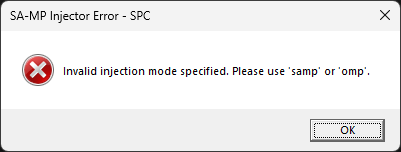

- **Displayed Error Message**: `"Invalid injection mode specified. Please use 'samp' or 'omp'."`
- **Cause**: The `inject_type` argument does not match the expected values of `"samp"` or `"omp"`. It could be a typo, an empty string, or an unrecognized value.
- **Solution**: Check that `$inject_type` is correctly set to either `"samp"` or `"omp"`. It is important that the string matches exactly (although the code uses `ToLower()` for comparison).
   ```powershell
   # Correct:
   Initialize_Game -inject_type "samp" ...
   Initialize_Game -inject_type "omp" ...

   # Incorrect (will cause an error):
   # Initialize_Game -inject_type "invalid" ...
   # Initialize_Game -inject_type "" ...
   ```

### 2. Invalid Server Port (Format or Range)

The port is an essential numerical parameter for connecting to the server. This error occurs if the value cannot be interpreted as a valid number or is outside the acceptable range (**1 to 65535**).

#### 2.1. Non-Numeric Port Format

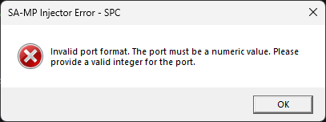

- **Displayed Error Message**: `"Invalid port format. The port must be a numeric value. Please provide a valid integer for the port."`
- **Cause**: The `port` argument contains characters that are not numeric digits or cannot be converted to a valid integer (e.g., `"abc"`, `"7777a"`).
- **Solution**: Provide a string that contains only digits and represents a valid integer.
   ```powershell
   # Correct:
   Initialize_Game ... -port "7777" ...
   
   # Incorrect (invalid format):
   # Initialize_Game ... -port "port7777" ...
   # Initialize_Game ... -port "invalid" ...
   ```

#### 2.2. Port Outside the Valid Range

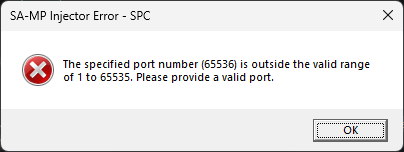

- **Displayed Error Message**: `"The specified port number (XXXX) is outside the valid range of 1 to 65535. Please provide a valid port."` (The **XXXX** will be the value you tried to use).
- **Cause**: The provided port is a valid number, but it is below `1` (reserved or unusable) or above `65535` (maximum limit for **TCP/UDP ports**).
- **Solution**: Provide a port that is within the range of `1` to `65535`. Common ports for **SA-MP**/**OMP** are `7777`.
   ```powershell
   # Correct:
   Initialize_Game ... -port "7777" ...

   # Incorrect (out of range):
   # Initialize_Game ... -port "0" ...      # Too low
   # Initialize_Game ... -port "65536" ...  # Too high
   # Initialize_Game ... -port "-1" ...     # Negative value
   ```

### 3. Invalid Nickname (Empty or Too Long)

The player's **nickname** is validated to ensure the game client will accept it.

#### 3.1. Empty Nickname

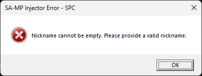

- **Displayed Error Message**: `"Nickname cannot be empty. Please provide a valid nickname."`
- **Cause**: The `nickname` argument was provided as an empty string.
- **Solution**: Make sure the nickname is not empty.
   ```powershell
   # Correct:
   Initialize_Game ... -nickname "MyName" ...

   # Incorrect (empty):
   # Initialize_Game ... -nickname "" ...
   ```

#### 3.2. Nickname Too Long

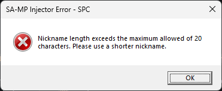

- **Displayed Error Message**: `"Nickname length exceeds the maximum allowed of 23 characters. Please use a shorter nickname."`
- **Cause**: The length of the provided **nickname** exceeds `$global:CONSTANTS.MAX_NICKNAME_LENGTH`, which is `23` characters.
- **Solution**: Use a **nickname** that is at most `23` characters long.
   ```powershell
   # Correct:
   Initialize_Game ... -nickname "Short" ...

   # Incorrect (too long):
   # Initialize_Game ... -nickname "ThisPlayerNameIsWayTooLongToUseHere" ...
   ```

### 4. Game or DLL Files Not Found

This is one of the most common causes of failure. The library requires `gta_sa.exe`, `samp.dll`, and, for **OMP**, `omp-client.dll` to be present in the expected locations.

#### 4.1. Game Executable (`gta_sa.exe`) Not Found

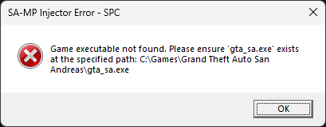

- **Displayed Error Message**: `"Game executable not found. Please ensure 'gta_sa.exe' exists at the specified path: [full path]"`. The `[full path]` will include the folder and filename.
- **Cause**: The `gta_sa.exe` file was not found in the folder provided in the `folder` argument.
- **Solution**:
   1. Check if `$folder` points to the correct installation directory of **GTA San Andreas**.
   2. Confirm that `gta_sa.exe` exists within that folder and that its name has not been changed.

#### 4.2. SA-MP Library (`samp.dll`) Not Found

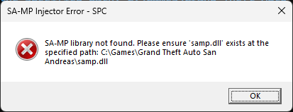

- **Displayed Error Message**: `"SA-MP library not found. Please ensure 'samp.dll' exists at the specified path: [full path]"`.
- **Cause**: The `samp.dll` file was not found in the folder provided in the `folder` argument. **This DLL** is a requirement for **both** injection types (`samp` and `omp`).
- **Solution**: Ensure that `samp.dll` is present in the **GTA San Andreas** installation folder.

#### 4.3. OMP Library (`omp-client.dll`) Not Found (for OMP injection only)

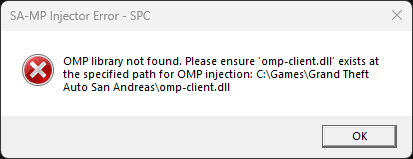

- **Displayed Error Message**: `"OMP library not found. Please ensure 'omp-client.dll' exists at the specified path for OMP injection: [full path]"`.
- **Cause**: If you specified `"omp"` as the injection type, but the `omp-client.dll` file was not found in the provided folder.
- **Solution**: Download the latest **OMP** client and ensure that `omp-client.dll` (and `samp.dll`) are present in the **GTA San Andreas** installation folder.

### 5. Failed to Create Game Process

This is a more complex error as it involves **operating system permissions** and the current state of `gta_sa.exe`.

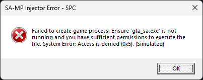

- **Displayed Error Message**: `"Failed to create game process. Ensure 'gta_sa.exe' is not running and you have sufficient permissions to execute the file. System Error: [Operating system error message]"`. The system message will be added by `Get_System_Error_Message` (e.g., `Access is denied.` or `The requested operation requires elevation.`).
- **Cause**: The `CreateProcessA` call to start `gta_sa.exe` failed. Common causes include:
   - **Process already running**: An instance of `gta_sa.exe` is already active and blocking a new execution.
   - **Insufficient permissions**: Your script does not have the necessary privileges (e.g., administrator) to create a process in certain system configurations (**UAC** enabled, protected folders, etc.).
   - **Issues with the executable**: `gta_sa.exe` may be corrupted or blocked by another program (e.g., a misconfigured antivirus).
- **Solution**:
   1. Check the Task Manager and make sure there are no instances of `gta_sa.exe` running. End any if they exist.
   2. Run the **PowerShell script as Administrator**. Right-click the PowerShell icon and select **"Run as administrator"**, or start it from a shortcut configured to do so.
   3. If an **antivirus** or **security software** is interfering, add your script and/or the **GTA:SA** folder to the antivirus exceptions (do this with care and only if you are sure of the integrity of your files).

### 6. Failed to Allocate Memory in the Target Process

The library attempts to allocate a small memory space in `gta_sa.exe` to copy the **DLL path**.

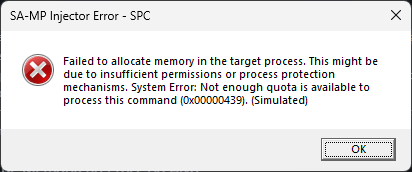

- **Displayed Error Message**: `"Failed to allocate memory in the target process. This might be due to insufficient permissions or process protection mechanisms. System Error: [Operating system error message]"`.
- **Cause**: The `VirtualAllocEx` function (used to allocate memory within another process) failed. This is most likely if:
   - The **GTA:SA** process (even while in a suspended state) has security defenses or **anti-injection patches** that prevent memory allocation by external processes.
   - Your script does not have the necessary elevated permissions to manipulate the memory of another process.
   - (Less common) There is an extreme shortage of virtual memory on the system.
- **Solution**:
   1. Run your script with **Administrator** privileges.
   2. Ensure that the game does not have any modifications or **security patches** that might be blocking injection attempts or memory manipulation (this is more common in modified environments or with certain third-party anti-cheat tools).

### 7. Failed to Write DLL Path to Process Memory

After allocating the memory, the library tries to copy the **DLL path** into it.

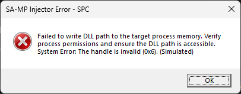

- **Displayed Error Message**: `"Failed to write DLL path to the target process memory. Verify process permissions and ensure the DLL path is accessible. System Error: [Operating system error message]"`.
- **Cause**: The `WriteProcessMemory` function failed while trying to copy the **bytes of the DLL path** to the remote memory allocated in `gta_sa.exe`. This usually points to:
   - **Write permissions**: Your script does not have permission to write to that memory region or to the **GTA:SA** process.
   - **Invalid handle**: The process **handle** has somehow become invalid (less common, but possible under extreme system conditions).
   - **Memory Protection Issues**: Some memory protection (either from the **OS** or game modifications) prevented the write operation.
- **Solution**: Run as **Administrator**. Check that `gta_sa.exe` and its environment are "clean" of tools that could block memory operations.

### 8. Failed to Find Essential System Functions

These are crucial Windows APIs; errors here indicate a fundamental problem with the operating system or the execution environment.

#### 8.1. `kernel32.dll` Not Found

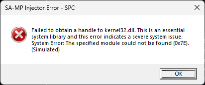

- **Displayed Error Message**: `"Failed to obtain a handle to kernel32.dll. This is an essential system library and this error indicates a severe system issue. System Error: [Operating system error message]"`.
- **Cause**: `kernel32.dll` is one of the most basic DLLs in Windows, containing essential functions. If `GetModuleHandleA` cannot get a **handle** to it, the operating system is in very serious trouble.
- **Solution**: This is a **critical** error that is rarely caused by the library or your script. It suggests system file corruption, serious problems with **Windows**, or a highly unusual **OS** installation. It is recommended to run system integrity checks (like `sfc /scannow` in the **Command Prompt** as **Administrator**) or, as a last resort, reinstall **Windows**.

#### 8.2. `LoadLibraryA` Not Found

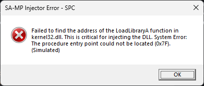

- **Displayed Error Message**: `"Failed to find the address of the LoadLibraryA function in kernel32.dll. This is critical for injecting the DLL. System Error: [Operating system error message]"`.
- **Cause**: Although `kernel32.dll` was found, the `LoadLibraryA` function could not be resolved via `GetProcAddress`. While extremely uncommon, it could be the result of corruption of the `kernel32.dll` **DLL file** or a highly non-standard execution environment.
- **Solution**: Just like the `kernel32.dll` error above, this indicates a serious problem with the operating system.

### 9. Failed to Create Remote Thread for Injection

After preparing the remote environment and copying the **DLL path**, a new **thread** is created in the game process to "call" `LoadLibraryA`.

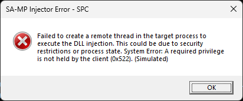

- **Displayed Error Message**: `"Failed to create a remote thread in the target process to execute the DLL injection. This could be due to security restrictions or process state. System Error: [Operating system error message]"`.
- **Cause**: The `CreateRemoteThread` call failed. This error is common on systems with robust **anti-injection** defenses or when a program is intensively monitoring process behavior:
   - **Security Mechanisms**: **Anti-cheat** tools, **security software**, or certain **Windows** policies can detect and block attempts to create **threads** in third-party processes.
   - **Inconsistent Target Process**: If the **GTA:SA** process is in an unexpected or unstable state (even though started with `CREATE_SUSPENDED`), this can affect the ability to create **threads** in it.
- **Solution**:
   1. Run your script with **Administrator** privileges.
   2. Check for **anti-cheat** tools, **aggressive antiviruses**, or **firewalls** configured to inspect and block process manipulation that might be in conflict. Add your script and `gta_sa.exe` to exceptions, if applicable (with caution).
   3. The system error message may provide additional details to investigate the specific cause (e.g., **"A process has been denied access to create threads for other processes."**).

### 10. Timeout or Failure in Injection Completion

After creating the remote **thread**, the injector waits for it to complete the **DLL loading**.

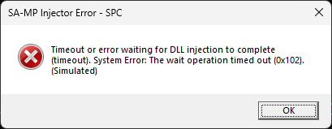

- **Displayed Error Message**: `"Timeout or error waiting for DLL injection to complete (timeout). System Error: [Operating system error message]"`.
- **Cause**: The remote **thread** running `LoadLibraryA` took longer than `$global:CONSTANTS.DLL_INJECTION_TIMEOUT_MS` (10 seconds) to return, or it failed and `GetExitCodeThread` returned 0. Potential causes include:
   - **Issues in the Injected DLL**: The `DllMain` of `samp.dll` or `omp-client.dll` is taking too long to execute, contains an **infinite loop**, a **crash**, or an error that **prevents the DLL** from loading correctly (e.g., missing **DLL dependencies**).
   - **Silent Blocking**: A security mechanism may have blocked `LoadLibraryA` but did not notify with an obvious **thread** creation error.
- **Solution**:
   1. Check the integrity of the `samp.dll` and `omp-client.dll` files. They may be corrupted or of a version incompatible with your `gta_sa.exe`.
   2. Ensure **that the injected DLL** does not depend on **other DLLs** that may be missing or inaccessible on the system.

### 11. Failed to Resume the Game Process Thread

This is the final step to start the game after **the DLLs** are injected.

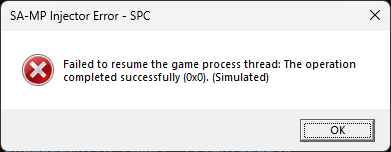

- **Displayed Error Message**: `"Failed to resume the game process thread: [Operating system error message]"`.
- **Cause**: The `ResumeThread` call failed, which means the main **thread** of `gta_sa.exe` could not be activated to start the game's execution. This is a rare error, but it can happen if:
   - The process **thread handle** has become invalid.
   - The operating system prevented the resumption for some reason, possibly related to a security interruption or inconsistent process state.
   - The process may have been terminated externally between the **DLL injection** and the attempt to resume the main **thread**.
- **Solution**: If all previous steps were successful and only `ResumeThread` failed, it could be a problem with the operating system, the **GTA:SA** installation itself, or other very strict **security software**. Re-examine the state of `gta_sa.exe` via **Task Manager** just before and after the error. Restarting the computer may resolve temporary system state issues.

> [!TIP]
> In complex debugging scenarios, tools like **Process Monitor (Sysinternals Suite)** or a debugger (like **WinDbg**) can be invaluable. They can help observe **API** calls, check for access errors, track the state of **handles**, and even inspect the process's memory, providing an in-depth view of what is happening under the hood.
>
> To debug PowerShell scripts that use `Add-Type` and interact with the WinAPI at a low level, tools like the **PowerShell Integrated Scripting Environment (ISE)** or **Visual Studio Code** with the PowerShell extension are useful, allowing for the placement of breakpoints and inspection of variables. Always remember to run them **as Administrator**.

## License

Copyright © **SA-MP Programming Community**

This software is licensed under the terms of the MIT License ("License"); you may use this software according to the License terms. A copy of the License can be obtained at: [MIT License](https://opensource.org/licenses/MIT)

### Terms and Conditions of Use

#### 1. Granted Permissions

This license grants, free of charge, to any person obtaining a copy of this software and associated documentation files, the following rights:
* To use, copy, modify, merge, publish, distribute, sublicense, and/or sell copies of the software without restriction
* To permit persons to whom the software is furnished to do so, subject to the following conditions

#### 2. Mandatory Conditions

All copies or substantial portions of the software must include:
* The above copyright notice
* This permission notice
* The disclaimer notice below

#### 3. Copyright

The software and all associated documentation are protected by copyright laws. The **SA-MP Programming Community** retains the original copyright of the software.

#### 4. Disclaimer of Warranty and Limitation of Liability

THE SOFTWARE IS PROVIDED "AS IS", WITHOUT WARRANTY OF ANY KIND, EXPRESS OR IMPLIED, INCLUDING BUT NOT LIMITED TO THE WARRANTIES OF MERCHANTABILITY, FITNESS FOR A PARTICULAR PURPOSE AND NONINFRINGEMENT.

IN NO EVENT SHALL THE AUTHORS OR COPYRIGHT HOLDERS BE LIABLE FOR ANY CLAIM, DAMAGES OR OTHER LIABILITY, WHETHER IN AN ACTION OF CONTRACT, TORT OR OTHERWISE, ARISING FROM, OUT OF OR IN CONNECTION WITH THE SOFTWARE OR THE USE OR OTHER DEALINGS IN THE SOFTWARE.

---

For detailed information about the MIT License, visit: https://opensource.org/licenses/MIT